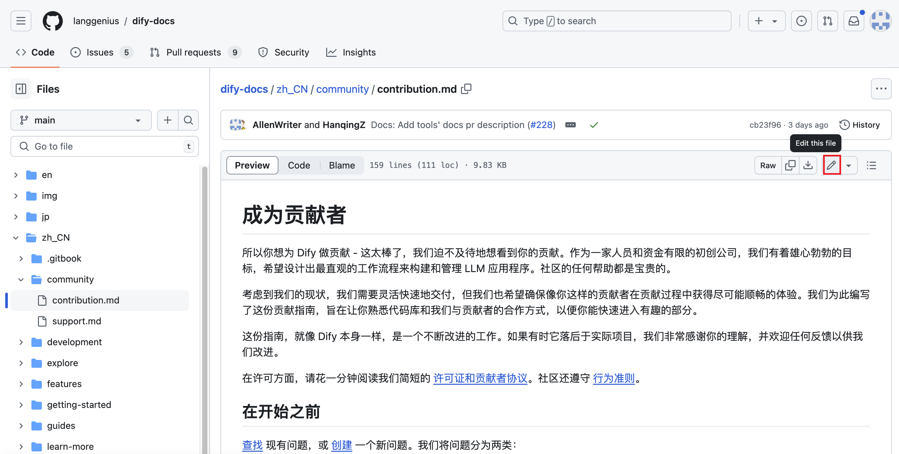

# 為 Dify 文檔做出貢獻

Dify 幫助文檔是一個[開源項目](https://github.com/langgenius/dify-docs)，我們歡迎任何形式的貢獻。如果你在閱讀文檔時發現任何問題，亦或是想要動手寫作，貢獻自己的一份力量，歡迎你在 Github 上提交 issue 或者直接發起 pull request，我們將盡快處理你的請求。

## 如何提交貢獻

我們將文檔問題分為以下幾類：

* 內容勘誤（錯別字 / 內容不正確）
* 內容缺失（需要補充新的內容）

### 內容勘誤

如果你在閱讀某篇文檔的時候發現存在內容錯誤，或者想要修改部分內容，請點擊文檔頁面右側目錄欄內的 **“在 Github 上編輯”** 按鈕，使用 Github 內置的在線編輯器修改文件，然後提交 pull request 並簡單描述本次修改行為。標題格式請使用 `Fix: Update xxx`，我們將在收到請求後進行 review，無誤後將合併你的修改。



當然，你也可以在 [Issues 頁](https://github.com/langgenius/dify-docs/issues)貼上文檔鏈接，並簡單描述需要修改的內容。收到反饋後將盡快處理。

### 內容缺失

如果你想要提交新的文檔至代碼倉庫中，請遵循以下步驟：

1. Fork 代碼倉庫

首先將代碼倉庫 Fork 至你的 Github 賬號內，然後使用 Git 拉取代碼倉庫至本地：

```bash
git clone https://github.com/<your-github-account>/dify-docs.git
```

> 你也可以使用 Github 在線代碼編輯器，在合適的目錄內提交新的 md 文件。

2. 找到對應的文檔目錄並提交文件

例如，你想要提交第三方工具的使用文檔，請在 `/guides/tools/tool-configuration/` 目錄內提交新的 md 文件（建議提供中英雙語內容）。

3. 提交 pull request

提交 pull request 時，請使用 `Docs: add xxx` 的格式，並在描述欄內簡單說明文檔的大致內容，我們在收到請求後進行 review，無誤後將合併你的修改。

## 獲取幫助

如果你在貢獻過程中遇到困難或者有任何問題，可以通過相關的 GitHub 問題提出你的疑問，或者加入我們的 [Discord](https://discord.gg/AhzKf7dNgk) 進行快速交流。
