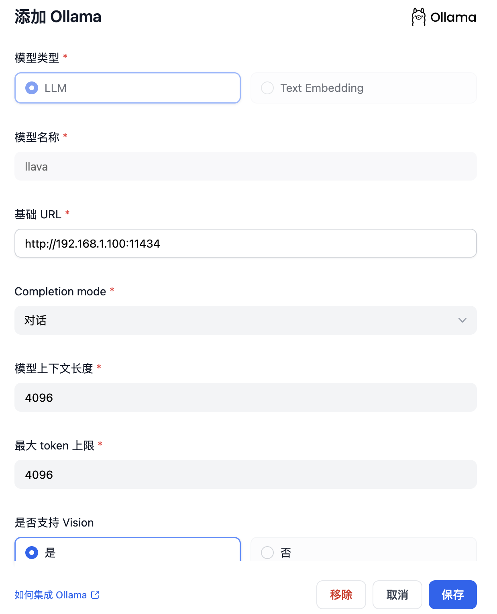
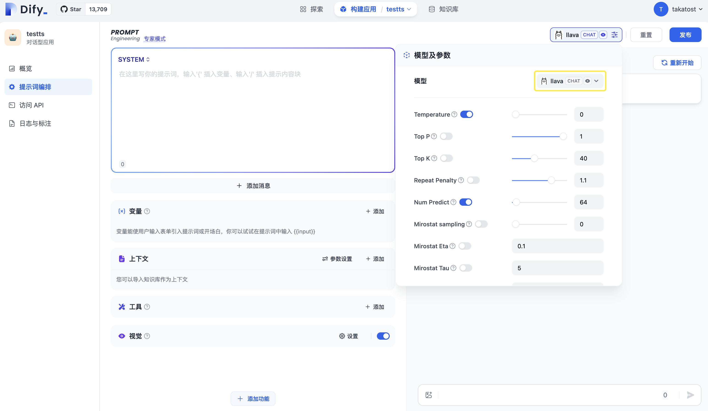

# 接入 Ollama 部署的本地模型


[Ollama](https://github.com/jmorganca/ollama) 是一個本地推理框架客戶端，可一鍵部署如 Llama 2, Mistral, Llava 等大型語言模型。
Dify 支持接入 Ollama 部署的大型語言模型推理和 embedding 能力。

## 快速接入

### 下載並啟動 Ollama

1. 下載 Ollama

   訪問 [https://ollama.ai/download](https://ollama.ai/download)，下載對應系統 Ollama 客戶端。

2. 運行 Ollama 並與 Llava 聊天

    ```bash
    ollama run llava
    ```

    啟動成功後，ollama 在本地 11434 端口啟動了一個 API 服務，可通過 `http://localhost:11434` 訪問。

    其他模型可訪問 [Ollama Models](https://ollama.ai/library) 瞭解詳情。

3. 在 Dify 中接入 Ollama

   在 `設置 > 模型供應商 > Ollama` 中填入：

   

   - 模型名稱：`llava`
   
   - 基礎 URL：`http://<your-ollama-endpoint-domain>:11434`
   
     此處需填寫可訪問到的 Ollama 服務地址。
   
     若 Dify 為 docker 部署，建議填寫局域網 IP 地址，如：`http://192.168.1.100:11434` 或 docker 宿主機 IP 地址，如：`http://172.17.0.1:11434`。
   
     若為本地源碼部署，可填寫 `http://localhost:11434`。

   - 模型類型：`對話`

   - 模型上下文長度：`4096`
   
     模型的最大上下文長度，若不清楚可填寫默認值 4096。
   
   - 最大 token 上限：`4096`
   
     模型返回內容的最大 token 數量，若模型無特別說明，則可與模型上下文長度保持一致。

   - 是否支持 Vision：`是`
   
     當模型支持圖片理解（多模態）勾選此項，如 `llava`。

   點擊 "保存" 校驗無誤後即可在應用中使用該模型。

   Embedding 模型接入方式與 LLM 類似，只需將模型類型改為 Text Embedding 即可。

4. 使用 Ollama 模型

   

   進入需要配置的 App 提示詞編排頁面，選擇 Ollama 供應商下的 `llava` 模型，配置模型參數後即可使用。

## FAQ

### ⚠️ 如果您使用Docker部署Dify和Ollama，您可能會遇到以下錯誤:

```
httpconnectionpool(host=127.0.0.1, port=11434): max retries exceeded with url:/cpi/chat (Caused by NewConnectionError('<urllib3.connection.HTTPConnection object at 0x7f8562812c20>: fail to establish a new connection:[Errno 111] Connection refused'))

httpconnectionpool(host=localhost, port=11434): max retries exceeded with url:/cpi/chat (Caused by NewConnectionError('<urllib3.connection.HTTPConnection object at 0x7f8562812c20>: fail to establish a new connection:[Errno 111] Connection refused'))
```

這個錯誤是因為 Docker 容器無法訪問 Ollama 服務。localhost 通常指的是容器本身，而不是主機或其他容器。要解決此問題，您需要將 Ollama 服務暴露給網絡。

### 在Mac上設置環境變量

如果 `Ollama` 作為 `macOS` 應用程序運行，則應使用以下命令設置環境變量`launchctl`：

1. 通過調用`launchctl setenv`設置環境變量：

    ```bash
    launchctl setenv OLLAMA_HOST "0.0.0.0"
    ```

2. 重啟Ollama應用程序。

3. 如果以上步驟無效，可以使用以下方法：

    問題是在docker內部，你應該連接到`host.docker.internal`，才能訪問docker的主機，所以將`localhost`替換為`host.docker.internal`服務就可以生效了：

    ```bash
    http://host.docker.internal:11434
    ```

### 在Linux上設置環境變量

如果Ollama作為systemd服務運行，應該使用`systemctl`設置環境變量：

1. 通過調用`systemctl edit ollama.service`編輯systemd服務。這將打開一個編輯器。

2. 對於每個環境變量，在`[Service]`部分下添加一行`Environment`：

    ```ini
    [Service]
    Environment="OLLAMA_HOST=0.0.0.0"
    ```

3. 保存並退出。

4. 重載`systemd`並重啟Ollama：

   ```bash
   systemctl daemon-reload
   systemctl restart ollama
   ```

### 在Windows上設置環境變量

在Windows上，Ollama繼承了您的用戶和系統環境變量。

1. 首先通過任務欄點擊Ollama退出程序

2. 從控制面板編輯系統環境變量

3. 為您的用戶賬戶編輯或新建變量，比如`OLLAMA_HOST`、`OLLAMA_MODELS`等。

4. 點擊OK/應用保存

5. 在一個新的終端窗口運行`ollama`

### 如何在我的網絡上暴露Ollama？

Ollama默認綁定127.0.0.1端口11434。通過`OLLAMA_HOST`環境變量更改綁定地址。

## 如需獲取 Ollama 更多信息，請參考

For more information on Ollama, please refer to: 

- [Ollama](https://github.com/jmorganca/ollama)
- [Ollama FAQ](https://github.com/ollama/ollama/blob/main/docs/faq.md)

