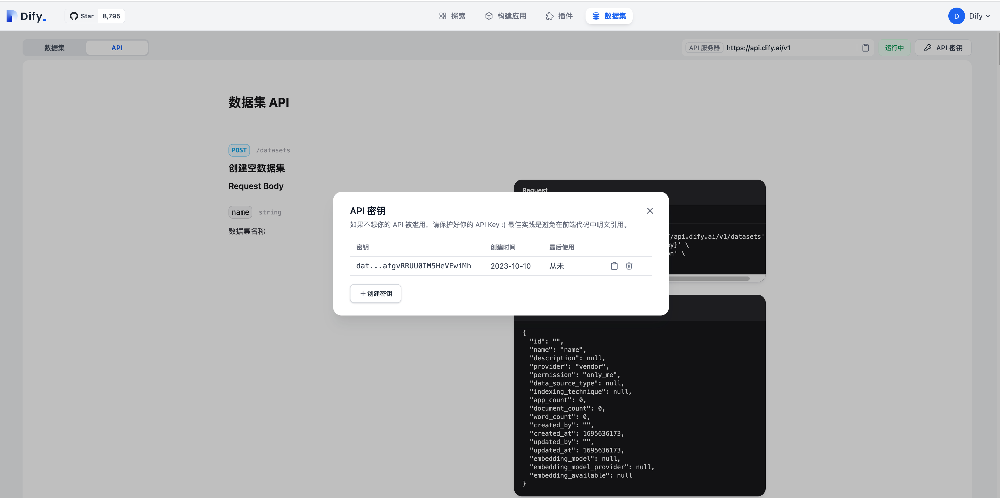

# 維護 Knowledge API

> 身份驗證、調用方法和應用服務API保持一致。區別在於知識API令牌可以對所有知識庫進行操作.

### 使用 Knowledge API 的好處
* 同步您的數據系統以分散Knowledge以創建強大的工作流.
* 提供知識列表和文檔列表API以及詳細查詢接口, 目的是為了便於生成自己的數據管理頁.
* 為了簡化您的同步進程，支持純文本和  文件上傳 / 更新文檔 以及批量新增和修改.
* 提高Dify軟件和服務的可見性，縮短手動處理文檔和同步的時間.

### 如何使用

請轉到知識頁面，您可以在左側導航中切換到API頁面。在此頁面上，您可以查看dify提供的API文檔並管理用於訪問Knowledge API的憑據.

<figure><figcaption><p>Knowledge API Document</p></figcaption></figure>

## **創建空的 Knowledge**

**`POST /datasets`**


僅用於創建空數據集


```
curl --location --request POST 'https://api.dify.ai/v1/datasets' \
--header 'Authorization: Bearer {api_key}' \
--header 'Content-Type: application/json' \
--data-raw '{"name": "name"}'

```

#### **Knowledge 列表**


```
curl --location --request GET 'https://api.dify.ai/v1/datasets?page=1&limit=20' \
--header 'Authorization: Bearer {api_key}'

```

#### **文本創建文檔**

```
curl --location --request POST '<https://api.dify.ai/v1/datasets/<uuid:dataset_id>/document/create_by_text>' \\
--header 'Authorization: Bearer {api_key}' \\
--header 'Content-Type: application/json' \\
--data-raw '{
    "name": "Dify",
    "text": "Dify means Do it for you...",
    "indexing_technique": "high_quality",
    "process_rule": {
        "rules": {
                "pre_processing_rules": [{
                        "id": "remove_extra_spaces",
                        "enabled": true
                }, {
                        "id": "remove_urls_emails",
                        "enabled": true
                }],
                "segmentation": {
                        "separator": "###",
                        "max_tokens": 500
                }
        },
        "mode": "custom"
    }
}'

```

#### **文件創建文檔**

```
curl --location POST 'https://api.dify.ai/v1/datasets/{dataset_id}/document/create_by_file' \
--header 'Authorization: Bearer {api_key}' \
--form 'data="{
	"name": "Dify",
	"indexing_technique": "high_quality",
	"process_rule": {
		"rules": {
			"pre_processing_rules": [{
				"id": "remove_extra_spaces",
				"enabled": true
			}, {
				"id": "remove_urls_emails",
				"enabled": true
			}],
			"segmentation": {
				"separator": "###",
				"max_tokens": 500
			}
		},
		"mode": "custom"
	}
    }";
    type=text/plain' \
--form 'file=@"/path/to/file"'

```

#### **獲取文檔嵌入狀態**

```
curl --location --request GET 'https://api.dify.ai/v1/datasets/{dataset_id}/documents/{batch}/indexing-status' \
--header 'Authorization: Bearer {api_key}'
```

#### **刪除文檔**

```
curl --location --request GET 'https://api.dify.ai/v1/datasets/{dataset_id}/documents' \
--header 'Authorization: Bearer {api_key}'

```

#### **添加新的片段**

```
curl --location 'https://api.dify.ai/v1/datasets/{dataset_id}/documents/{document_id}/segments' \
--header 'Authorization: Bearer {api_key}' \
--header 'Content-Type: application/json' \
--data '{"segments": [{"content": "1","answer": "1","keywords": ["a"]}]}'
```

#### 刪除文檔分段

```
curl --location --request DELETE 'https://api.dify.dev/v1/datasets/{dataset_id}/documents/{document_id}/segments/{segment_id}' \
--header 'Authorization: Bearer {api_key}' \
--header 'Content-Type: application/json'
```

### 報錯信息

- `document_indexing`，表示文檔正處於索引過程中
- `provider_not_initialize`， 表示未配置嵌入模型
- `not_found`，文檔不存在
- `dataset_name_duplicate` ，重複命名
- `provider_quota_exceeded`，配額已超出最大限制
- `dataset_not_initialized`，未進行初始化
- `unsupported_file_type`，不支持的文件類型
    - 現支持的文件類型如下：txt, markdown, md, pdf, html, htm, xlsx, docx, csv
- `too_many_files`，表示文件數量太大，暫時只支持單文件上傳
- `file_too_large`，表示文件太大，僅支持15M以下的文件