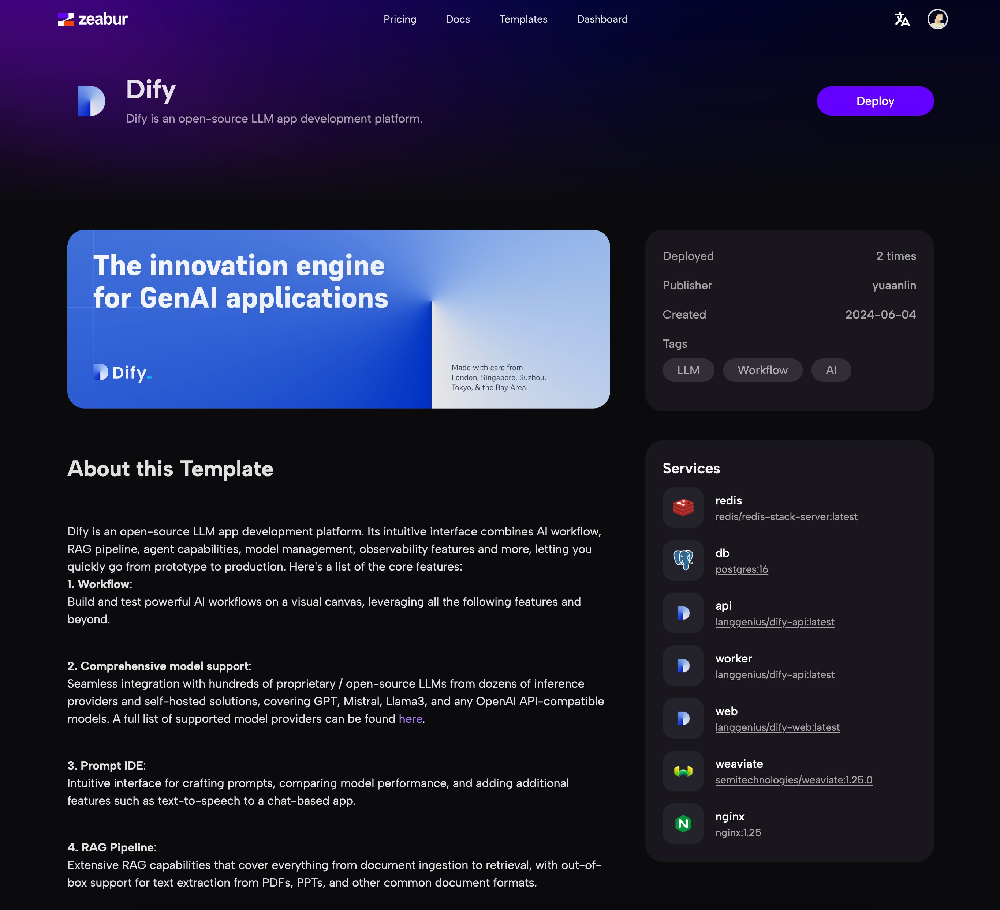
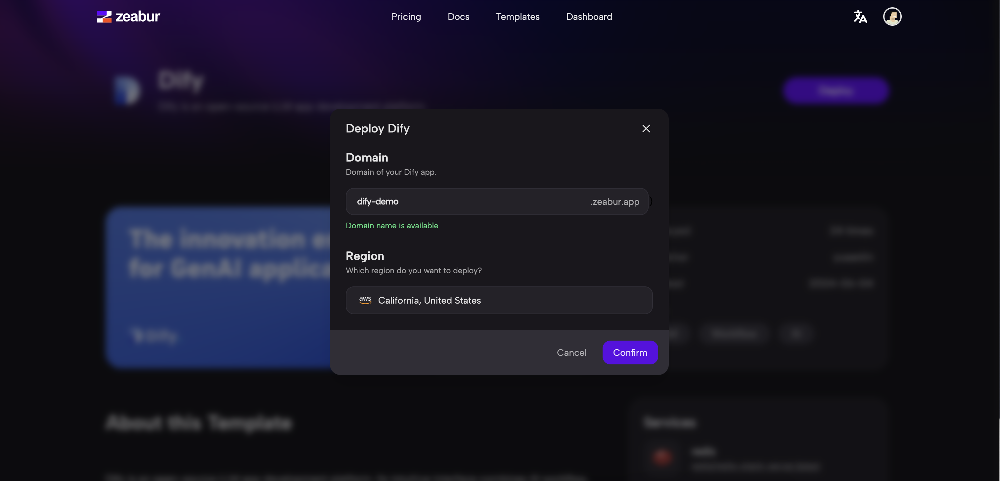
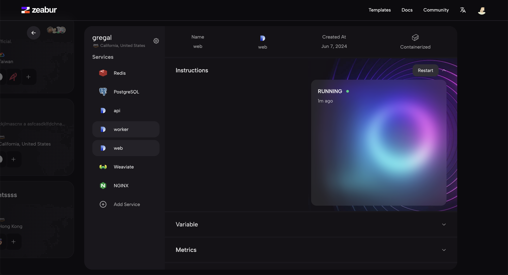

# 部署 Dify 到 Zeabur

[Zeabur](https://zeabur.com) 是一個服務部署平臺，可以通過一鍵部署的方式部署 Dify。本指南將指導您如何將 Dify 部署到 Zeabur。

## 前置要求

在開始之前，您需要以下內容：

- 一個 Zeabur 賬戶。如果您沒有賬戶，可以在 [Zeabur](https://zeabur.com/) 註冊一個免費賬戶。
- 升級您的 Zeabur 賬戶到開發者計劃（每月 5 美元）。您可以從 [Zeabur 定價](https://zeabur.com/pricing) 瞭解更多信息。

## 部署 Dify 到 Zeabur

Zeabur 團隊準備了一個一鍵部署模板，您只需點擊下面的按鈕即可開始：

點擊按鈕後，您將被導航到 Zeabur 上的模板頁面，您可以在那裡查看部署的詳細信息和說明。

<figure><figcaption></figcaption></figure>

點擊部署按鈕後，您需要輸入一個生成的域名，以便將域名綁定到您的 Dify 實例並注入到其他服務中作為環境變量。
然後選擇您喜歡的區域，點擊部署按鈕，您的 Dify 實例將在幾分鐘內部署完成。

<figure><figcaption></figcaption></figure>

部署完成後，您可以在 Zeabur 控制檯中看到一個項目頁面，如下圖所示，您在部署過程中輸入的域名將自動綁定到 NGINX 服務，您可以通過該域名訪問您的 Dify 實例。

<figure><figcaption></figcaption></figure>

你也可以在 NGINX 服務頁面的 Networking 選項卡中更改域名。您可以參考 [Zeabur 文檔](https://zeabur.com/docs/deploy/domain-binding) 瞭解更多信息。