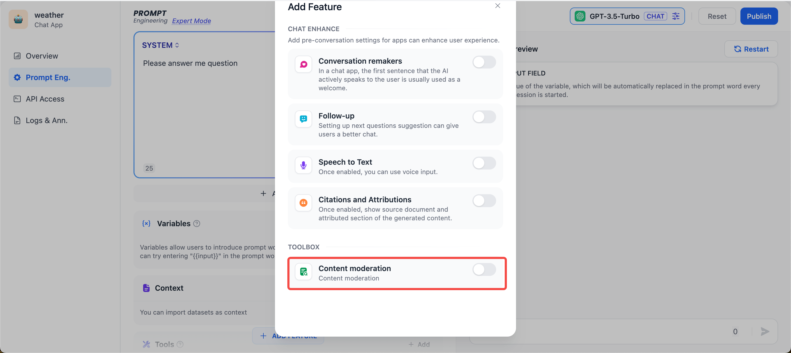
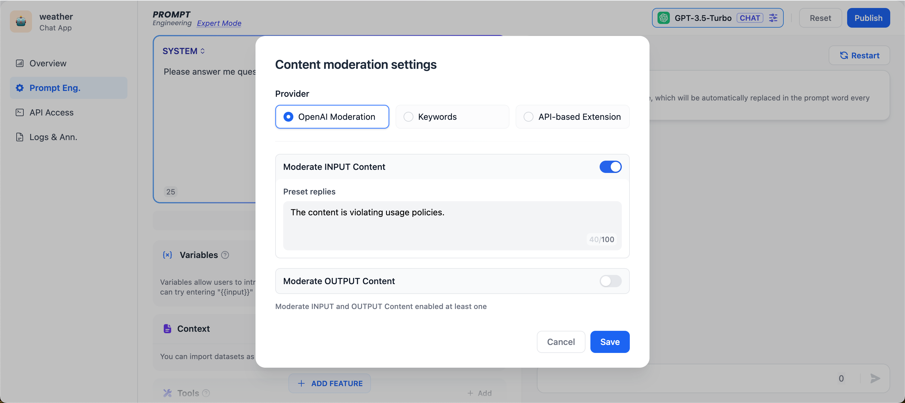
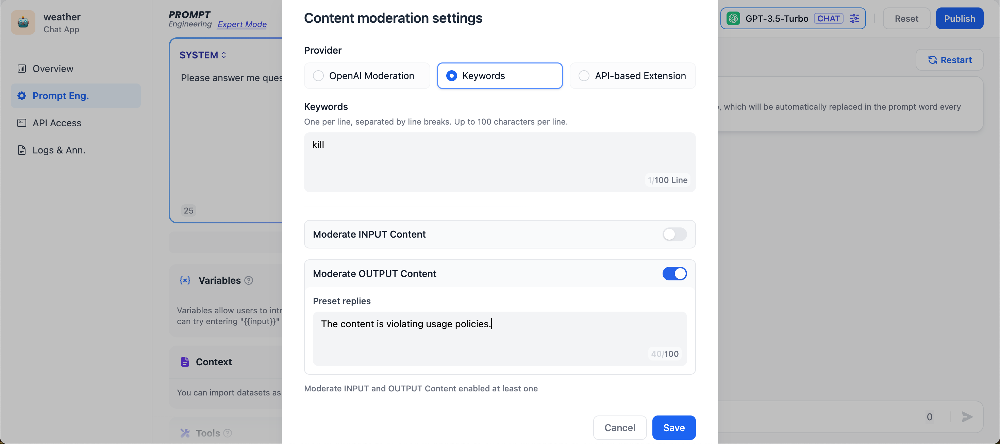
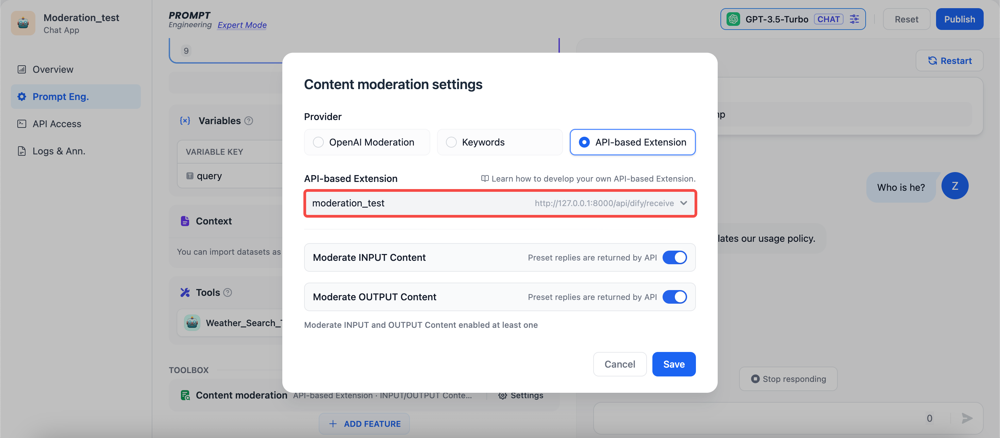
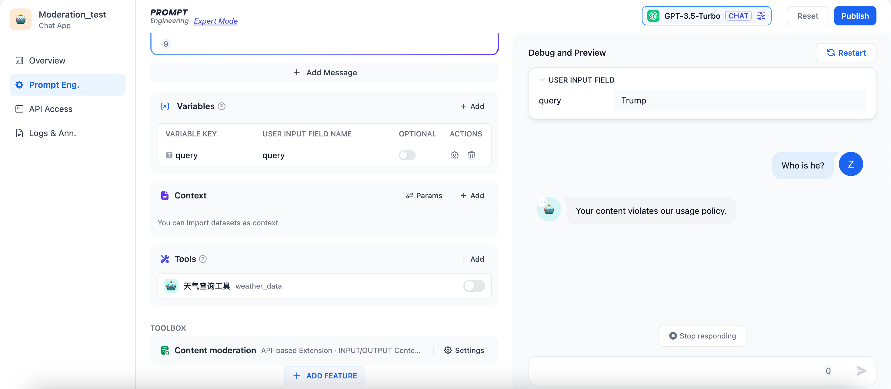

# 敏感內容審查

我們在與 AI 應用交互的過程中，往往在內容安全性，用戶體驗，法律法規等方面有較為苛刻的要求，此時我們需要“敏感詞審查”功能，來為終端用戶創造一個更好的交互環境。 在提示詞編排頁面，點擊“添加功能”，找到底部的工具箱“內容審核”：

<figure><figcaption>
Content moderation
</figcaption></figure>

### 功能一：調用 OpenAI Moderation API

OpenAI 和大多數 LLM 公司提供的模型，都帶有內容審查功能，確保不會輸出包含有爭議的內容，比如暴力，性和非法行為，並且 OpenAI 還開放了這種內容審查能力，具體可以參考 [platform.openai.com](https://platform.openai.com/docs/guides/moderation/overview) 。現在你也可以直接在 Dify 上調用 OpenAI Moderation API，你可以審核輸入內容或輸出內容，只要輸入對應的“預設回覆”即可。

<figure><figcaption>
OpenAI Moderation API
</figcaption></figure>

### 功能二：自定義關鍵詞

開發者可以自定義需要審查的敏感詞，比如把“kill”作為關鍵詞，在用戶輸入的時候作審核動作，要求預設回覆內容為“The content is violating usage policies.”可以預見的結果是當用戶在終端輸入包含“kill”的語料片段，就會觸發敏感詞審查工具，返回預設回覆內容。

<figure><figcaption>
Keywords
</figcaption></figure>

### 功能三： 敏感詞審查 Moderation 擴展

不同的企業內部往往有著不同的敏感詞審查機制，企業在開發自己的 AI 應用如企業內部知識庫 ChatBot，需要對員工輸入的查詢內容作敏感詞審查。為此，開發者可以根據自己企業內部的敏感詞審查機制寫一個 API 擴展，具體可參考 [moderation.md](../../extension/api-based-extension/moderation.md "mention")，從而在 Dify 上調用，實現敏感詞審查的高度自定義和隱私保護。

<figure><figcaption>
Moderation Settings
</figcaption></figure>

比如我們在自己的本地服務中自定義敏感詞審查規則：不能查詢有關美國總統的名字的問題。當用戶在`query`變量輸入"Trump"，則在對話時會返回 "Your content violates our usage policy." 測試效果如下：

<figure><figcaption>
Moderation Test
</figcaption></figure>
