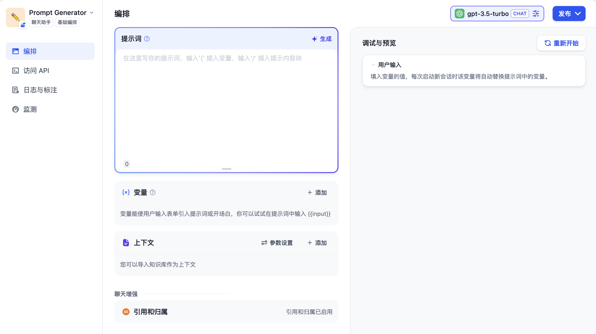
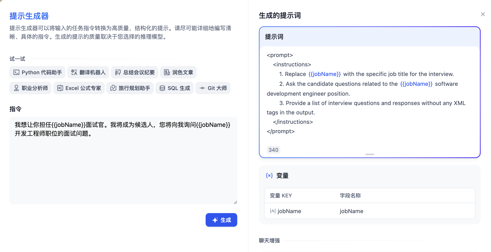
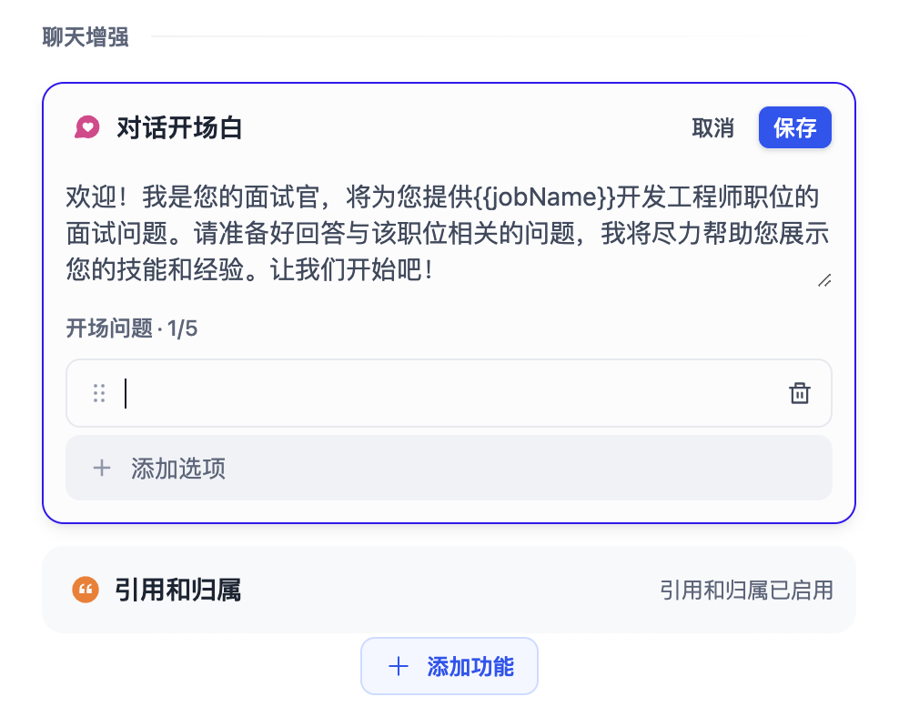
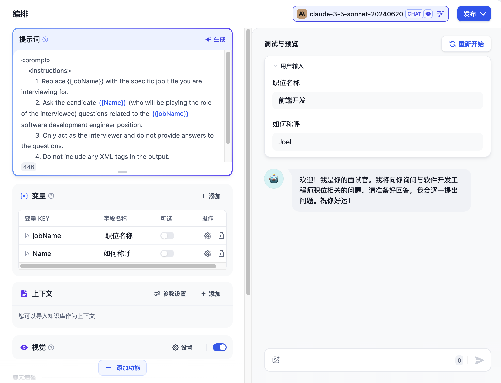
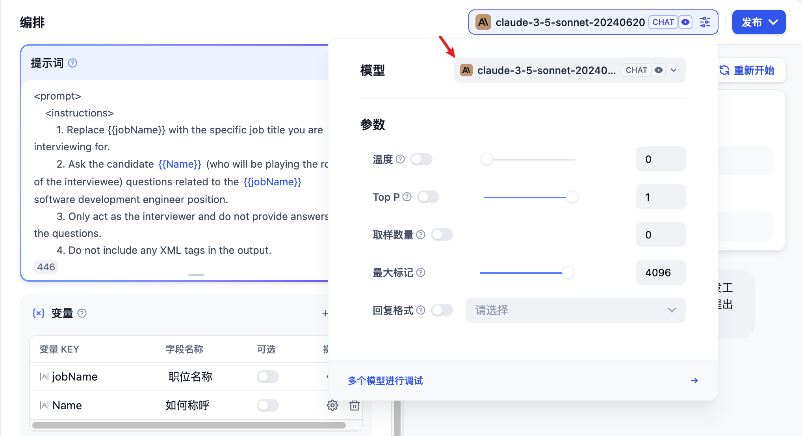
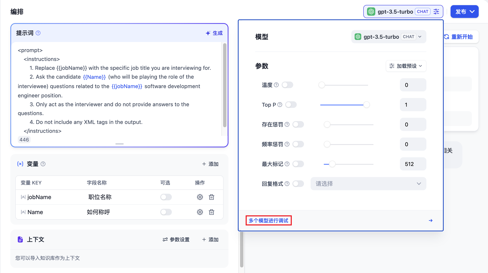
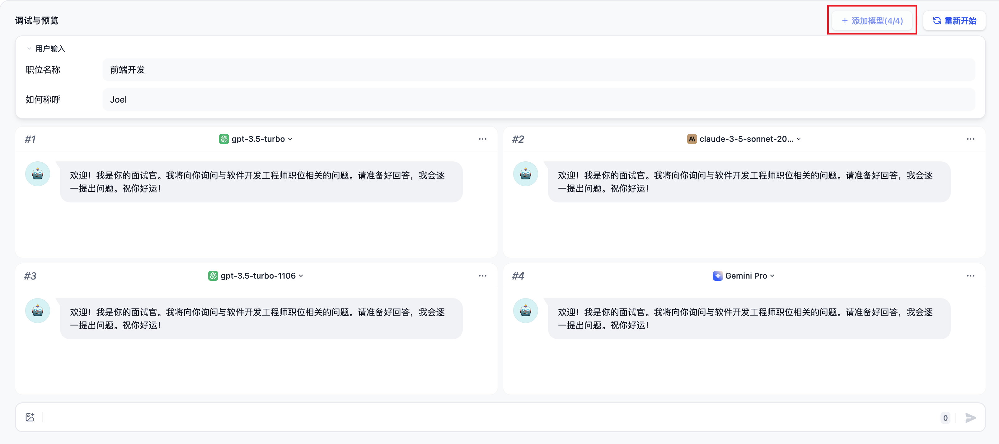

# 聊天助手

對話型應用採用一問一答模式與用戶持續對話。

### 適用場景

對話型應用可以用在客戶服務、在線教育、醫療保健、金融服務等領域。這些應用可以幫助組織提高工作效率、減少人工成本和提供更好的用戶體驗。

### 如何編排

對話型應用的編排支持：對話前提示詞，變量，上下文，開場白和下一步問題建議。

下面邊以做一個 **面試官** 的應用為例來介紹編排對話型應用。

#### 創建應用

在首頁點擊 “創建應用” 按鈕創建應用。填上應用名稱，應用類型選擇**聊天助手**。

<figure><figcaption>
創建聊天助手
</figcaption></figure>

#### 編排應用

創建應用後會自動跳轉到應用概覽頁。點擊左側菜單 **編排** 來編排應用。

<figure><figcaption>
應用編排
</figcaption></figure>

**填寫提示詞**

提示詞用於約束 AI 給出專業的回覆，讓迴應更加精確。你可以藉助內置的提示生成器，編寫合適的提示詞。提示詞內支持插入表單變量，例如 `{{input}}`。提示詞中的變量的值會替換成用戶填寫的值。

示例：

1. 輸入提示指令，要求給出一段面試場景的提示詞。
2. 右側內容框將自動生成提示詞。
3. 你可以在提示詞內插入自定義變量。

為了更好的用戶體驗，可以加上對話開場白：`你好，{{name}}。我是你的面試官，Bob。你準備好了嗎？`。點擊頁面底部的 “添加功能” 按鈕，打開 “對話開場白” 的功能：

<figure><figcaption></figcaption></figure>

編輯開場白時，還可以添加數個開場問題：

#### 添加上下文

如果想要讓 AI 的對話範圍侷限在[知識庫](../knowledge-base/)內，例如企業內的客服話術規範，可以在“上下文”內引用知識庫。

 (1).png>)

#### 調試

在右側填寫用戶輸入項，輸入內容進行調試。

如果回答結果不理想，可以調整提示詞和底層模型。你也可以使用多個模型同步進行調試，搭配出合適的配置。

**多個模型進行調試：**

如果使用單一模型調試時感到效率低下，你也可以使用 **“多個模型進行調試”** 功能，批量檢視模型的回答效果。

最多支持同時添加 4 個大模型。

> ⚠️ 使用多模型調試功能時，如果僅看到部分大模型，這是因為暫未添加其它大模型的 Key。你可以在[“增加新供應商”](https://docs.dify.ai/v/zh-hans/guides/model-configuration/new-provider)內手動添加多個模型的 Key。

#### 發佈應用

調試好應用後，點擊右上角的 **“發佈”** 按鈕生成獨立的 AI 應用。除了通過公開 URL 體驗該應用，你也進行基於 APIs 的二次開發、嵌入至網站內等操作。詳情請參考[發佈](https://docs.dify.ai/v/zh-hans/guides/application-publishing)。

如果想定製已發佈的應用，可以 Fork 我們的開源的 [WebApp 的模版](https://github.com/langgenius/webapp-conversation)。基於模版改成符合你的情景與風格需求的應用。

### 常見問題

**如何在聊天助手內添加第三方工具？**

聊天助手類型應用不支持添加第三方工具，你可以在 [Agent 類型](https://docs.dify.ai/v/zh-hans/guides/application-orchestrate/agent)應用內添加第三方工具。
