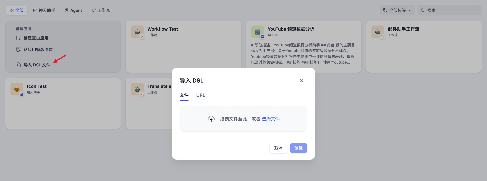
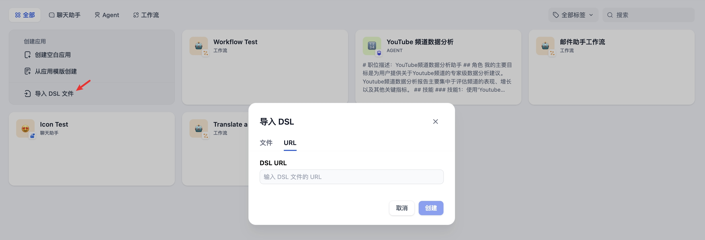

# 創建應用

你可以通過 3 種方式在 Dify 的工作室內創建應用：

* 基於應用模板創建（新手推薦）
* 創建一個空白應用
* 通過 DSL 文件（本地/在線）創建應用

### 從模板創建應用

初次使用 Dify 時，你可能對於應用創建比較陌生。為了幫助新手用戶快速瞭解在 Dify 上能夠構建哪些類型的應用，Dify 團隊內的提示詞工程師已經創建好了多場景、高質量的應用模板。

你可以從導航選擇 「工作室 」，在應用列表內選擇 「從模版創建」。

<figure><figcaption><p>從模板創建應用</p></figcaption></figure>

任意選擇某個模板，並將其添加至工作區。

<figure><figcaption><p>Dify 應用模板</p></figcaption></figure>

### 創建一個新應用

如果你需要在 Dify 上創建一個空白應用，你可以從導航選擇 「工作室」 ，在應用列表內選擇 「從空白創建 」。

<figure><figcaption></figcaption></figure>

初次創建應用時，你可能需要先理解 Dify 上 4 種不同應用類型的[基本概念](./#application\_type)，分別是聊天助手、文本生成應用、Agent 和工作流。

創建應用時，你需要給應用起一個名字、選擇合適的圖標，或者上傳喜愛的圖片用作圖標、使用簡介清晰的文字來描述此應用的用途，以方便後續應用在團隊內的使用。

<figure><figcaption><p>創建一個空白應用</p></figcaption></figure>

### 通過 DSL 文件創建應用


Dify DSL 是由 Dify.AI 所定義的 AI 應用工程文件標準，文件格式為 YML。該標準涵蓋應用在 Dify 內的基本描述、模型參數、編排配置等信息。


#### 本地導入

如果你從社區或其它人那裡獲得了一個應用模版（DSL 文件），可以從工作室選擇 「 導入DSL 文件 」。DSL 文件導入後將直接加載原應用的所有配置信息。

<figure><figcaption><p>導入 DSL 文件創建應用</p></figcaption></figure>

#### URL 導入

你也可以通過 URL 導入 DSL 文件，參考的鏈接格式：

```URL
https://example.com/your_dsl.yml
```

<figure><figcaption><p>通過 URL 導入 DSL 文件</p></figcaption></figure>
