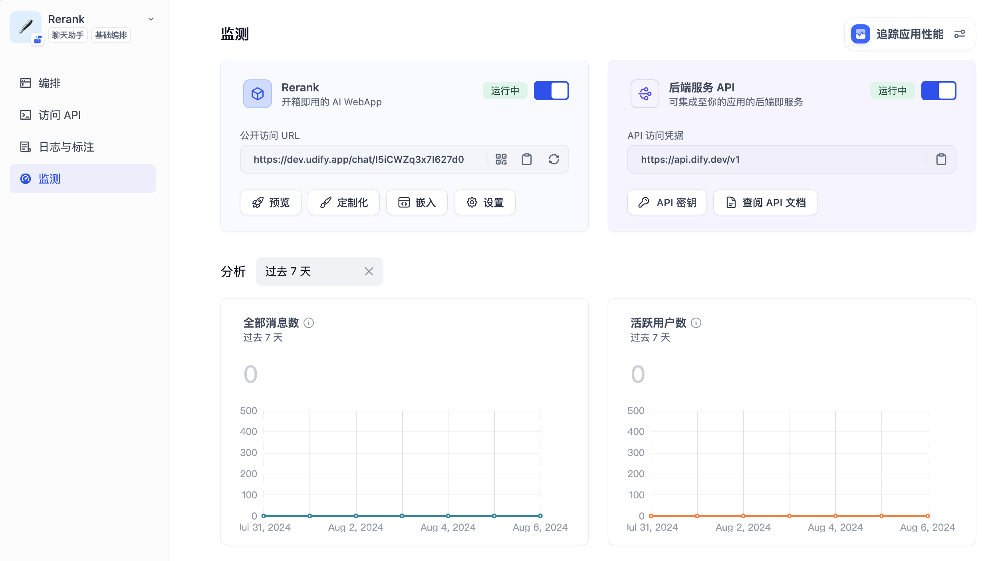
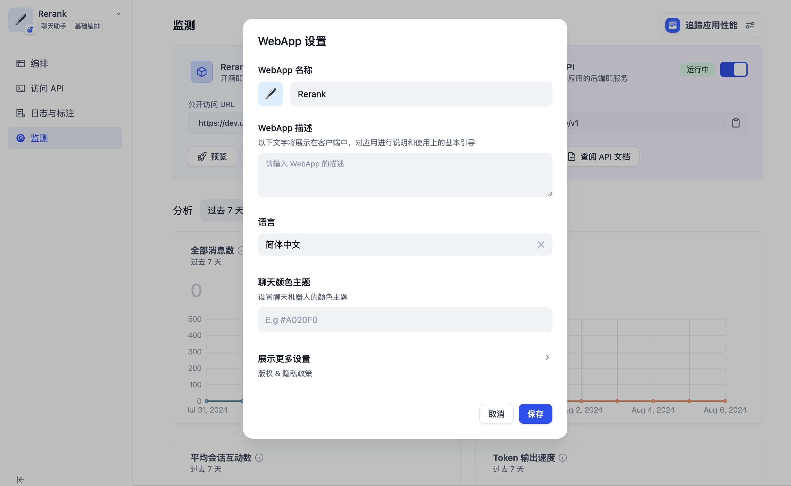

# 發佈為公開 Web 站點

使用 Dify 創建 AI 應用的一個好處在於，你可以在幾分鐘內就發佈一個可供用戶在互聯網上公開訪問的 Web 應用，該應用將根據你的 Prompt 和編排設置進行工作。

* 如果你使用的是自部署的開源版，該應用將運行在你的服務器上
* 如果你使用的是雲服務，該應用將託管至網址 [https://udify.app/](https://udify.app/)

***

### 發佈 AI 站點

在應用監測頁中，你可以找到 WebApp 的管理卡片。打開訪問開關後，你可以得到一個能夠在互聯網上公開分享的網址。

<figure><figcaption></figcaption></figure>

我們對以下兩種應用類型均預置了漂亮的 WebApp 界面：

* 文本生成型（[前往預覽](text-generator.md)）
* 對話型（[前往預覽](conversation-application.md)）

***

### 設置你的 AI 站點

點擊 WebApp 卡片上的**設置**按鈕，為 AI 站點配置一些選項，它們都會被最終用戶所見：


界面語言目前已支持：英文，中文，繁體中文，葡萄牙語，德語，日本語，韓語，烏克蘭語，越南語。如果您需要增加更多語言，可以在 GitHub 內提交 Issue[ 尋求支持](../../../community/support.md)或者提交 PR 貢獻代碼。


***

### 嵌入你的 AI 站點

除了將應用發佈為一個公開的 AI 網站，你還可以將它嵌入並集成至你的網站、博客或其它任意網頁中。詳細說明請參考 [《嵌入網站》](https://docs.dify.ai/v/zh-hans/guides/application-publishing/embedding-in-websites)。
