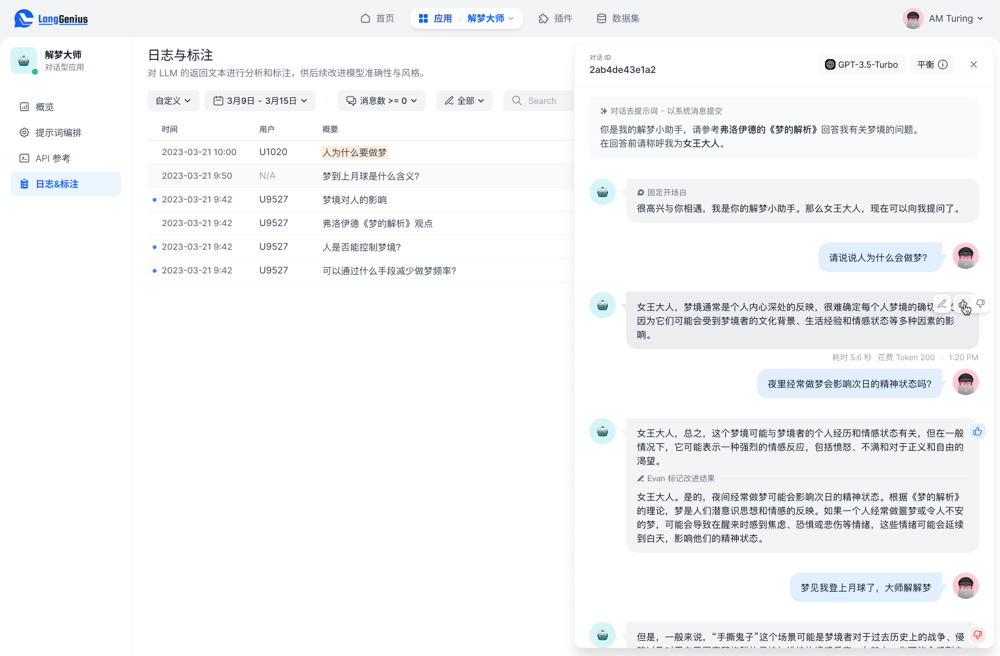

# 日誌與標註


請確保您的應用在收集用戶數據時遵守當地法規。通常的做法是發佈隱私政策並徵得用戶的同意。


日誌（Logs）功能用以觀察與標記 Dify 應用的工作表現，Dify 為應用的全部交互過程記錄了日誌，無論你是通過 WebApp 或 API 調用的，如果你是 Prompt 工程師或 LLM 運營人員，它將為你提供可視化的 LLM 應用運營體驗。

### 使用日誌控制檯

你可以在應用的左側導航找到**日誌（Logs）**，該頁面通常展示了：

* 所選時間內用戶與用戶的交互記錄
* 用戶輸入與 AI 輸出的結果，對於對話型應用通常是一系列的消息流
* 用戶、運營人員的評價，以及運營人員的改進標註

注意，如果團隊中的多位協作者對同一條日誌進行標註，最後標註的記錄將覆蓋此前的標註。

### 改進標註


這些標記將在 Dify 的後續版本中供模型微調使用，以提升模型的準確性與回覆風格，當前預覽版僅支持標記。


<figure><figcaption>
標記日誌以改進
</figcaption></figure>

點擊一條日誌會在界面右側打開日誌詳情面板，在該面板中運營人員可以對一次互動進行標註：

* 對錶現較佳的消息點贊
* 對錶現不佳的消息點踩
* 對改進的結果標記改進回覆，這代表了你期望 AI 回覆的文本

注意，如果團隊中的多位管理員對同一條日誌進行標註，最後標註的記錄將覆蓋此前的標註。
