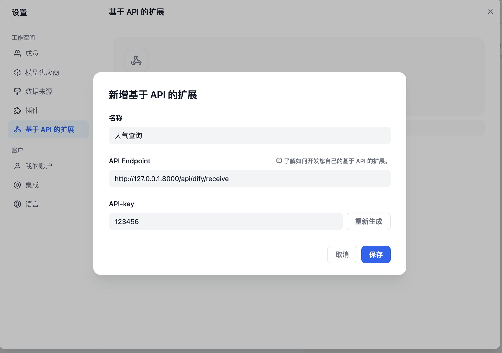

# API 擴展

開發者可通過 API 擴展模塊能力，當前支持以下模塊擴展：

* `moderation` 敏感內容審計
* `external_data_tool` 外部數據工具

在擴展模塊能力之前，您需要準備一個 API 和用於鑑權的 API Key（也可由 Dify 自動生成，可選）。

除了需要開發對應的模塊能力，還需要遵照以下規範，以便 Dify 正確調用 API。

<figure><figcaption><p>基於 API 擴展</p></figcaption></figure>

### API 規範 <a href="#usercontentapi-gui-fan" id="usercontentapi-gui-fan"></a>

Dify 將會以以下規範調用您的接口：

```
POST {Your-API-Endpoint}
```

#### Header <a href="#user-content-header" id="user-content-header"></a>

| Header          | Value             | Desc                                                                  |
| --------------- | ----------------- | --------------------------------------------------------------------- |
| `Content-Type`  | application/json  | 請求內容為 JSON 格式。                                                        |
| `Authorization` | Bearer {api\_key} | API Key 以 Token 令牌的方式傳輸，您需要解析該 `api_key` 並確認是否和提供的 API Key 一致，保證接口安全。 |

#### Request Body <a href="#user-content-request-body" id="user-content-request-body"></a>

```
{
    "point":  string, //  擴展點，不同模塊可能包含多個擴展點
    "params": {
        ...  // 各模塊擴展點傳入參數
    }
}
```

#### API 返回 <a href="#usercontentapi-fan-hui" id="usercontentapi-fan-hui"></a>

```
{
    ...  // API 返回的內容，不同擴展點返回見不同模塊的規範設計
}
```

### 校驗 <a href="#usercontent-xiao-yan" id="usercontent-xiao-yan"></a>

在 Dify 配置 API-based Extension 時，Dify 將會發送一個請求至 API Endpoint，以檢驗 API 的可用性。

當 API Endpoint 接收到 `point=ping` 時，接口應返回 `result=pong`，具體如下：

#### Header <a href="#user-content-header-1" id="user-content-header-1"></a>

```
Content-Type: application/json
Authorization: Bearer {api_key}
```

#### Request Body <a href="#user-content-request-body-1" id="user-content-request-body-1"></a>

```
{
    "point": "ping"
}
```

#### API 期望返回 <a href="#usercontentapi-qi-wang-fan-hui" id="usercontentapi-qi-wang-fan-hui"></a>

```
{
    "result": "pong"
}
```

### 範例 <a href="#usercontent-fan-li" id="usercontent-fan-li"></a>

此處以外部數據工具為例，場景為根據地區獲取外部天氣信息作為上下文。

#### API 範例 <a href="#usercontentapi-fan-li" id="usercontentapi-fan-li"></a>

```
POST https://fake-domain.com/api/dify/receive
```

**Header**

```
Content-Type: application/json
Authorization: Bearer 123456
```

**Request Body**

```
{
    "point": "app.external_data_tool.query",
    "params": {
        "app_id": "61248ab4-1125-45be-ae32-0ce91334d021",
        "tool_variable": "weather_retrieve",
        "inputs": {
            "location": "London"
        },
        "query": "How's the weather today?"
    }
}
```

**API 返回**

```
{
    "result": "City: London\nTemperature: 10°C\nRealFeel®: 8°C\nAir Quality: Poor\nWind Direction: ENE\nWind Speed: 8 km/h\nWind Gusts: 14 km/h\nPrecipitation: Light rain"
}
```

#### 代碼範例 <a href="#usercontent-dai-ma-fan-li" id="usercontent-dai-ma-fan-li"></a>

代碼基於 Python FastAPI 框架。

1.  安裝依賴

    ```
    pip install fastapi[all] uvicorn
    ```
2.  按照接口規範編寫代碼

    ```
    from fastapi import FastAPI, Body, HTTPException, Header
    from pydantic import BaseModel

    app = FastAPI()


    class InputData(BaseModel):
        point: str
        params: dict = {}


    @app.post("/api/dify/receive")
    async def dify_receive(data: InputData = Body(...), authorization: str = Header(None)):
        """
        Receive API query data from Dify.
        """
        expected_api_key = "123456"  # TODO Your API key of this API
        auth_scheme, _, api_key = authorization.partition(' ')

        if auth_scheme.lower() != "bearer" or api_key != expected_api_key:
            raise HTTPException(status_code=401, detail="Unauthorized")

        point = data.point

        # for debug
        print(f"point: {point}")

        if point == "ping":
            return {
                "result": "pong"
            }
        if point == "app.external_data_tool.query":
            return handle_app_external_data_tool_query(params=data.params)
        # elif point == "{point name}":
            # TODO other point implementation here

        raise HTTPException(status_code=400, detail="Not implemented")


    def handle_app_external_data_tool_query(params: dict):
        app_id = params.get("app_id")
        tool_variable = params.get("tool_variable")
        inputs = params.get("inputs")
        query = params.get("query")

        # for debug
        print(f"app_id: {app_id}")
        print(f"tool_variable: {tool_variable}")
        print(f"inputs: {inputs}")
        print(f"query: {query}")

        # TODO your external data tool query implementation here, 
        #  return must be a dict with key "result", and the value is the query result
        if inputs.get("location") == "London":
            return {
                "result": "City: London\nTemperature: 10°C\nRealFeel®: 8°C\nAir Quality: Poor\nWind Direction: ENE\nWind "
                          "Speed: 8 km/h\nWind Gusts: 14 km/h\nPrecipitation: Light rain"
            }
        else:
            return {"result": "Unknown city"}
    ```
3.  啟動 API 服務，默認端口為 8000，API 完整地址為：`http://127.0.0.1:8000/api/dify/receive`，配置的 API Key 為 `123456`。

    <pre><code><strong>uvicorn main:app --reload --host 0.0.0.0
    </strong></code></pre>
4. 在 Dify 配置該 API。

<figure><figcaption><p>配置 API</p></figcaption></figure>

5. 在 App 中選擇該 API 擴展。

<figure><figcaption><p>選擇擴展</p></figcaption></figure>

App 調試時，Dify 將請求配置的 API，併發送以下內容（範例）：

```
{
    "point": "app.external_data_tool.query",
    "params": {
        "app_id": "61248ab4-1125-45be-ae32-0ce91334d021",
        "tool_variable": "weather_retrieve",
        "inputs": {
            "location": "London"
        },
        "query": "How's the weather today?"
    }
}
```

API 返回為：

```
{
    "result": "City: London\nTemperature: 10°C\nRealFeel®: 8°C\nAir Quality: Poor\nWind Direction: ENE\nWind Speed: 8 km/h\nWind Gusts: 14 km/h\nPrecipitation: Light rain"
}
```

### 本地調試

由於 Dify 雲端版無法訪問內網 API 服務，為了方便本地調試 API 服務，可以使用 [Ngrok](https://ngrok.com) 將 API 服務的端點暴露到公網，實現雲端調試本地代碼。操作步驟：

1.  進入 [https://ngrok.com](https://ngrok.com) 官網，註冊並下載 Ngrok 文件。

    <figure><figcaption><p>Download</p></figcaption></figure>
2. 下載完成後，進入下載目錄，根據下方說明解壓壓縮包，並執行說明中的初始化腳本。
   * ```Shell
     $ unzip /path/to/ngrok.zip
     $ ./ngrok config add-authtoken 你的Token
     ```
3. 查看本地 API 服務的端口：

<figure><figcaption><p>查看端口</p></figcaption></figure>

並運行以下命令啟動：

*   ```Shell
    $ ./ngrok http 端口號
    ```

    啟動成功的樣例如下：

<figure><figcaption><p>Ngrok 啟動</p></figcaption></figure>

4. 我們找到 Forwarding 中，如上圖：`https://177e-159-223-41-52.ngrok-free.app`（此為示例域名，請替換為自己的）即為公網域名。

* 按照上述的範例，我們把本地已經啟動的服務端點暴露出去，將代碼範例接口：`http://127.0.0.1:8000/api/dify/receive` 替換為 `https://177e-159-223-41-52.ngrok-free.app/api/dify/receive`

此 API 端點即可公網訪問。至此，我們即可在 Dify 配置該 API 端點進行本地調試代碼，配置步驟請參考 [外部數據工具](../../knowledge-base/external-data-tool.md "mention")。

### 使用 Cloudflare Workers 部署 API 擴展

我們推薦你使用 Cloudflare Workers 來部署你的 API 擴展，因為 Cloudflare Workers 可以方便的提供一個公網地址，而且可以免費使用。

[cloudflare-workers.md](cloudflare-workers.md "mention")。
