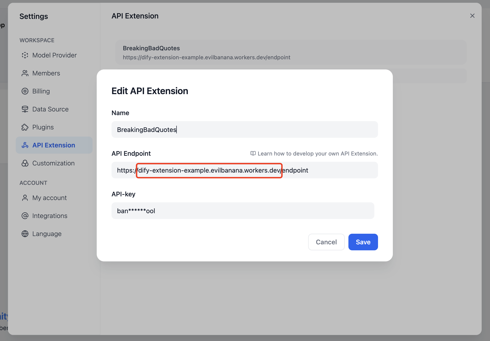
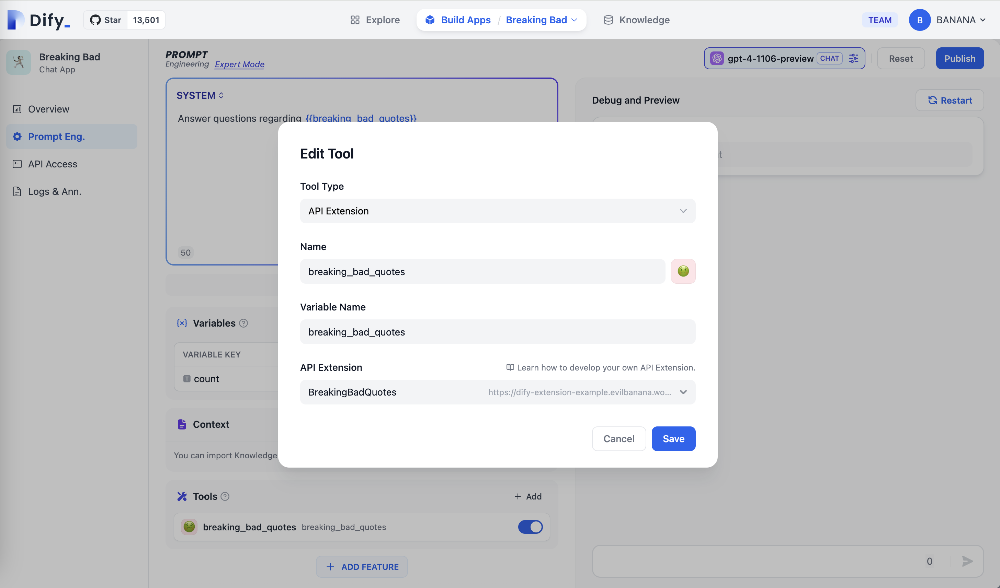

# 使用 Cloudflare Workers 部署 API Tools

## 開始

因為 Dify API Extension 需要使用可以訪問的公網地址作為 API Endpoint，所以我們需要將 API 擴展部署到一個公網地址上。這裡我們使用 Cloudflare Workers 來部署我們的 API 擴展。

我們 Clone [Example GitHub Repository](https://github.com/crazywoola/dify-extension-workers)，這個倉庫包含了一個簡單的 API 擴展，我們可以在這個基礎上進行修改。

```bash
git clone https://github.com/crazywoola/dify-extension-workers.git
cp wrangler.toml.example wrangler.toml
```

打開 `wrangler.toml` 文件，修改 `name` 和 `compatibility_date` 為你的應用名稱和兼容日期。

這裡我們我們需要注意的配置就是 `vars` 裡面的 `TOKEN`，在 Dify 添加 API 擴展的時候，我們需要填寫這個 Token。出於安全考慮，我們建議你使用一個隨機的字符串作為 Token，你不應該在源代碼中直接寫入 Token，而是使用環境變量的方式來傳遞 Token。所以請不要把 wrangler.toml 提交到你的代碼倉庫中。

```toml
name = "dify-extension-example"
compatibility_date = "2023-01-01"

[vars]
TOKEN = "bananaiscool"
```

這個 API 擴展會返回一個隨機的 Breaking Bad 名言。你可以在 `src/index.ts` 中修改這個 API 擴展的邏輯。這個例子展示了與第三方 API 進行交互的方式。

```typescript
// ⬇️ implement your logic here ⬇️
// point === "app.external_data_tool.query"
// https://api.breakingbadquotes.xyz/v1/quotes
const count = params?.inputs?.count ?? 1;
const url = `https://api.breakingbadquotes.xyz/v1/quotes/${count}`;
const result = await fetch(url).then(res => res.text())
// ⬆️ implement your logic here ⬆️
```

這個倉庫簡化了除了業務邏輯之外所有的配置，你可以直接使用 `npm` 命令來部署你的 API 擴展。

```bash
npm run deploy
```

部署成功之後，你會得到一個公網地址，你可以在 Dify 中添加這個地址作為 API Endpoint。請注意不要遺漏 `endpoint` 這個路徑。

<figure><figcaption><p>在 Dify 中添加 API Endpoint</p></figcaption></figure>

<figure><figcaption><p>在 App 編輯頁面中添加上 API Tool</p></figcaption></figure>

## 其他邏輯 TL;DR

### 關於 Bearer Auth

```typescript
import { bearerAuth } from "hono/bearer-auth";

(c, next) => {
    const auth = bearerAuth({ token: c.env.TOKEN });
    return auth(c, next);
},
```

我們的 Bearer 校驗邏輯在如上代碼中，我們使用了 `hono/bearer-auth` 這個包來實現 Bearer 校驗。你可以在 `src/index.ts` 中使用 `c.env.TOKEN` 來獲取 Token。

### 關於參數驗證

```typescript
import { z } from "zod";
import { zValidator } from "@hono/zod-validator";

const schema = z.object({
  point: z.union([
    z.literal("ping"),
    z.literal("app.external_data_tool.query"),
  ]), // Restricts 'point' to two specific values
  params: z
    .object({
      app_id: z.string().optional(),
      tool_variable: z.string().optional(),
      inputs: z.record(z.any()).optional(),
      query: z.any().optional(),  // string or null
    })
    .optional(),
});

```

我們這裡使用了 `zod` 來定義參數的類型，你可以在 `src/index.ts` 中使用 `zValidator` 來校驗參數。通過 `const { point, params } = c.req.valid("json");` 來獲取校驗後的參數。 我們這裡的 point 只有兩個值，所以我們使用了 `z.union` 來定義。 params 是一個可選的參數，所以我們使用了 `z.optional` 來定義。 其中會有一個 `inputs` 的參數，這個參數是一個 `Record<string, any>` 類型，這個類型表示一個 key 為 string，value 為 any 的對象。這個類型可以表示任意的對象，你可以在 `src/index.ts` 中使用 `params?.inputs?.count` 來獲取 `count` 參數。

### 獲取 Cloudflare Workers 的日誌

```bash
wrangler tail
```

## 參考內容

* [Cloudflare Workers](https://workers.cloudflare.com/)
* [Cloudflare Workers CLI](https://developers.cloudflare.com/workers/cli-wrangler/install-update)
* [Example GitHub Repository](https://github.com/crazywoola/dify-extension-workers)
