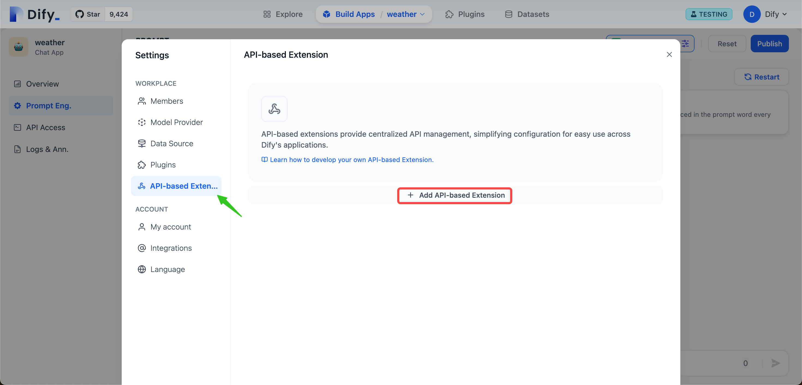
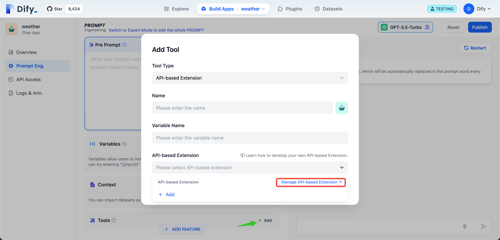
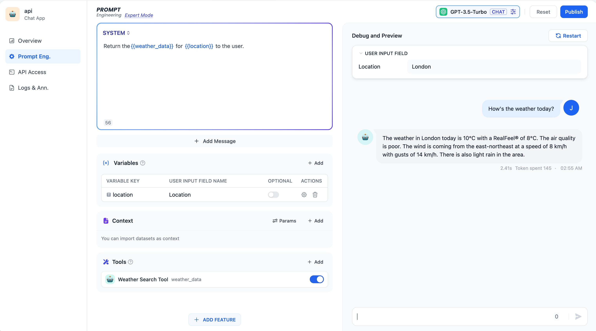
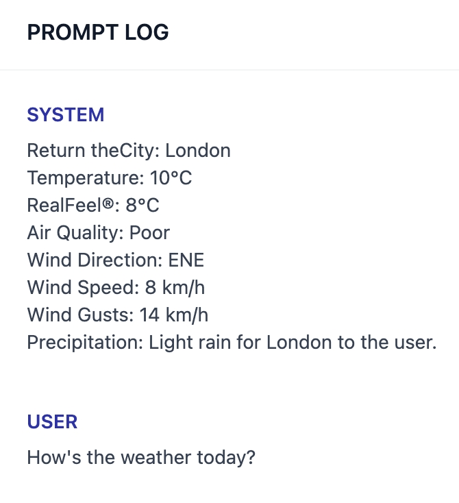

# 外部數據工具

## 功能介紹

此前 [.](./ "mention") 功能允許開發者可以直接上傳各類格式的長文本、結構化數據來構建數據集，使 AI 應用基於用戶上傳的最新上下文進行對話。

而本次更新的**外部數據工具**賦能開發者可以使用自有的搜索能力或內部知識庫等外部數據作為 LLM 的上下文，通過 API 擴展的方式實現外部數據的獲取並嵌入提示詞。相比在雲端上傳數據集，使用**外部數據工具**可以在保障私有數據安全，自定義搜索，獲取實時數據等方面有顯著優勢。

## 具體實現

當終端用戶向對話系統提出請求時，平臺後端會觸發外部數據工具（即調用自己的 API），它會查詢用戶問題相關的外部信息，如員工資料、實時記錄等，通過 API 返回與當前請求相關的部分。平臺後端會將返回的結果組裝成文本作為上下文注入到提示詞中，以輸出更加個性化和符合用戶需求的回覆內容。

## 操作說明

1. 在使用外部數據工具之前，你需要準備一個 API 和用於鑑權的 API Key，請閱讀[external-data-tool.md](../extension/api-based-extension/external-data-tool.md "mention")
2. Dify 提供了集中式的 API 管理，在設置界面統一添加 API 擴展配置後，即可在 Dify 上的各類應用中直接使用。

<figure><figcaption>
API-based Extension
</figcaption></figure>

3. 我們以“查詢天氣”為例，在“新增基於 API 的擴展”對話框輸入名字，API 端點，API Key。保存後我們就可以調用 API 了。

<figure><figcaption>
Weather Inquiry
</figcaption></figure>

4. 在提示詞編排頁面，點擊“工具”右側的“+添加”按鈕，在打開的“添加 工具”對話框，填寫名稱和變量名稱（變量名稱會被引用到提示詞中，請填寫英文），以及選擇第 2 步中已經添加的基於 API 的擴展。

<figure><figcaption>
External_data_tool
</figcaption></figure>

5. 這樣，我們在提示詞編排框就可以把查詢到的外部數據拼裝到提示詞中。比如我們要查詢今天的倫敦天氣，可以添加`location` 變量，輸入"London"，結合外部數據工具的擴展變量名稱`weather_data`，調試輸出如下：

<figure><figcaption>
Weather_search_tool
</figcaption></figure>

在對話日誌中，我們也可以看到 API 返回的實時數據：

<figure><figcaption>
Prompt Log
</figcaption></figure>
