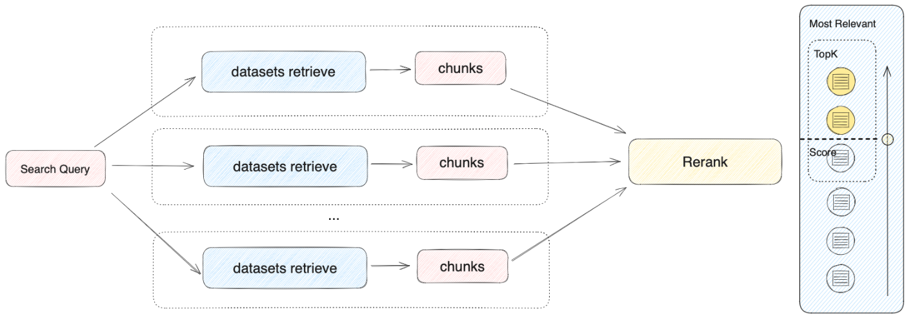
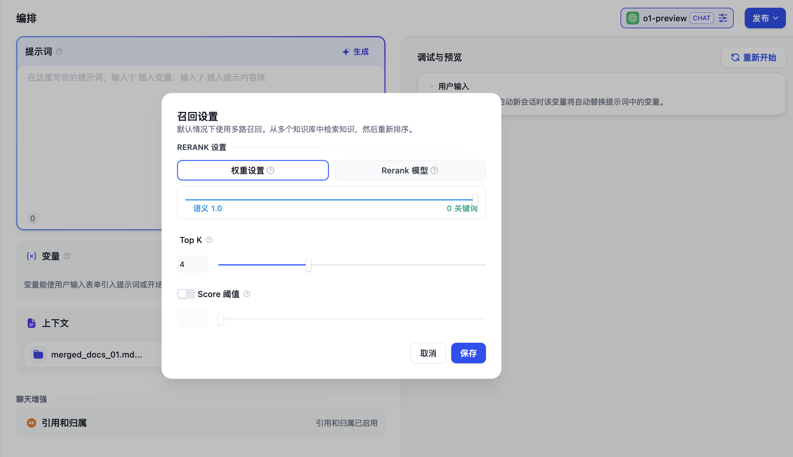
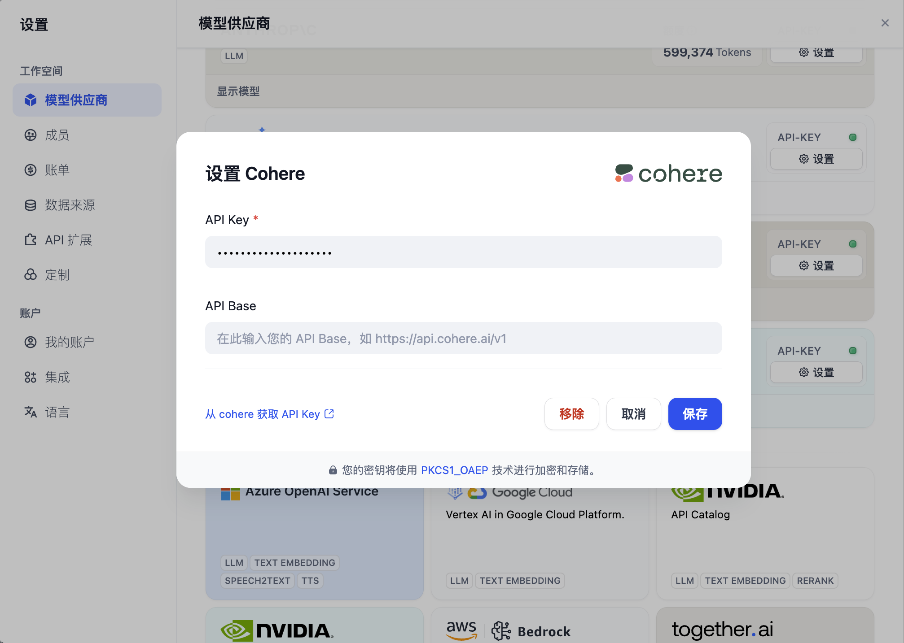

# 在應用內集成知識庫

知識庫可以作為外部知識提供給大語言模型用於精確回覆用戶問題，你可以在 Dify 的[所有應用類型](../application-orchestrate/#application\_type)內關聯已創建的知識庫。

以聊天助手為例，使用流程如下：

1. 進入 **工作室 -- 創建應用 --創建聊天助手**
2. 進入 **上下文設置** 點擊 **添加** 選擇已創建的知識庫
3. 在 **上下文設置 -- 參數設置** 內配置**召回策略**
4. 在 **添加功能** 內打開 **引用和歸屬**
5. 在 **調試與預覽** 內輸入與知識庫相關的用戶問題進行調試
6. 調試完成之後**保存併發布**為一個 AI 知識庫問答類應用

***

### 關聯知識庫並指定召回模式

如果當前應用的上下文涉及多個知識庫，需要設置召回模式以使得檢索的內容更加精確。進入 **上下文 -- 參數設置 -- 召回設置**。

#### 召回設置

檢索器會在所有與應用關聯的知識庫中去檢索與用戶問題相關的文本內容，並將多路召回的相關文檔結果合併，以下是召回策略的技術流程圖：

<figure><figcaption></figcaption></figure>

根據用戶意圖同時檢索所有添加至 **“上下文”** 的知識庫，在多個知識庫內查詢相關文本片段，選擇所有和用戶問題相匹配的內容，最後通過 Rerank 策略找到最適合的內容並回答用戶。該方法的檢索原理更為科學。

<figure><figcaption></figcaption></figure>

舉例：A 應用的上下文關聯了 K1、K2、K3 三個知識庫，當用戶輸入問題後，將在三個知識庫內檢索並彙總多條內容。為確保能找到最匹配的內容，需要通過 Rerank 策略確定與用戶問題最相關的內容，確保結果更加精準與可信。

在實際問答場景中，每個知識庫的內容來源和檢索方式可能都有所差異。針對檢索返回的多條混合內容，[Rerank 策略](https://docs.dify.ai/v/zh-hans/learn-more/extended-reading/retrieval-augment/rerank)是一個更加科學的內容排序機制。它可以幫助確認候選內容列表與用戶問題的匹配度，改進多個知識間排序的結果以找到最匹配的內容，提高回答質量和用戶體驗。

考慮到 Rerank 的使用成本和業務需求，多路召回模式提供了以下兩種 Rerank 設置：

**權重設置**

該設置無需配置外部 Rerank 模型，重排序內容**無需額外花費**。可以通過調整語義或關鍵詞的權重比例條，選擇最適合的內容匹配策略。

*   **語義值為 1**

    僅啟用語義檢索模式。藉助 Embedding 模型，即便知識庫中沒有出現查詢中的確切詞彙，也能通過計算向量距離的方式提高搜索的深度，返回正確內容。此外，當需要處理多語言內容時，語義檢索能夠捕捉不同語言之間的意義轉換，提供更加準確的跨語言搜索結果。

    > 語義檢索指的是比對用戶問題與知識庫內容中的向量距離。距離越近，匹配的概率越大。參考閱讀：[《Dify：Embedding 技術與 Dify 數據集設計/規劃》](https://mp.weixin.qq.com/s/vmY\_CUmETo2IpEBf1nEGLQ)。
*   **關鍵詞值為 1**

    僅啟用關鍵詞檢索模式。通過用戶輸入的信息文本在知識庫全文匹配，適用於用戶知道確切的信息或術語的場景。該方法所消耗的計算資源較低，適合在大量文檔的知識庫內快速檢索。
*   **自定義關鍵詞和語義權重**

    除了僅啟用語義檢索或關鍵詞檢索模式，我們還提供了靈活的自定義權重設置。你可以通過不斷調試二者的權重，找到符合業務場景的最佳權重比例。

**Rerank 模型**

Rerank 模型是一種外部評分系統，它會計算用戶問題與給定的每個候選文檔之間的相關性分數，從而改進語義排序的結果，並按相關性返回從高到低排序的文檔列表。

雖然此方法會產生一定的額外花費，但是更加擅長處理知識庫內容來源複雜的情況，例如混合了語義查詢和關鍵詞匹配的內容，或返回內容存在多語言的情況。

> 點擊瞭解更多[重排序](https://docs.dify.ai/v/zh-hans/learn-more/extended-reading/retrieval-augment/rerank)機制。

Dify 目前支持多個 Rerank 模型，進入 “模型供應商” 頁填入 Rerank 模型（例如 Cohere、Jina AI 等模型）的 API Key。

<figure><figcaption>
在模型供應商內配置 Rerank 模型
</figcaption></figure>

**可調參數**

*   **TopK**

    用於篩選與用戶問題相似度最高的文本片段。系統同時會根據選用模型上下文窗口大小，動態調整分段數量。數值越高，預期被召回的文本分段數量越多。
*   **Score 閾值**

    用於設置文本片段篩選的相似度閾值。向量檢索的相似度分數需要超過設置的分數後才會被召回，數值越高，預期被召回的文本數量越少。

多路召回模式在多知識庫檢索時能夠獲得質量更高的召回效果，因此更**推薦將召回模式設置為多路召回**。

### 常見問題

1. **如何選擇多路召回中的 Rerank 設置？**

如果用戶知道確切的信息或術語，可以通過關鍵詞檢索精確發揮匹配結果，那麼請將 “權重設置” 中的**關鍵詞設置為 1**。

如果知識庫內並未出現確切詞彙，或者存在跨語言查詢的情況，那麼推薦使用 “權重設置” 中的**語義設置為 1**。

如果業務人員對於用戶的實際提問場景比較熟悉，想要主動調整語義或關鍵詞的比值，那麼推薦自行調整 “權重設置” 裡的比值。

如果知識庫內容較為複雜，無法通過語義或關鍵詞等簡單條件進行匹配，同時要求較為精準的回答，願意支付額外的費用，那麼推薦使用 **Rerank 模型** 進行內容檢索。

2. **為什麼會出現找不到 “權重設置” 或要求必須配置 Rerank 模型等情況，應該如何處理？**

以下是知識庫檢索方式對文本召回的影響情況：

3. **引用多個知識庫時，無法調整 “權重設置”，提示錯誤應如何處理？**

出現此問題是因為上下文內所引用的多個知識庫內所使用的嵌入模型（Embedding）不一致，為避免檢索內容衝突而出現此提示。推薦設置在“模型供應商”內設置並啟用 Rerank 模型，或者統一知識庫的檢索設置。

4. **為什麼在多路召回模式下找不到“權重設置”選項，只能看到 Rerank 模型？**

請檢查你的知識庫是否使用了“經濟”型索引模式。如果是，那麼將其切換為“高質量”索引模式。
