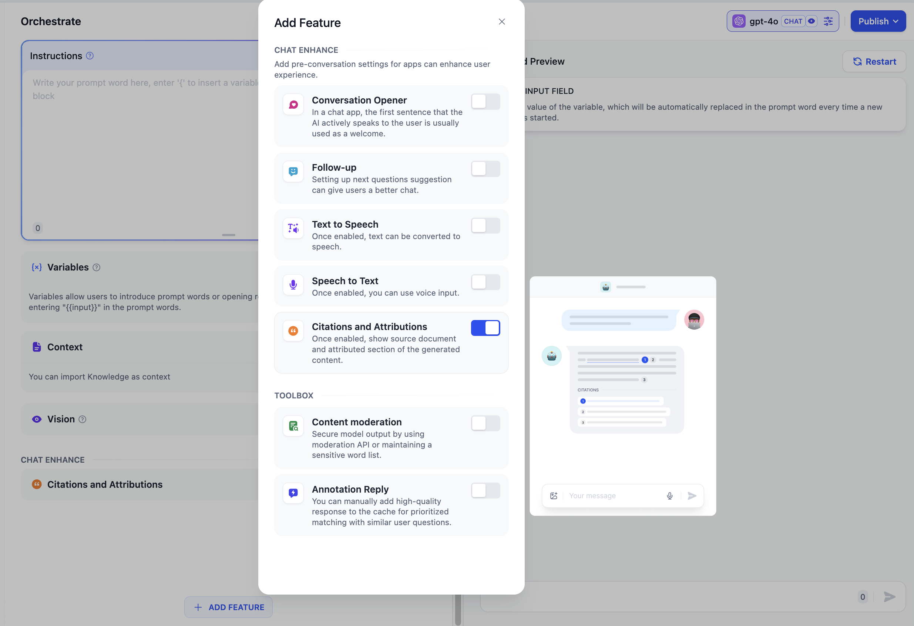

# 召回測試/引用歸屬

### 1 召回測試

Dify 知識庫內提供了文本召回測試的功能，用於調試不同檢索方式及參數配置下的召回效果。你可以在 **源文本** 輸入框輸入常見的用戶問題，點擊 **測試** 並在右側的 **召回段落** 查看召回結果。在 **最近查詢** 內可以查看到歷史的查詢記錄；若知識庫已關聯至應用內，由應用內觸發的知識庫查詢也可以在此查看記錄。

<figure><figcaption>
召回測試
</figcaption></figure>

點擊源文本輸入框右上角的圖標可以更換當前知識庫的檢索方式和具體參數，**保存之後僅在召回測試的調試過程中生效**。在召回測試完成調試並確認更改知識庫的檢索參數時，需要在 [知識庫設置 > 檢索設置](create-knowledge-and-upload-documents/#id-6-jian-suo-she-zhi) 中進行更改。

<figure><figcaption>
召回測試-檢索設置
</figcaption></figure>

**召回測試建議步驟：**

1. 設計和整理覆蓋常見用戶問題的測試用例/測試問題集；
2. 選擇合適的檢索策略：向量檢索/全文檢索/混合檢索，不同檢索方式的優缺點，請參考擴展閱讀[檢索增強生成（RAG）](../../learn-more/extended-reading/retrieval-augment/)；
3. 調試召回分段數量（TopK）和召回分數閾值（Score），需根據應用場景、包括文檔本身的質量來選擇合適的參數組合。

**TopK 值和召回閾值（Score ）如何配置**

* **TopK 代表按相似分數倒排時召回分段的最大個數**。TopK 值調小，將會召回更少分段，可能導致召回的相關文本不全；TopK 值調大，將召回更多分段，可能導致召回語義相關性較低的分段使得 LLM 回覆質量降低。
* **召回閾值（Score）代表允許召回分段的最低相似分數。** 召回分數調小，將會召回更多分段，可能導致召回相關度較低的分段；召回分數閾值調大，將會召回更少分段，過大時將會導致丟失相關分段。

***

### 2 引用與歸屬

在應用內測試知識庫效果時，你可以進入 **工作室 -- 添加功能 -- 引用歸屬**，打開引用歸屬功能。

<figure><figcaption>
打開引用與歸屬功能
</figcaption></figure>

開啟功能後，當 LLM 引用知識庫內容來回答問題時，可以在回覆內容下面查看到具體的引用段落信息，包括**原始分段文本、分段序號、匹配度**等。點擊引用分段上方的 \*\*跳轉至知識庫 ，\*\*可以快捷訪問該分段所在的知識庫分段列表，方便開發者進行調試編輯。

<figure><figcaption>
查看回復內容的引用信息
</figcaption></figure>
