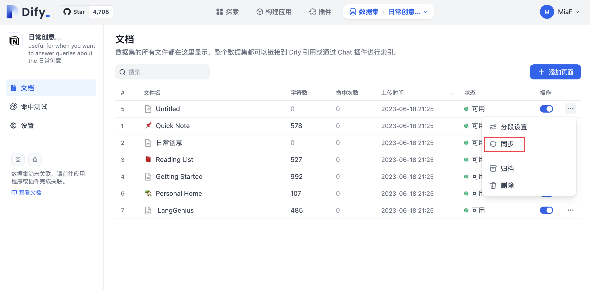

# 從 Notion 導入數據

Dify 知識庫支持從 Notion 導入，並設置 **同步** 使得數據在 Notion 更新後便自動同步到 Dify。

### 授權驗證

1. 在創建數據集，選擇數據源時，點擊 **同步自 Notion 內容-- 去綁定，根據提示完成授權驗證。**
2. 你也可以：進入 **設置 -- 數據來源 -- 添加數據源** 中點擊 Notion 來源 **綁定** ，完成授權驗證。

<figure><figcaption>
綁定 Notion
</figcaption></figure>

### 導入 Notion 數據

完成驗證授權後，進入創建數據集頁面，點擊 \*\*同步自 Notion 內容 ，\*\*選擇需要的授權頁面進行導入。

### 進行分段和清洗

接下來，選擇你的**分段設置**和**索引方式**，**保存並處理**。等待 Dify 為你處理這些數據，通常該步驟在 LLM 供應商中需要消耗 Token。Dify 不僅支持普通類型頁面導入，並且會將 database 類型下的頁面屬性進行彙總保存。

_**請注意：圖片和文件暫不支持導入，表格類數據會被轉換為文本展示。**_

### 同步 Notion 數據

如果您的 Notion 內容有修改，您可以直接在 Dify 數據集 **文檔列表頁**中點擊 **同步** 即可進行數據一鍵同步，該步驟是需要消耗 Token。

<figure><figcaption>
同步 Notion 內容
</figcaption></figure>

### 社區版 Notion 的集成配置方法

Notion集成分為**內部集成**（internal integration）和**外部集成**（public integration）兩種方式。可按需在 Dify 裡配置。兩種集成方式的具體區別請參閱 [Notion 官方文檔](https://developers.notion.com/docs/authorization)。

### 1、**使用 internal 集成方式**

首先，在集成的設置頁面中[創建集成](https://www.notion.so/my-integrations)。默認情況下，所有集成都以內部集成開始；內部集成將與您選擇的工作區相關聯，因此您需要是工作區所有者才能創建集成。

具體操作步驟：

點擊“**New integration**”按鈕，類型默認是 **Internal**（不可修改），選擇關聯的空間，輸入集成名稱並上傳 logo 後，點擊“Submit”，集成創建成功。

<figure><figcaption></figcaption></figure>

創建集成後，您可以根據需要在 Capabilities 選項卡下更新其設置，並在 Secrets 下點擊 “Show” 按鈕然後複製 Secrets。

<figure><figcaption></figcaption></figure>

複製後回到 Dify 源代碼下，在 **.env** 文件裡配置相關環境變量，環境變量如下：

**NOTION\_INTEGRATION\_TYPE** = internal or **NOTION\_INTEGRATION\_TYPE** = public

**NOTION\_INTERNAL\_SECRET**=you-internal-secret

### 2、**使用 Public 集成方式**

**需要將 internal 集成升級為 public 集成**，導航到集成的 Distribution 頁面，然後切換開關以公開集成。將開關切換到公共設置，您需要在下面的 Organization Information 表單中填寫其他信息，包括您的公司名稱、網站和重定向 URL 等信息，然後點擊“Submit”按鈕。

<figure><figcaption></figcaption></figure>

在集成的設置頁面中成功公開集成後，您將能夠在密鑰選項卡中訪問集成的密鑰：

<figure><figcaption></figcaption></figure>

回到 Dify 源代碼下，在 **.env** 文件裡配置相關環境變量，環境變量如下：

**NOTION\_INTEGRATION\_TYPE**=public

**NOTION\_CLIENT\_SECRET**=you-client-secret

**NOTION\_CLIENT\_ID**=you-client-id

配置完成後，即可在數據集中操作 Notion 的數據導入及同步功能。
