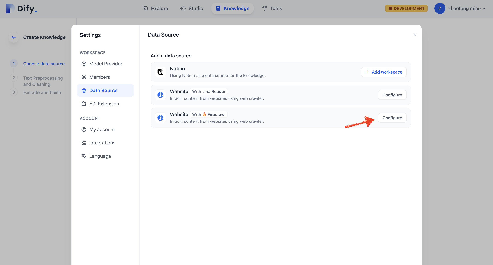
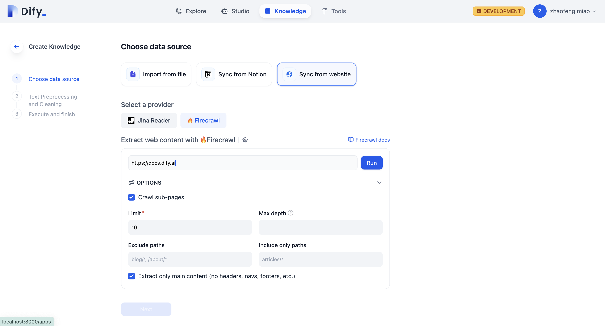
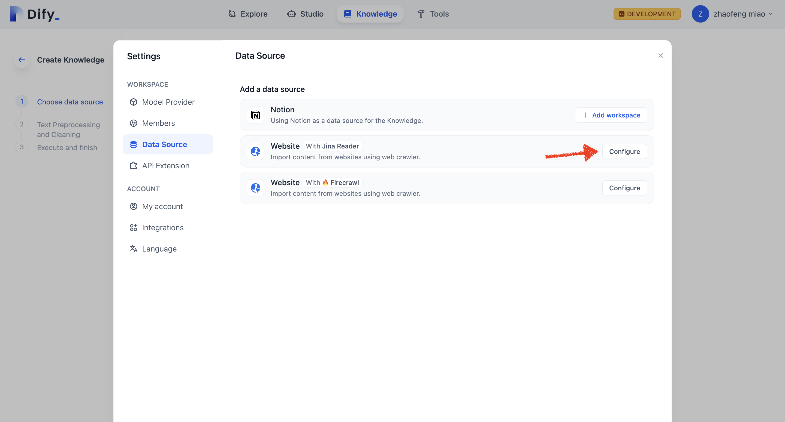
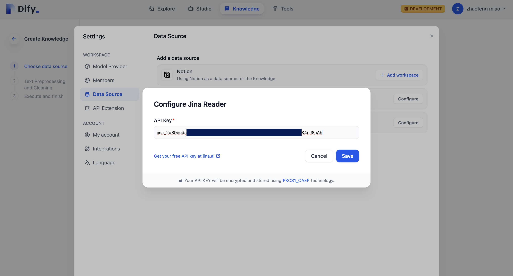
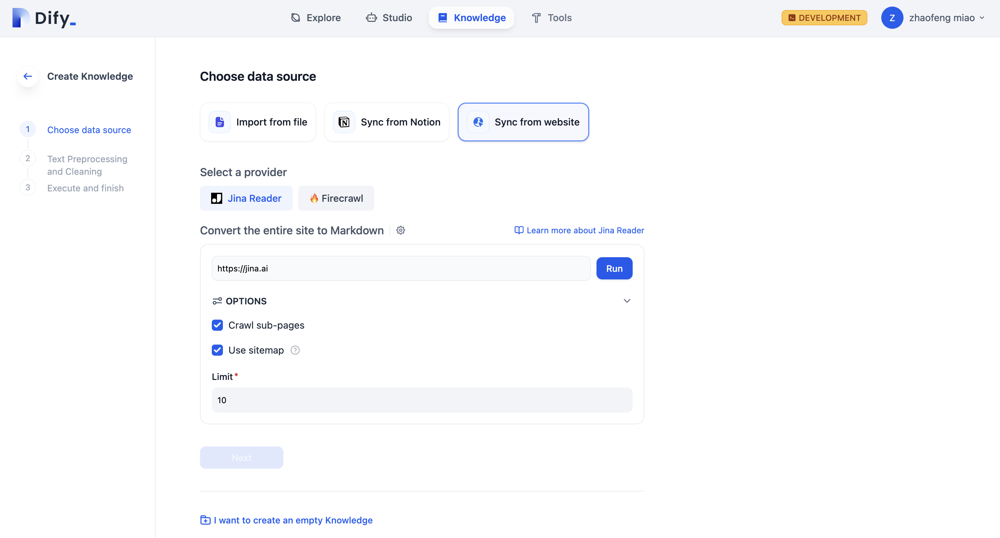
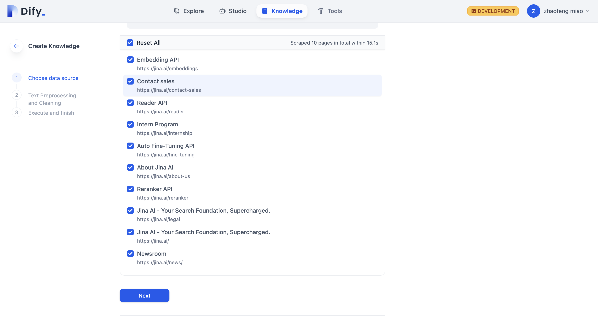
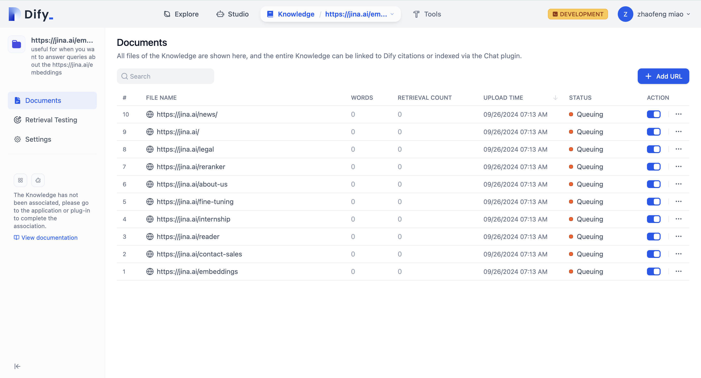

# 從網頁導入數據

Dify 知識庫支持通過第三方工具如 [Jina Reader](https://jina.ai/reader), [Firecrawl ](https://www.firecrawl.dev/)抓取公開網頁中的內容，解析為 Markdown 內容並導入至知識庫。


Jina Reader 和 Firecrawl 均是開源的網頁解析工具，能將網頁將其轉換為乾淨並且方便 LLM 識別的 Markdown 格式文本，同時提供了易於使用的 API 服務。


下文將分別介紹 Firecrawl 和 Jina Reader 的使用方法。

### Firecrawl

#### 配置 Firecrawl 憑據

點擊右上角頭像，然後前往 **DataSource** 頁面，點擊 Firecrawl 右側的 Configure 按鈕。

<figure><figcaption>
配置 Firecrawl
</figcaption></figure>

登錄 [Firecrawl 官網](https://www.firecrawl.dev/) 完成註冊，獲取 API Key 後填入並保存。

<figure><figcaption></figcaption></figure>

#### 使用 Firecrawl 抓取網頁內容

在知識庫創建頁選擇 **Sync from website**，provider 選中 Firecrawl，填入需要抓取的目標 URL。

<figure><figcaption>
網頁抓取配置
</figcaption></figure>

設置中的配置項包括：是否抓取子頁面、抓取頁面數量上限、頁面抓取深度、排除頁面、僅抓取頁面、提取內容。完成配置後點擊 **Run**，預覽將要被抓取的目標頁面鏈接。

<figure><figcaption>
執行抓取
</figcaption></figure>

導入網頁解析的文本後存儲至知識庫的文檔中，查看導入結果。點擊 **Add URL** 可以繼續導入新的網頁。

<figure><figcaption>
導入網頁解析文本至知識庫內
</figcaption></figure>

抓取完成後，網頁中的內容將會被收錄至知識庫內。

***

### Jina Reader

#### 配置 Jina Reader 憑據

點擊右上角頭像，然後前往 **DataSource** 頁面，點擊 Jina Reader 右側的 Configure 按鈕。

<figure><figcaption>
配置 Jina Reader
</figcaption></figure>

登錄[ Jina Reader 官網](https://jina.ai/reader) 完成註冊，獲取 API Key 後填入並保存。

<figure><figcaption>
填寫 Jina 配置
</figcaption></figure>

#### 使用  Jina Reader 抓取網頁內容

在知識庫創建頁選擇 **Sync from website**，provider 選中 Jina Reader，填寫需要抓取的目標 URL。

<figure><figcaption>
網頁抓取配置
</figcaption></figure>

設置中的配置項包括：是否抓取子頁面、抓取頁面數量上限、是否使用 sitemap 抓取。完成配置後點擊 **Run** 按鈕，預覽將要被抓取的頁面鏈接。

<figure><figcaption>
執行抓取
</figcaption></figure>

導入網頁解析的文本後存儲至知識庫的文檔中，查看導入結果。如需繼續添加網頁，輕點右側 **Add URL** 按鈕繼續導入新的網頁。

<figure><figcaption>
導入網頁解析文本至知識庫內
</figcaption></figure>

抓取完成後，網頁中的內容將會被收錄至知識庫內。
