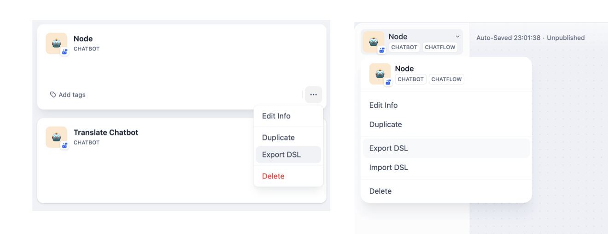
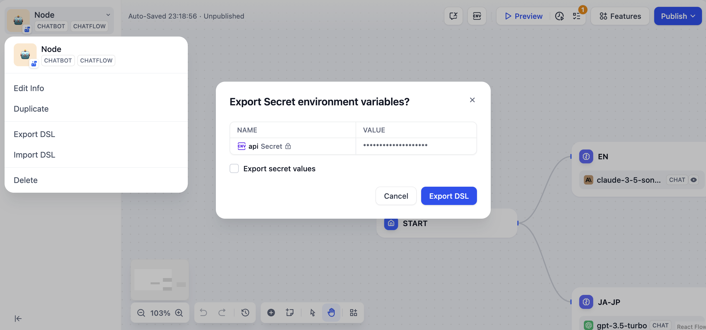

# 應用管理

### 編輯應用信息

創建應用後，如果你想要修改應用名稱或描述，可以點擊應用左上角的 「編輯信息」 ，重新修改應用的圖標、名稱或描述。

<figure><figcaption>
編輯應用信息
</figcaption></figure>

### 複製應用

應用均支持複製操作，點擊應用左上角的 「複製」。

### 導出應用

在 Dify 內創建的應用均支持以 DSL 格式進行導出，你可以自由地將配置文件導入至任意 Dify 團隊。

通過以下兩種方式導出 DSL 文件。

* 在 “工作室” 頁點擊應用菜單按鈕中 “導出 DSL”；
* 進入應用的編排頁後，點擊左上角 “導出 DSL”。

DSL 文件不包含自定義工具節點內已填寫的授權信息，例如第三方服務的 API Key；如果環境變量中包含 `Secret`類型變量，導出文件時將提示是否允許導出該敏感信息。


Dify DSL 格式文件是 Dify.AI 定義的 AI 應用工程文件標準，文件格式為 YML。該標準涵蓋應用的基本描述、模型參數、編排配置等信息。


### 刪除應用

如果你想要清理應用，可以點擊應用左上角的 「刪除」 。


⚠️ 應用的刪除操作無法撤銷，所有用戶將無法訪問你的應用，應用內的所有 Prompt、編排配置和日誌均會被刪除。

