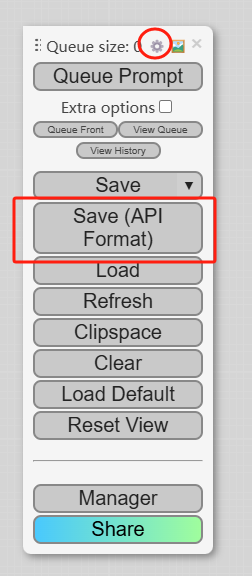

# ComfyUI
[ComfyUI](https://www.comfy.org/) 是一個強大的、模塊化的生成圖形的平臺。現在你可以在 Dify 中使用它， 傳入圖片的提示詞， 並得到生成的圖片。

## 1. 確保已能正常運行 ComfyUI 的工作流。  
請參考其[官方文檔](https://docs.comfy.org/get_started/gettingstarted)，確保 ComfyUI 可以正常運行並生成圖片。

## 2. 導出工作流的 API 文件。
<figure><figcaption></figcaption></figure>
如圖所示，在工具欄中選擇 `Save(API Format)`，如果沒有該選擇，則需要在設置中開啟 `Dev Mode`。

## 3. 在 Dify 中集成 ComfyUI  
在 `工具 > ComfyUI > 去認證` 中填寫訪問地址，如果您使用的 docker 部署的 Dify，這個地址一般是 `http://host.docker.internal:8188`。

## 4. 在 Dify 中使用 ComfyUI
打開其 `工作流` 工具，在 `WORKFLOW JSON` 中填入剛剛導出的 API 文件中的內容，就可以正常生成了。
