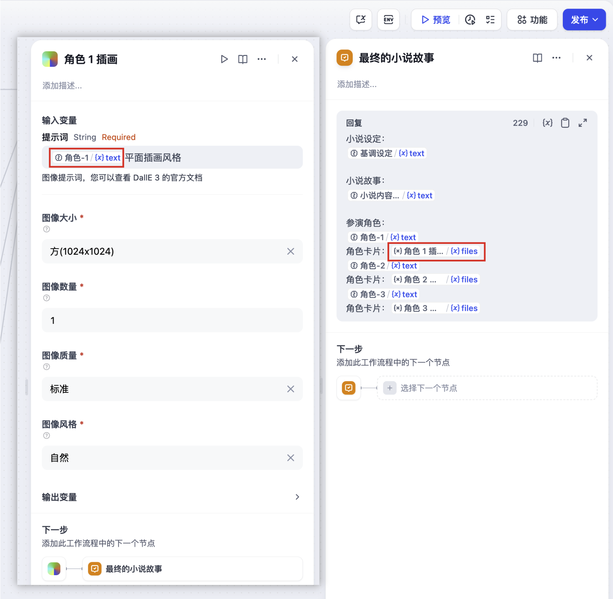

# Dall-e

> 工具作者 @Dify。

DALL-E 是由 OpenAI 開發的一種基於文本提示生成圖像的工具。Dify 已接入 DALL-E 工具，以下是在 Dify 中配置和使用 DALL-E 繪圖工具的步驟。

## 1. 申請 OpenAI 的 API Key

請在 [OpenAI Platform](https://platform.openai.com/)申請 API Key，並確保賬戶內有足夠的 Credits。

## 2. 在 Dify 內填寫配置

在 Dify 導航頁內輕點 `工具 > DALL-E > 去授權` 填寫 API Key。

## 3. 使用工具

* **Chatflow / Workflow 應用**

Chatflow 和 Workflow 應用均支持添加 `DALL-E 繪圖` 工具節點。添加後，需要在節點內的 “輸入變量 → 提示詞” 內填寫[變量](https://docs.dify.ai/v/zh-hans/guides/workflow/variables)引用用戶輸入的提示詞，或者是上一節點生成的內容。最後在 “結束” 節點內使用變量引用 `DALL-E 繪圖` 輸出的圖像。

* **Agent 應用**

在 Agent 應用內添加 `DALL-E` 工具，然後在對話框內發送圖片描述，調用工具生成 AI 圖像。

