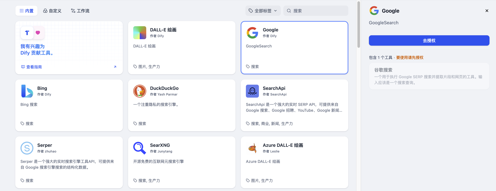

# Google

> 工具作者 @Dify。

Google 搜索工具能夠幫助你在使用 LLM 應用的時候，獲取聯網搜索結果。以下是在 Dify 中配置和使用 Google 搜索工具的步驟。

## 1. 申請 Serp API Key

請在 [Serp 平臺](https://serpapi.com/dashboard)申請 API Key。

## 2. 在 Dify 內填寫配置

在 Dify 導航頁內輕點 `工具 > Google > 去授權` 填寫 API Key。

## 3. 使用工具

你可以在以下應用類型中使用 Google 工具。

* **Chatflow / Workflow 應用**

Chatflow 和 Workflow 應用均支持添加 `Google` 工具節點。

* **Agent 應用**

在 Agent 應用內添加 `Google` 工具，然後輸入在線搜索指令，調用此工具。
