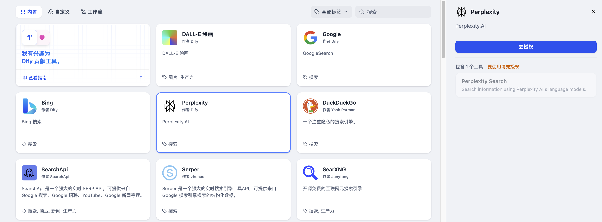
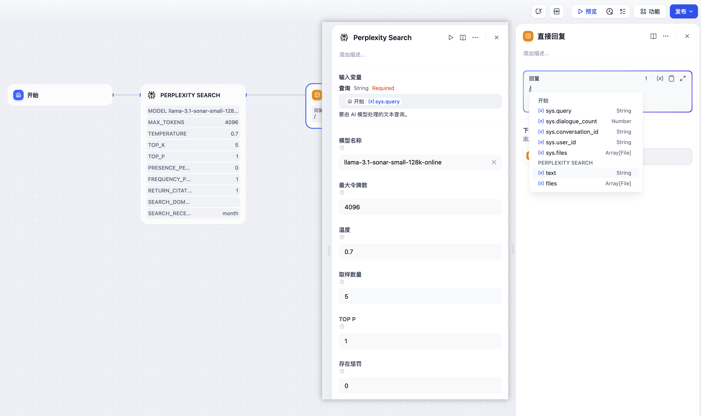
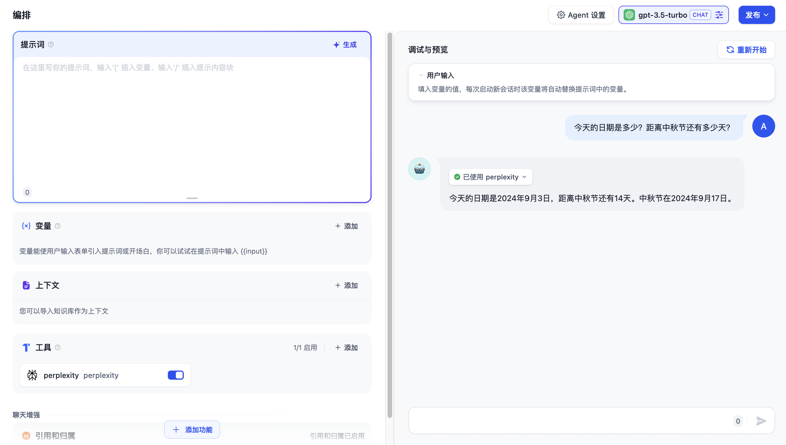

# Perplexity Search

> 工具作者 @Dify。

Perplexity 是一個基於 AI 的搜索引擎，能夠理解複雜的查詢並提供準確、相關的實時答案。以下是在 Dify 中配置和使用 Perplexity Search 工具的步驟。

## 1. 申請 Perplexity API Key

請在 [Perplexity](https://www.perplexity.ai/settings/api)申請 API Key，並確保賬戶內有足夠的 Credits。

## 2. 在 Dify 內填寫配置

在 Dify 導航頁內輕點 `工具 > Perplexity > 去授權` 填寫 API Key。

## 3. 使用工具

你可以在以下應用類型中使用 Perplexity Search 工具。

* **Chatflow / Workflow 應用**

Chatflow 和 Workflow 應用均支持添加 Perplexity 工具節點。將用戶輸入的內容通過變量傳遞至 Perplexity 工具節點內的“查詢”框中，按照需求調整 Perplexity 工具的內置參數，最後在“結束”節點的回覆框中選中 Perplexity 工具節點的輸出內容。

* **Agent 應用**

在 Agent 應用內添加 `Perplexity Search` 工具，然後輸入相關指令即可調用此工具。

