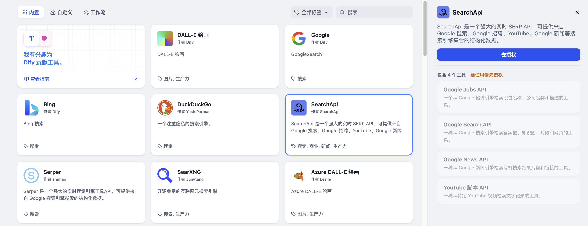
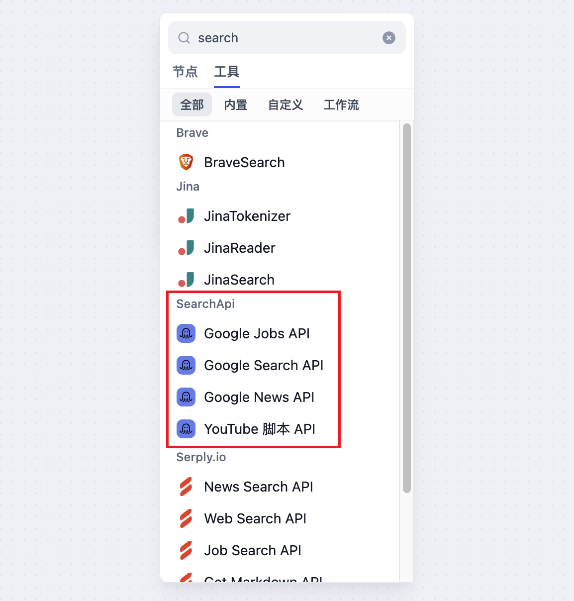

# SearchApi

> 工具作者 @SearchApi。

SearchApi 是一個強大的實時 SERP API，可提供來自 Google 搜索、Google 招聘、YouTube、Google 新聞等搜索引擎集合的結構化數據。以下是在 Dify 中配置和使用 SearchApi 搜索工具的步驟。

## 1. 申請 Search API Key

請在 [SearchApi](https://www.searchapi.io/)申請 API Key。

## 2. 在 Dify 內填寫配置

在 Dify 導航頁內輕點 `工具 > SearchApi > 去授權` 填寫 API Key。

## 3. 使用工具

你可以在以下應用類型中使用 SearchApi 工具。

* **Chatflow / Workflow 應用**

Chatflow 和 Workflow 應用均支持添加 `SearchApi` 系列工具節點，提供 Google Jobs API，Google News API，Google Search API，YouTube 腳本 API 四種工具。

* **Agent 應用**

在 Agent 應用內選擇需要添加的 `SearchApi` 工具，然後輸入指令調用工具。
