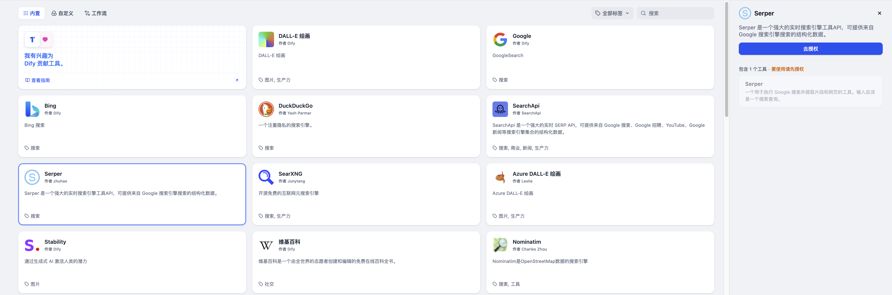

# Serper

> 工具作者 @zhuhao。

Serper 是一個強大的實時搜索引擎工具API，可提供來自 Google 搜索引擎搜索的結構化數據。以下是在 Dify 中配置和使用 Serper 搜索工具的步驟。

## 1. 申請 Serp API Key

請在 [Serper 平臺](https://serper.dev/signup)申請 API Key。

## 2. 在 Dify 內填寫配置

在 Dify 導航頁內輕點 `工具 > Serper > 去授權` 填寫 API Key。

## 3. 使用工具

你可以在以下應用類型中使用 Serper 工具。

* **Chatflow / Workflow 應用**

Chatflow 和 Workflow 應用均支持添加 `Serper` 工具節點。

* **Agent 應用**

在 Agent 應用內選擇需要添加的 `Serper` 工具，然後輸入指令調用工具。
