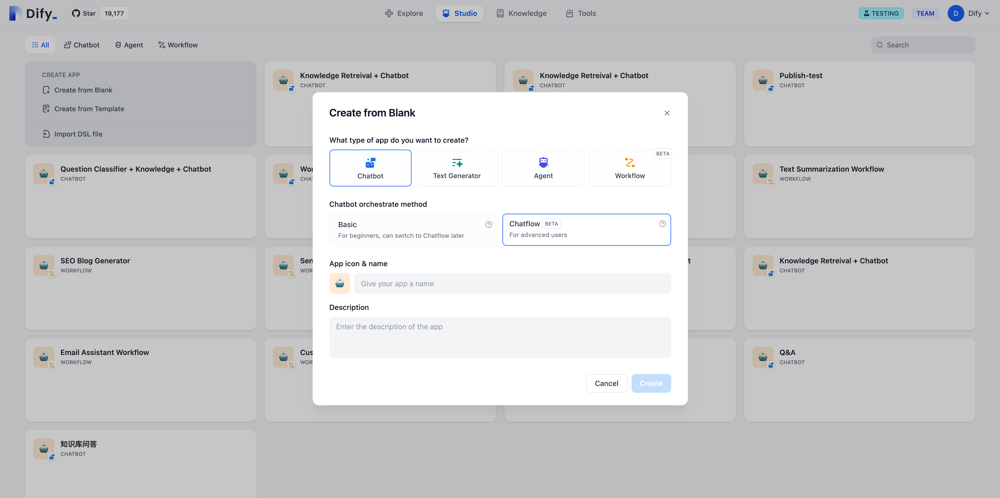

# 關鍵概念

### 節點

**節點是工作流的關鍵構成**，通過連接不同功能的節點，執行工作流的一系列操作。

工作流的核心節點請查看[節點說明](node/)。

***

### 變量

**變量用於串聯工作流內前後節點的輸入與輸出**，實現流程中的複雜處理邏輯，包含系統變量、環境變量和會話變量。詳細說明請參考 [《變量》](variables.md)。

***

### Chatflow

**適用場景：**

面向對話類情景，包括客戶服務、語義搜索、以及其他需要在構建響應時進行多步邏輯的對話式應用程序。該類型應用的特點在於支持對生成的結果進行多輪對話交互，調整生成的結果。

常見的交互路徑：給出指令 → 生成內容 → 就內容進行多次討論 → 重新生成結果 → 結束

<figure><figcaption>
Chatflow 入口
</figcaption></figure>

### Workflow

**適用場景：**

面向自動化和批處理情景，適合高質量翻譯、數據分析、內容生成、電子郵件自動化等應用程序。該類型應用無法對生成的結果進行多輪對話交互。

常見的交互路徑：給出指令 → 生成內容 → 結束

<figure><figcaption>
Workflow 入口
</figcaption></figure>

**應用類型差異**

1. End 節點屬於 Workflow 的結束節點，僅可在流程結束時選擇。
2. Answer 節點屬於 Chatflow ，用於流式輸出文本內容，並支持在流程中間步驟輸出。
3. Chatflow 內置聊天記憶（Memory），用於存儲和傳遞多輪對話的歷史消息，可在 LLM 、問題分類等節點內開啟，Workflow 無 Memory 相關配置，無法開啟。
4. Chatflow 的開始節點內置變量包括：`sys.query`，`sys.files`，`sys.conversation_id`，`sys.user_id`。Workflow 的開始節點內置變量包括：`sys.files`，`sys.user_id`
