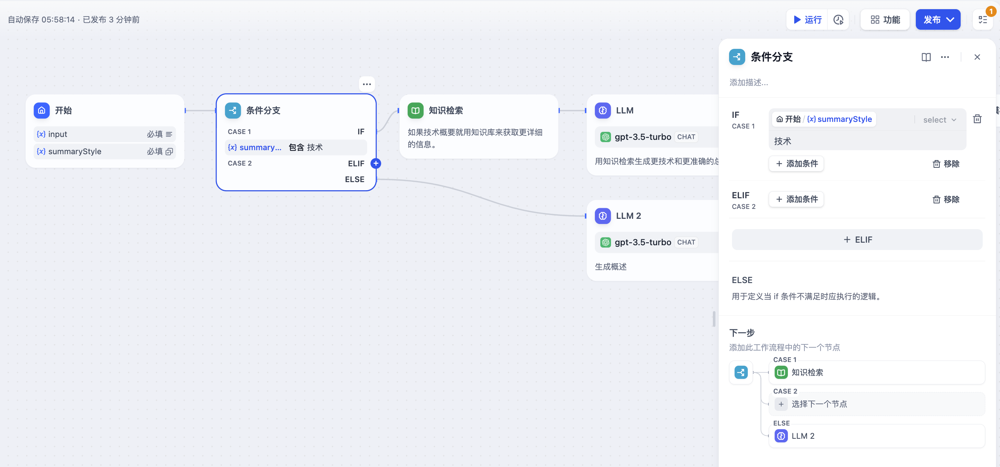

# 條件分支

### 定義

根據 If/else/elif 條件將 Chatflow / Workflow 流程拆分成多個分支。

### 節點功能

條件分支的運行機制包含以下六個路徑：

* IF 條件：選擇變量，設置條件和滿足條件的值；
* IF 條件判斷為 `True`，執行 IF 路徑；
* IF 條件判斷為 `False`，執行 ELSE 路徑；
* ELIF 條件判斷為 `True`，執行 ELIF 路徑；
* ELIF 條件判斷為 `False`，繼續判斷下一個 ELIF 路徑或執行最後的 ELSE 路徑；

**條件類型**

支持設置以下條件類型：

* 包含（Contains）
* 不包含（Not contains）
* 開始是（Start with）
* 結束是（End with）
* 是（Is）
* 不是（Is not）
* 為空（Is empty）
* 不為空（Is not empty）

***

### 場景

<figure><figcaption></figcaption></figure>

以**文本總結工作流**作為示例說明各個條件：

* IF 條件： 選擇開始節點中的 `summarystyle` 變量，條件為**包含** `技術`；
* IF 條件判斷為 `True`，執行 IF 路徑，通過知識檢索節點查詢技術相關知識再到 LLM 節點回復（圖中上半部分）；
* IF 條件判斷為 `False`，但添加了 `ELIF` 條件，即 `summarystyle` 變量輸入**不包含**`技術`，但 `ELIF` 條件內包含 `科技`，會檢查 `ELIF` 內的條件是否為 `True`，然後執行路徑內定義的步驟；
* `ELIF` 內的條件為 `False`，即輸入變量既不不包含 `技術`，也不包含 `科技`，繼續判斷下一個 ELIF 路徑或執行最後的 ELSE 路徑；
* IF 條件判斷為 `False`，即 `summarystyle` 變量輸入**不包含** `技術`，執行 ELSE 路徑，通過 LLM2 節點進行回覆（圖中下半部分）；

**多重條件判斷**

涉及複雜的條件判斷時，可以設置多重條件判斷，在條件之間設置 **AND** 或者 **OR**，即在條件之間取**交集**或者**並集**。

<figure><figcaption>
多重條件判斷
</figcaption></figure>
