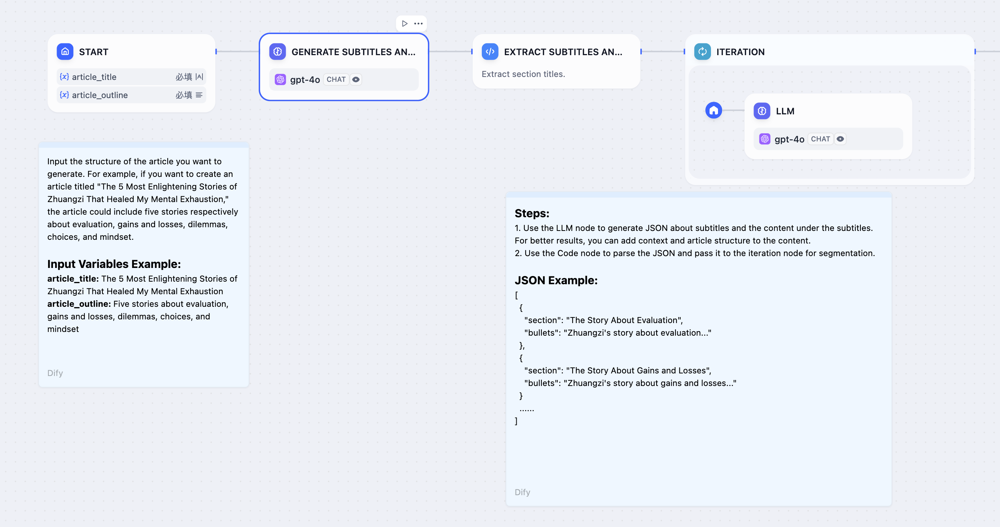
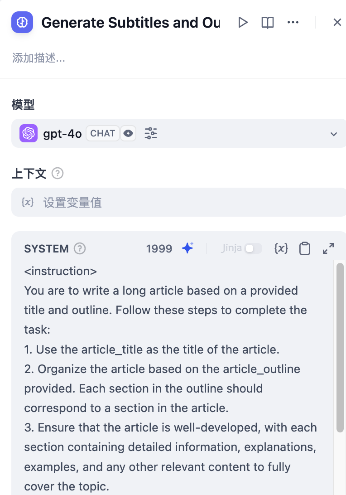
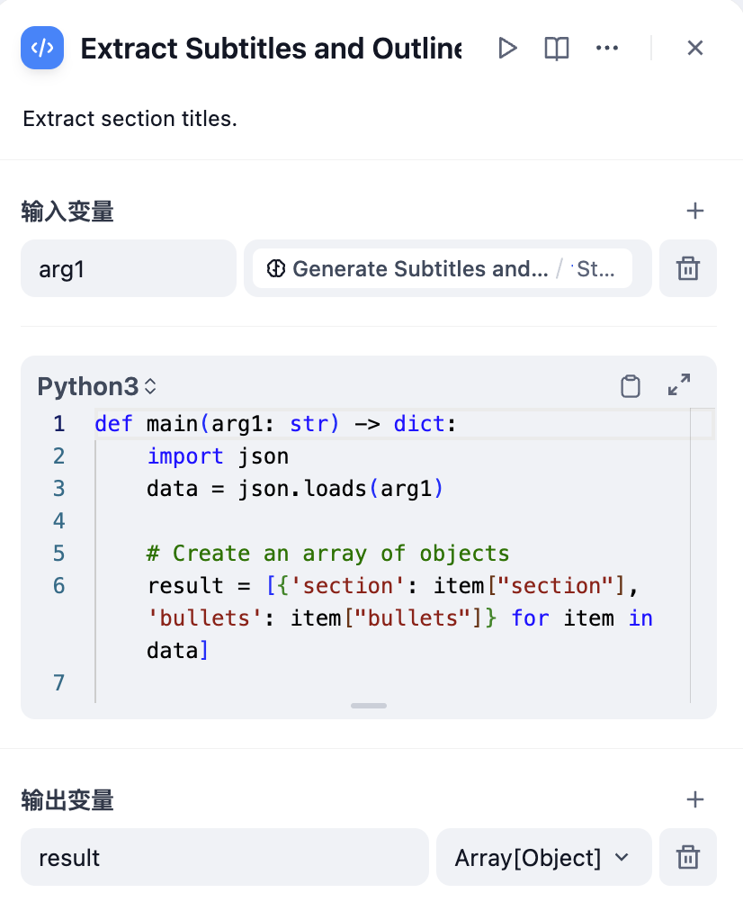

# 迭代

### 定義

對數組執行多次步驟直至輸出所有結果。

迭代步驟在列表中的每個條目（item）上執行相同的步驟。使用迭代的條件是確保輸入值已經格式化為列表對象。迭代節點允許 AI 工作流處理更復雜的處理邏輯，迭代節點是循環節點的友好版本，它在自定義程度上做出了一些妥協，以便非技術用戶能夠快速入門。

***

### 場景

#### **示例1：長文章迭代生成器**

<figure><figcaption><p>長故事生成器</p></figcaption></figure>

1. 在 **開始節點** 內輸入故事標題和大綱
2. 使用 **LLM 節點=** 基於用戶輸入的故事標題和大綱，讓 LLM 開始編寫內容
3. 使用 **參數提取節點** 將 LLM 輸出的完整內容轉換成數組格式
4. 通過 **迭代節點** 包裹的 **LLM 節點** 循環多次生成各章節內容
5. 將 **直接回復** 節點添加在迭代節點內部，實現在每輪迭代生成之後流式輸出

**具體配置步驟**

1. 在 **開始節點** 配置故事標題（title）和大綱（outline）；

<figure><figcaption><p>開始節點配置</p></figcaption></figure>

2. 選擇 **LLM 節點** 基於用戶輸入的故事標題和大綱，讓 LLM 開始編寫文本；

<figure><figcaption><p>模板節點</p></figcaption></figure>

3. 選擇 **參數提取節點**，將故事文本轉換成為數組（Array）結構。提取參數為 `sections` ，參數類型為 `Array[Object]`

<figure><figcaption><p>參數提取</p></figcaption></figure>


參數提取效果受模型推理能力和指令影響，使用推理能力更強的模型，在**指令**內增加示例可以提高參數提取的效果。


4. 將數組格式的故事大綱作為迭代節點的輸入，在迭代節點內部使用 **LLM 節點** 進行處理

<figure><figcaption><p>配置迭代節點</p></figcaption></figure>

在 LLM 節點內配置輸入變量 `GenerateOverallOutline/output` 和 `Iteration/item`

<figure><figcaption><p>配置 LLM 節點</p></figcaption></figure>


迭代的內置變量：`items[object]` 和 `index[number]`

`items[object] 代表以每輪迭代的輸入條目；`

`index[number] 代表當前迭代的輪次；`


5. 在迭代節點內部配置 **直接回復節點** ，可以實現在每輪迭代生成之後流式輸出。

<figure><figcaption><p>配置 Answer 節點</p></figcaption></figure>

6. 完整調試和預覽

<figure><figcaption><p>按故事章節多輪迭代生成</p></figcaption></figure>

#### **示例 2：長文章迭代生成器（另一種編排方式）**

<figure><figcaption></figcaption></figure>

* 在 **開始節點** 內輸入故事標題和大綱
* 使用 **LLM 節點** 生成文章小標題，以及小標題對應的內容
* 使用 **代碼節點** 將完整內容轉換成數組格式
* 通過 **迭代節點** 包裹的 **LLM 節點** 循環多次生成各章節內容
* 使用 **模板轉換** 節點將迭代節點輸出的字符串數組轉換為字符串
* 在最後添加 **直接回復節點** 將轉換後的字符串直接輸出

### 什麼是數組內容

列表是一種特定的數據類型，其中的元素用逗號分隔，以 `[` 開頭，以 `]` 結尾。例如：

**數字型：**

```
[0,1,2,3,4,5]
```

**字符串型：**

```
["monday", "Tuesday", "Wednesday", "Thursday"]
```

**JSON 對象：**

```
[
    {
        "name": "Alice",
        "age": 30,
        "email": "alice@example.com"
    },
    {
        "name": "Bob",
        "age": 25,
        "email": "bob@example.com"
    },
    {
        "name": "Charlie",
        "age": 35,
        "email": "charlie@example.com"
    }
]
```

***

### 支持返回數組的節點

* 代碼節點
* 參數提取
* 知識庫檢索
* 迭代
* 工具
* HTTP 請求

### 如何獲取數組格式的內容

**使用 CODE 節點返回**

<figure><figcaption><p>code 節點輸出 array</p></figcaption></figure>

**使用 參數提取 節點返回**

<figure><figcaption><p>參數提取節點輸出 array</p></figcaption></figure>

### 如何將數組轉換為文本

迭代節點的輸出變量為數組格式，無法直接輸出。你可以使用一個簡單的步驟將數組轉換回文本。

**使用代碼節點轉換**

<figure><figcaption><p>代碼節點轉換</p></figcaption></figure>

代碼示例：

```python
def main(articleSections: list):
    data = articleSections
    return {
        "result": "\n".join(data)
    }
```

**使用模板節點轉換**

<figure><figcaption><p>模板節點轉換</p></figcaption></figure>

代碼示例：

```django
{{ articleSections | join("\n") }}
```
