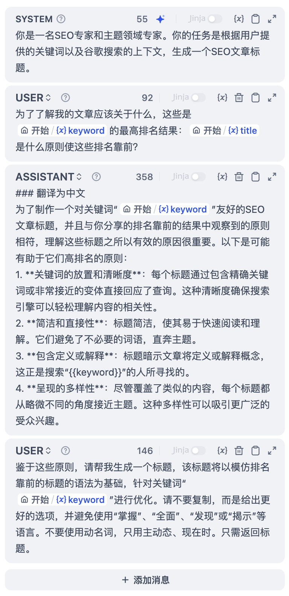
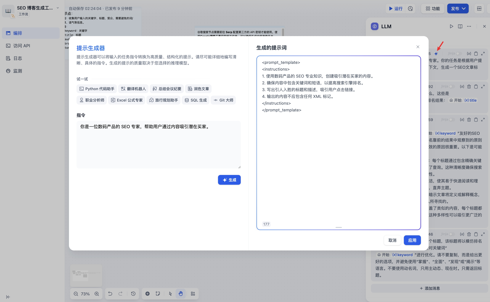

# LLM

### 定義

調用大語言模型回答問題或者處理自然語言。

<figure><figcaption>
LLM 節點
</figcaption></figure>

***

### 場景

LLM 是 Chatflow/Workflow 的核心節點，利用大語言模型的對話/生成/分類/處理等能力，根據給定的提示詞處理廣泛的任務類型，並能夠在工作流的不同環節使用。

* **意圖識別**，在客服對話情景中，對用戶問題進行意圖識別和分類，導向下游不同的流程。
* **文本生成**，在文章生成情景中，作為內容生成的節點，根據主題、關鍵詞生成符合的文本內容。
* **內容分類**，在郵件批處理情景中，對郵件的類型進行自動化分類，如諮詢/投訴/垃圾郵件。
* **文本轉換**，在文本翻譯情景中，將用戶提供的文本內容翻譯成指定語言。
* **代碼生成**，在輔助編程情景中，根據用戶的要求生成指定的業務代碼，編寫測試用例。
* **RAG**，在知識庫問答情景中，將檢索到的相關知識和用戶問題重新組織回覆問題。
* **圖片理解**，使用 vision 能力的多模態模型，能對圖像內的信息進行理解和問答。

選擇合適的模型，編寫提示詞，你可以在 Chatflow/Workflow 中構建出強大、可靠的解決方案。

***

### 如何配置

<figure><figcaption>
LLM 節點配置-選擇模型
</figcaption></figure>

**配置步驟：**

1. **選擇模型**，Dify 提供了全球主流模型的[支持](../../../getting-started/readme/model-providers.md)，包括 OpenAI 的 GPT 系列、Anthropic 的 Claude 系列、Google 的 Gemini 系列等，選擇一個模型取決於其推理能力、成本、響應速度、上下文窗口等因素，你需要根據場景需求和任務類型選擇合適的模型。
2. **配置模型參數**，模型參數用於控制模型的生成結果，例如溫度、TopP，最大標記、回覆格式等，為了方便選擇系統同時提供了 3 套預設參數：創意，平衡和精確。
3. **編寫提示詞**，LLM 節點提供了一個易用的提示詞編排頁面，選擇聊天模型或補全模型，會顯示不同的提示詞編排結構。
4. **高級設置**，可以開關記憶，設置記憶窗口，使用 Jinja-2 模版語言來進行更復雜的提示詞等。


如果你是初次使用 Dify ，在 LLM 節點選擇模型之前，需要在 **系統設置—模型供應商** 內提前完成[模型配置](../../model-configuration/)。


#### **編寫提示詞**

在 LLM 節點內，你可以自定義模型輸入提示詞。如果選擇聊天模型（Chat model），你可以自定義系統提示詞（SYSTEM）/用戶（USER）/助手（ASSISTANT）三部分內容。

<figure><figcaption></figcaption></figure>

**提示生成器**

如果在編寫系統提示詞（SYSTEM）時沒有好的頭緒，也可以使用提示生成器功能，藉助 AI 能力快速生成適合實際業務場景的提示詞。

在提示詞編輯器中，你可以通過輸入 **“/”** 或者 **“{”** 呼出 **變量插入菜單**，將 **特殊變量塊** 或者 **上游節點變量** 插入到提示詞中作為上下文內容。

<figure><figcaption>
呼出變量插入菜單
</figcaption></figure>

***

### 特殊變量說明

**上下文變量**

上下文變量是 LLM 節點內定義的特殊變量類型，用於在提示詞內插入外部檢索的文本內容。

<figure><figcaption>
上下文變量
</figcaption></figure>

在常見的知識庫問答應用中，知識庫檢索的下游節點一般為 LLM 節點，知識檢索的 **輸出變量** `result` 需要配置在 LLM 節點中的 **上下文變量** 內關聯賦值。關聯後在提示詞的合適位置插入 **上下文變量** ，可以將外部檢索到的知識插入到提示詞中。

該變量除了可以作為 LLM 回覆問題時的提示詞上下文作為外部知識引入，由於其數據結構中包含了分段引用信息，同時可以支持應用端的 [**引用與歸屬**](../../knowledge-base/retrieval-test-and-citation.md#id-2-yin-yong-yu-gui-shu) 功能。


若上下文變量關聯賦值的是上游節點的普通變量，例如開始節點的字符串類型變量，則上下文的變量同樣可以作為外部知識引入，但 **引用與歸屬** 功能將會失效。


**會話歷史**

為了在文本補全類模型（例如 gpt-3.5-turbo-Instruct）內實現聊天型應用的對話記憶，Dify 在原[提示詞專家模式（已下線）](../../../learn-more/extended-reading/prompt-engineering/prompt-engineering-1/)內設計了會話歷史變量，該變量沿用至 Chatflow 的 LLM 節點內，用於在提示詞中插入 AI 與用戶之間的聊天曆史，幫助 LLM 理解對話上文。


會話歷史變量應用並不廣泛，僅在 Chatflow 中選擇文本補全類模型時可以插入使用。


<figure><figcaption>
插入會話歷史變量
</figcaption></figure>

**模型參數**

模型的參數會影響模型的輸出效果。不同模型的參數會有所區別。下圖為`gpt-4`的參數列表。

<figure><figcaption></figcaption></figure>

主要的參數名詞解釋如下：

* **溫度：**通常是0-1的一個值，控制隨機性。溫度越接近0，結果越確定和重複，溫度越接近1，結果越隨機。
* **Top P：**控制結果的多樣性。模型根據概率從候選詞中選擇，確保累積概率不超過預設的閾值P。
* **存在懲罰：**用於減少重複生成同一實體或信息，通過對已經生成的內容施加懲罰，使模型傾向於生成新的或不同的內容。參數值增加時，對於已經生成過的內容，模型在後續生成中被施加更大的懲罰，生成重複內容的可能性越低。
* **頻率懲罰：**對過於頻繁出現的詞或短語施加懲罰，通過降低這些詞的生成概率。隨著參數值的增加，對頻繁出現的詞或短語施加更大的懲罰。較高的參數值會減少這些詞的出現頻率，從而增加文本的詞彙多樣性。

如果你不理解這些參數是什麼，可以選擇**加載預設**，從創意、平衡、精確三種預設中選擇。

<figure><figcaption></figcaption></figure>

***

### 高級功能

**記憶：** 開啟記憶後問題分類器的每次輸入將包含對話中的聊天曆史，以幫助 LLM 理解上文，提高對話交互中的問題理解能力。

**記憶窗口：** 記憶窗口關閉時，系統會根據模型上下文窗口動態過濾聊天曆史的傳遞數量；打開時用戶可以精確控制聊天曆史的傳遞數量（對數）。

**對話角色名設置：** 由於模型在訓練階段的差異，不同模型對於角色名的指令遵循程度不同，如 Human/Assistant，Human/AI，人類/助手等等。為適配多模型的提示響應效果，系統提供了對話角色名的設置，修改對話角色名將會修改會話歷史的角色前綴。

**Jinja-2 模板：** LLM 的提示詞編輯器內支持 Jinja-2 模板語言，允許你藉助 Jinja2 這一強大的 Python 模板語言，實現輕量級數據轉換和邏輯處理，參考[官方文檔](https://jinja.palletsprojects.com/en/3.1.x/templates/)。
