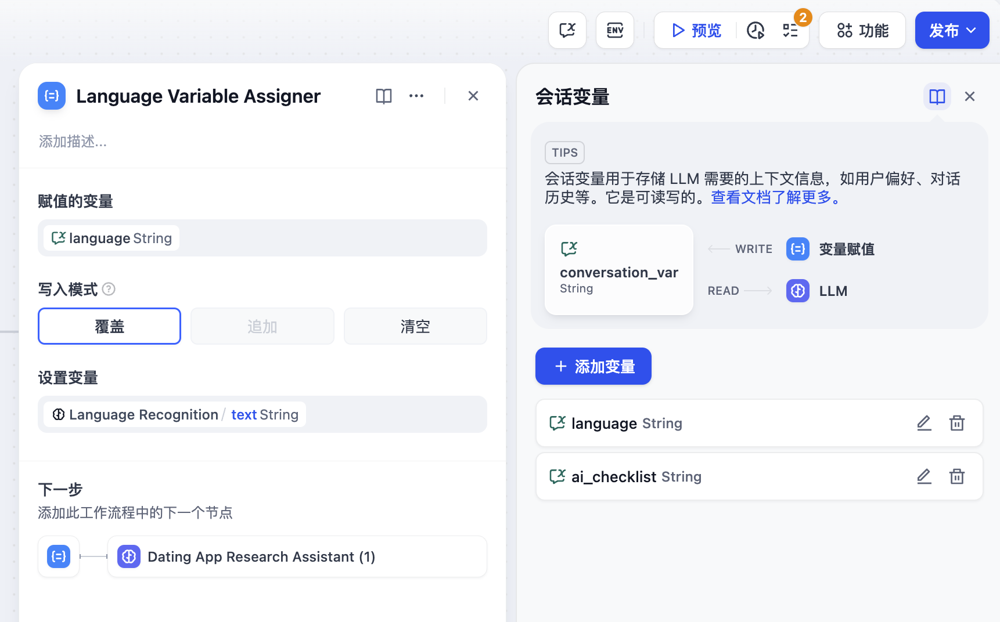
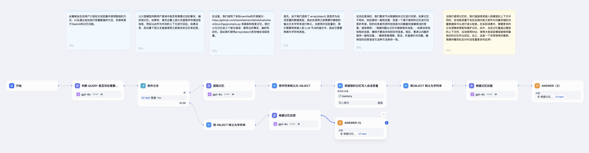
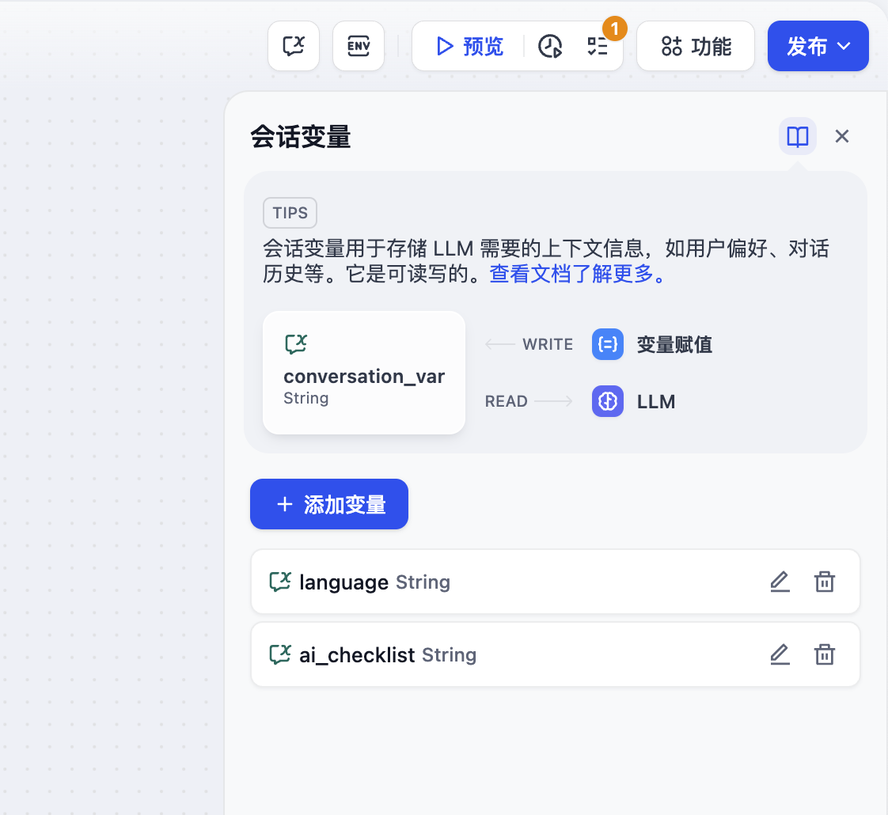
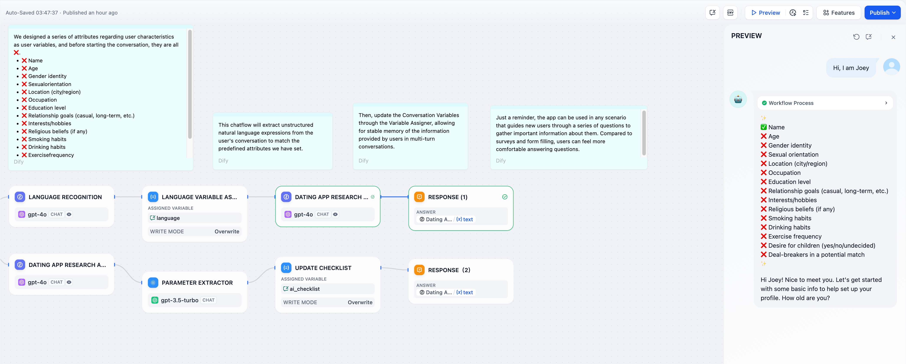
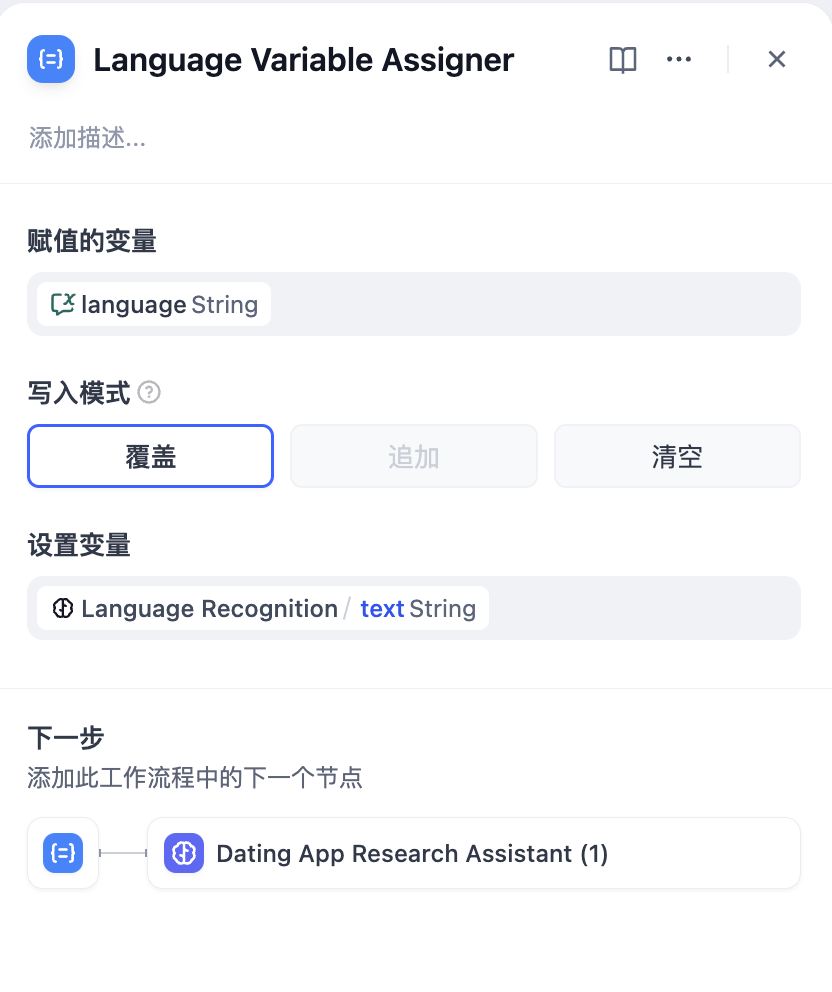

# 變量賦值

定義

變量賦值節點用於向可寫入變量進行變量賦值，已支持以下可寫入變量：

* [會話變量](../key-concept.md#hui-hua-bian-liang)。

用法：通過變量賦值節點，你可以將工作流內的變量賦值到會話變量中用於臨時存儲，並可以在後續對話中持續引用。

<figure><figcaption></figcaption></figure>

***

### 使用場景示例

通過變量賦值節點，你可以將會話過程中的**上下文、上傳至對話框的文件（即將上線）、用戶所輸入的偏好信息**等寫入至會話變量，並在後續對話中引用已存儲的信息導向不同的處理流程或者進行回覆。

**場景 1**

**自動判斷提取並存儲對話中的信息**，在會話內通過會話變量數組記錄用戶輸入的重要信息，並在後續對話中讓 LLM 基於會話變量中存儲的歷史信息進行個性化回覆。

示例：開始對話後，LLM 會自動判斷用戶輸入是否包含需要記住的事實、偏好或歷史記錄。如果有，LLM 會先提取並存儲這些信息，然後再用這些信息作為上下文來回答。如果沒有新的信息需要保存，LLM 會直接使用自身的相關記憶知識來回答問題。

<figure><figcaption></figcaption></figure>

**配置流程：**

1. **設置會話變量**：首先設置一個會話變量數組 `memories`，類型為 array\[object]，用於存儲用戶的事實、偏好和歷史記錄。
2. **判斷和提取記憶**：
   * 添加一個條件判斷節點，使用 LLM 來判斷用戶輸入是否包含需要記住的新信息。
   * 如果有新信息，走上分支，使用 LLM 節點提取這些信息。
   * 如果沒有新信息，走下分支，直接使用現有記憶回答。
3. **變量賦值/寫入**：
   * 在上分支中，使用變量賦值節點，將提取出的新信息追加（append）到 `memories` 數組中。
   * 使用轉義功能將 LLM 輸出的文本字符串轉換為適合存儲在 array\[object] 中的格式。
4. **變量讀取和使用**：
   * 在後續的 LLM 節點中，將 `memories` 數組中的內容轉換為字符串，並插入到 LLM 的提示詞 Prompts 中作為上下文。
   * LLM 使用這些歷史信息來生成個性化回覆。

圖中的 code 節點代碼如下：

1. 將字符串轉義為 object

```python
import json

def main(arg1: str) -> object:
    try:
        # Parse the input JSON string
        input_data = json.loads(arg1)
        
        # Extract the memory object
        memory = input_data.get("memory", {})
        
        # Construct the return object
        result = {
            "facts": memory.get("facts", []),
            "preferences": memory.get("preferences", []),
            "memories": memory.get("memories", [])
        }
        
        return {
            "mem": result
        }
    except json.JSONDecodeError:
        return {
            "result": "Error: Invalid JSON string"
        }
    except Exception as e:
        return {
            "result": f"Error: {str(e)}"
        }
```

2. 將 object 轉義為字符串

```python
import json

def main(arg1: list) -> str:
    try:
        # Assume arg1[0] is the dictionary we need to process
        context = arg1[0] if arg1 else {}
        
        # Construct the memory object
        memory = {"memory": context}
        
        # Convert the object to a JSON string
        json_str = json.dumps(memory, ensure_ascii=False, indent=2)
        
        # Wrap the JSON string in <answer> tags
        result = f"<answer>{json_str}</answer>"
        
        return {
            "result": result
        }
    except Exception as e:
        return {
            "result": f"<answer>Error: {str(e)}</answer>"
        }
```

**場景 2**

**記錄用戶的初始偏好信息**，在會話內記住用戶輸入的語言偏好，在後續對話中持續使用該語言類型進行回覆。

示例：用戶在對話開始前，在 `language` 輸入框內指定了 “中文”，該語言將會被寫入會話變量，LLM 在後續進行答覆時會參考會話變量中的信息，在後續對話中持續使用“中文”進行回覆。

<figure><figcaption></figcaption></figure>

**配置流程：**

**設置會話變量**：首先設置一個會話變量 `language`，在會話流程開始時添加一個條件判斷節點，用來判斷 `language` 變量的值是否為空。

**變量寫入/賦值**：首輪對話開始時，若 `language` 變量值為空，則使用 LLM 節點來提取用戶輸入的語言，再通過變量賦值節點將該語言類型寫入到會話變量 `language` 中。

**變量讀取**：在後續對話輪次中 `language` 變量已存儲用戶語言偏好。在後續對話中，LLM 節點通過引用 language 變量，使用用戶的偏好語言類型進行回覆。

**場景 3**

**輔助 Checklist 檢查**，在會話內通過會話變量記錄用戶的輸入項，更新 Checklist 中的內容，並在後續對話中檢查遺漏項。

示例：開始對話後，LLM 會要求用戶在對話框內輸入 Checklist 所涉及的事項，用戶一旦提及了 Checklist 中的內容，將會更新並存儲至會話變量內。LLM 會在每輪對話後提醒用戶繼續補充遺漏項。

<figure><figcaption></figcaption></figure>

**配置流程：**

* **設置會話變量：** 首先設置一個會話變量 `ai_checklist`，在 LLM 內引用該變量作為上下文進行檢查。
* **變量賦值/寫入：** 每一輪對話時，在 LLM 節點內檢查 `ai_checklist` 內的值並比對用戶輸入，若用戶提供了新的信息，則更新 Checklist 並將輸出內容通過變量賦值節點寫入到 `ai_checklist` 內。
* **變量讀取：** 每一輪對話讀取 `ai_cheklist` 內的值並比對用戶輸入直至所有 checklist 完成。

***

### 使用變量賦值節點

點擊節點右側 ＋ 號，選擇“變量賦值”節點，填寫“賦值的變量”和“設置變量”。

<figure><figcaption></figcaption></figure>

**設置變量：**

賦值的變量：選擇被賦值變量，即指定需要被賦值的目標會話變量。

設置變量：選擇需要賦值的變量，即指定需要被轉換的源變量。

以上圖賦值邏輯為例：將上一個節點的文本輸出項 `Language Recognition/text` 賦值到會話變量 `language` 內。

**寫入模式：**

* 覆蓋，將源變量的內容覆蓋至目標會話變量
* 追加，指定變量為 Array 類型時
* 清空，清空目標會話變量中的內容
