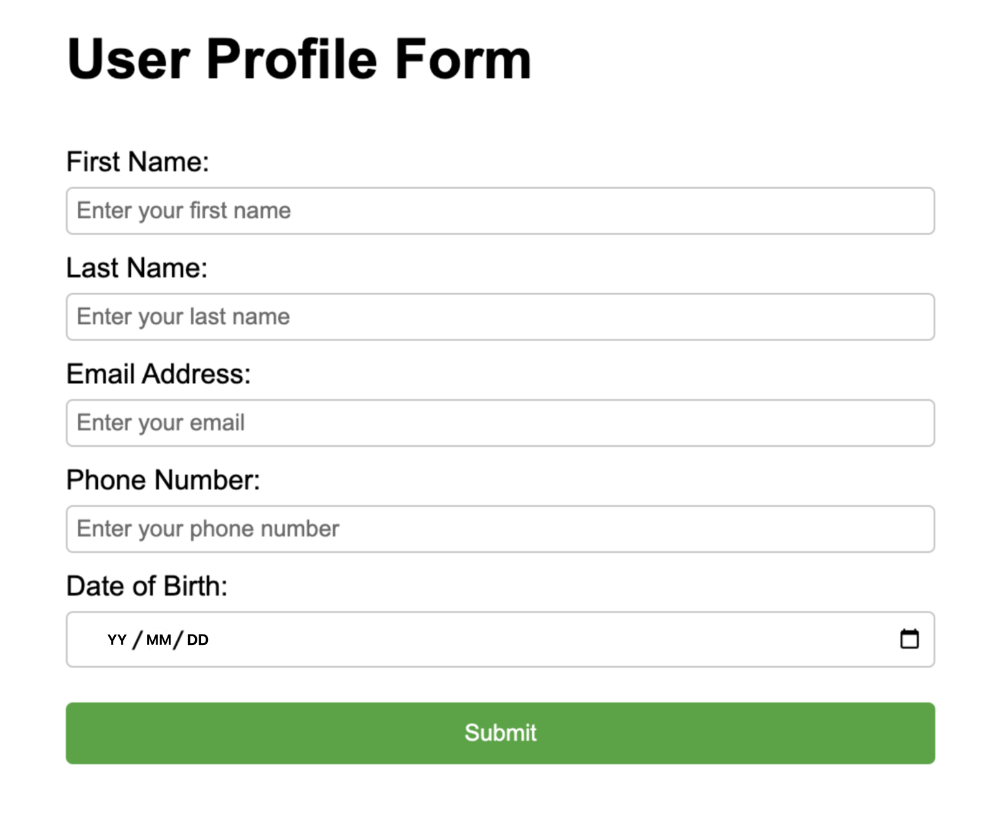

# 如何使用 JSON Schema 讓 LLM 輸出遵循結構化格式的內容？

JSON Schema 是一種用於描述 JSON 數據結構的規範，開發者可以通過定義 JSON Schema 結構，指定 LLM 輸出嚴格遵循定義內的數據或內容，例如按照指定內容格式輸出文檔或代碼結構。

## 支持 JSON Schema 功能的模型

* `gpt-4o-mini-2024-07-18` and later
* `gpt-4o-2024-08-06` and later

> 如需瞭解更多關於 OpenAI 系列模型的結構化輸出能力，請參考 [Structured Outputs](https://platform.openai.com/docs/guides/structured-outputs/introduction)。

## 結構化輸出用法

以下是指定 LLM 結構化輸出的用法路徑：

1. 將 LLM 連接到系統中的工具、函數、數據等；在函數定義中設置 `strict: true`，當打開它時，結構化輸出（Structured-outputs）功能可確保 LLM 為函數調用生成的參數與你在函數定義中提供的 JSON 架構完全匹配。
2. LLM 回答用戶時，按照 JSON Schema 中的定義，以結構化內容格式輸出。

下文將簡要介紹如何在 Dify 開啟並使用 JSON Schema 功能。

### 1. 開啟 JSON Schema

將應用中的 LLM 切換至上述支持 JSON Schema 輸出的模型，然後在設置表單開啟 `JSON Schema` 並填寫 JSON Schema 模板；同時開啟 `response_format` 欄並切換至 `json_schema` 格式。


LLM 生成的內容支持以下格式輸出：

* **Text:** 以文本格式輸出

### 2. 定義 JSON Schema 模板

你可以參考以下 JSON Schema 格式並定義模板內容：

```json
{
    "name": "template_schema",
    "description": "A generic template for JSON Schema",
    "strict": true,
    "schema": {
        "type": "object",
        "properties": {
            "field1": {
                "type": "string",
                "description": "Description of field1"
            },
            "field2": {
                "type": "number",
                "description": "Description of field2"
            },
            "field3": {
                "type": "array",
                "description": "Description of field3",
                "items": {
                    "type": "string"
                }
            },
            "field4": {
                "type": "object",
                "description": "Description of field4",
                "properties": {
                    "subfield1": {
                        "type": "string",
                        "description": "Description of subfield1"
                    }
                },
                "required": ["subfield1"],
                "additionalProperties": false
            }
        },
        "required": ["field1", "field2", "field3", "field4"],
        "additionalProperties": false
    }
}
```

步驟指導：

1. 定義基本信息：

* 設置 `name`：為您的 schema 起一個描述性的名稱。
* 添加 `description`：簡要說明 schema 的用途。
* 設置 `strict`: true：確保嚴格模式。

2. 創建 `schema` 對象：

* 設置 `type: "object"`：指定根級別為對象類型。
* 添加 `properties` 對象：用於定義所有字段。

3. 定義字段：

* 為每個字段創建一個對象，包含 `type` 和 `description`。
* 常見類型：`string`, `number`, `boolean`, `array`, `object`。
* 對於數組，使用 `items` 定義元素類型。
* 對於對象，遞歸定義 `properties`。

4. 設置約束：

* 在每個級別添加 `required` 數組，列出所有必需字段。
* 在每個對象級別設置 `additionalProperties: false`。

5. 特殊字段處理：

* 使用 `enum` 限制可選值。
* 使用 `$ref` 實現遞歸結構。

## 示例

### 1. 推理鏈（常規）

**JSON Schema 文件示例**

```json
{
    "name": "math_reasoning",
    "description": "Records steps and final answer for mathematical reasoning",
    "strict": true,
    "schema": {
        "type": "object",
        "properties": {
            "steps": {
                "type": "array",
                "description": "Array of reasoning steps",
                "items": {
                    "type": "object",
                    "properties": {
                        "explanation": {
                            "type": "string",
                            "description": "Explanation of the reasoning step"
                        },
                        "output": {
                            "type": "string",
                            "description": "Output of the reasoning step"
                        }
                    },
                    "required": ["explanation", "output"],
                    "additionalProperties": false
                }
            },
            "final_answer": {
                "type": "string",
                "description": "The final answer to the mathematical problem"
            }
        },
        "additionalProperties": false,
        "required": ["steps", "final_answer"]
    }
}
```

**提示詞參考**

```
You are a helpful math tutor. You will be provided with a math problem,
and your goal will be to output a step by step solution, along with a final answer.
For each step, just provide the output as an equation use the explanation field to detail the reasoning.
```

### UI 生成器（根遞歸模式）

```json
{
        "name": "ui",
        "description": "Dynamically generated UI",
        "strict": true,
        "schema": {
            "type": "object",
            "properties": {
                "type": {
                    "type": "string",
                    "description": "The type of the UI component",
                    "enum": ["div", "button", "header", "section", "field", "form"]
                },
                "label": {
                    "type": "string",
                    "description": "The label of the UI component, used for buttons or form fields"
                },
                "children": {
                    "type": "array",
                    "description": "Nested UI components",
                    "items": {
                        "$ref": "#"
                    }
                },
                "attributes": {
                    "type": "array",
                    "description": "Arbitrary attributes for the UI component, suitable for any element",
                    "items": {
                        "type": "object",
                        "properties": {
                            "name": {
                                "type": "string",
                                "description": "The name of the attribute, for example onClick or className"
                            },
                            "value": {
                                "type": "string",
                                "description": "The value of the attribute"
                            }
                        },
                      "additionalProperties": false,
                      "required": ["name", "value"]
                    }
                }
            },
            "required": ["type", "label", "children", "attributes"],
            "additionalProperties": false
        }
    }
```

**提示詞參考：**

```
You are a UI generator AI. Convert the user input into a UI.
```

**效果示例：**



## 提示

* 請確保應用提示詞內包含如何處理用戶輸入無法產生有效響應的情況說明。
* 模型將始終嘗試遵循提供的模式，如果輸入的內容與指定的模式完全無關，則可能會導致 LLM 產生幻覺。
* 如果 LLM 檢測到輸入與任務不兼容，你可以在提示中包含語言，以指定返回空參數或特定句子。
* 所有字段必須為 `required`，詳情請參考[此處](https://platform.openai.com/docs/guides/structured-outputs/supported-schemas)。
* [additionalProperties：false](https://platform.openai.com/docs/guides/structured-outputs/additionalproperties-false-must-always-be-set-in-objects) 必須始終在對象中設置
* 模式的根級別對象必須是一個對象

## 參考閱讀

* [Introduction to Structured Outputs](https://cookbook.openai.com/examples/structured\_outputs\_intro)
* [Structured Output](https://platform.openai.com/docs/guides/structured-outputs/json-mode?context=without\_parse)
