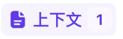
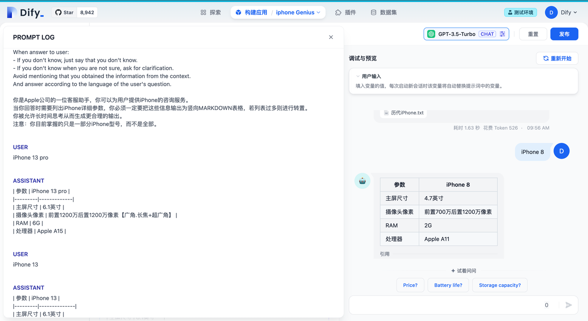
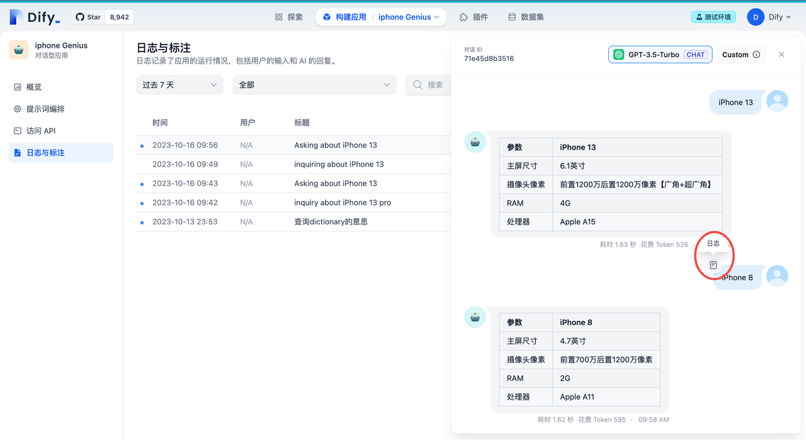

# 提示詞專家模式（已下線）

在 Dify 創建應用的編排默認為**簡易模式**，這很適合想要快速創建應用的非技術人員，比如你想創建一個企業知識庫 Chatbot 或者文章摘要生成器，利用**簡易模式**編排對話前提示詞，添加變量，添加上下文等簡易步驟即可發佈一個完整的應用（可參考👉[conversation-application.md](../../../../guides/application-orchestrate/conversation-application.md "mention")）。

而如果你是一個熟練掌握使用 **OpenAI** 的 **Playground** 的技術人員，正想創建一個學習導師應用，需要在提示詞中針對不同的教學模塊位置嵌入不同的上下文和變量，就可以選擇**專家模式。在此模式下你可以自由地編寫完整的提示詞，包括修改內置的提示詞，調整上下文和聊天曆史內容在提示詞中的位置，設定必要參數等。如果你對 Chat 和 Complete 兩種模型不陌生，現在專家模式**可以快速切換 Chat 和Complete 模型以滿足你的需要，並且都適用於對話型應用和文本生成型應用。

在你開始嘗試新模式前，你需要知道**專家模式**下的必要元素：

*   **文本補全模型** 

    在選擇模型的時候，模型名字的右側顯示 COMPLETE 的即為文本補全模型，該類模型接受名為“提示詞”的自由格式文本字符串，模型將生成一個文本補全，試圖匹配您給它的任何上下文或模式。例如，如果您給的提示詞：“正如笛卡爾所說，我思故”，它將高概率返回“我在”作為補全。
*   **聊天模型** 

    在選擇模型的時候，模型名字的右側顯示 CHAT 的即為聊天模型，該類模型將消息列表作為輸入，並返回模型生成的消息作為輸出。儘管聊天格式旨在簡化多輪對話，但它對於沒有任何對話的單輪任務同樣有用。聊天模型使用的是聊天消息作為輸入和輸出，包含 SYSTEM / USER / ASSISTANT 三種消息類型：

    * `SYSTEM`
      * 系統消息有助於設置 AI 助手的行為。例如，您可以修改 AI 助手的個性或提供有關它在整個對話過程中應如何表現的具體說明。系統消息是可選的，沒有系統消息的模型行為可能類似於使用通用消息，例如“你是一個有幫助的助手”。
    * `USER`
      * 用戶消息提供請求或評論以供 AI 助手響應。
    * `ASSISTANT`
      * 助手消息存儲以前的助手響應，但也可以由您編寫以提供所需行為的示例。
*   **停止序列 Stop\_Sequences**

    是指特定的單詞、短語或字符，用於向 LLM 發出停止生成文本的信號。
* **專家模式提示詞中的內容塊**
  *   

      用戶在配置了數據集的 App 中，輸入查詢內容，App 會將查詢內容作為數據集的檢索條件，檢索的結果在組織之後會作為上下文內容替換 `上下文` 變量，使 LLM 能夠參考上下文的內容進行回答。
  *   

      查詢內容僅在對話型應用的文本補全模型中可用，對話中用戶輸入的內容將替換該變量，以觸發每輪新的對話。
  *   

      會話歷史僅在對話型應用的文本補全模型中可用。在對話型應用中多次對話時，Dify 會將歷史的對話記錄根據內置規則進行組裝拼接，並替換 `會話歷史` 變量。其中 Human 和 Assistant 前綴可點擊 `會話歷史` 後的`...` 進行修改。
*   **初始模版**

    在**專家模式**下，正式編排之前，提示詞框會給到一個初始模版，我們可以直接修改初始模版來對 LLM有更加定製化的要求。注意：不同類型應用的不同類型模式下有所區別。

    具體請參考👉[prompt-engineering-template.md](prompt-engineering-template.md "mention")

## 兩種模式對比

<table><thead><tr><th width="333">對比維度</th><th width="197">簡易模式</th><th>專家模式</th></tr></thead><tbody><tr><td>內置提示詞可見性</td><td>封裝不可見</td><td>開放可見</td></tr><tr><td>有無自動編排</td><td>可用</td><td>不可用</td></tr><tr><td>文本補全模型和聊天模型選擇有無區別</td><td>無</td><td>文本補全模型和聊天模型選擇後有編排區別</td></tr><tr><td>變量插入</td><td>有</td><td>有</td></tr><tr><td>內容塊校驗</td><td>無</td><td>有</td></tr><tr><td>SYSTEM / USER / ASSISTANT<br>三種消息類型編排</td><td>無</td><td>有</td></tr><tr><td>上下文參數設置</td><td>可設置</td><td>可設置</td></tr><tr><td>查看 PROMPT LOG</td><td>可查看完整提示詞日誌</td><td>可查看完整提示詞日誌</td></tr><tr><td>停止序列 Stop_Sequences 參數設置</td><td>無</td><td>可設置</td></tr></tbody></table>

## 操作說明

### 1. 如何進入專家模式

創建應用後，在提示詞編排頁可以切換至**專家模式**，在此模式下可以編輯完整的應用提示詞。

<figure><figcaption><p>專家模式入口</p></figcaption></figure>


在**專家模式**下修改提示詞併發布應用後，將無法返回至**簡易模式**。


### 2. 修改插入上下文參數

在**簡易模式**和**專家模式**下，都可以對插入上下文的參數進行修改，參數包含了 **TopK** 和 **Score 閾值**。


需要注意的是，我們只有先上傳了上下文，在**專家模式**下才會呈現包含 \{{#context#\}} 的內置提示詞


<figure><figcaption><p>上下文參數設置</p></figcaption></figure>

**TopK：值範圍為整數 1～10**

用於篩選與用戶問題相似度最高的文本片段。系統同時會根據選用模型上下文窗口大小動態調整片段數量。系統默認值為 2 。這個值建議可以設置為 2～5 ，因為我們期待的是得到與嵌入的上下文匹配度更高的答案。

**Score 閾值：值範圍為兩位小數的浮點數 0～1**

用於設置文本片段篩選的相似度閾值，即：只召回超過設置分數的文本片段（在“命中測試”中我們可以查看到每個片段的命中分數）。系統默認關閉該設置，即不會對召回的文本片段相似值過濾。打開後默認值為 0.7 。這裡我們推薦保持默認關閉設置，如果你有更精準的回覆要求，也可以設置更高的值（最高值為1，不建議過高）

### 3. 設置**停止序列 Stop\_Sequences**

我們不期望 LLM 生成多餘的內容，所以需要設置指特定的單詞、短語或字符(默認設置為 `Human:`)，告知 LLM 停止生成文本。

比如你在提示詞中寫了 _Few-Shot_:

```
Human1: 天是什麼顏色

Assistant1: 天是藍色的

Human1: 火是什麼顏色

Assistant1: 火是紅色的

Human1: 土是什麼顏色

Assistant1: 
```

那麼在模型參數裡的 `停止序列 Stop_Sequences`，輸入 `Human1:`，並按下 "Tab" 鍵。

這樣 LLM 在回覆的時候只會回覆一句：

```
Assistant1: 土是黃色的
```

而不會生成多餘的對話（即 LLM 生成內容到達下一個 “Human1:” 之前就停止了）。

### 4. 快捷插入變量和內容塊

在**專家模式**下，你可以在文本編輯器中輸入“`/`”，快捷調出內容塊來插入提示詞中。內容塊分為：`上下文`、`變量`、`會話歷史`、`查詢內容`。你也可以通過輸入“`{`”，快捷插入已創建過的變量列表。\\

<figure><figcaption><p>快捷鍵 “/”</p></figcaption></figure>


除“`變量`”以外的其他內容塊不可重複插入。在不同應用和模型下，可插入的內容塊會根據不同的提示詞模板結構有所區別，`會話歷史`、`查詢內容` 僅在對話型應用的文本補全模型中可用。


### 5. 輸入對話前提示詞

系統的提示詞初始模版提供了必要的參數和 LLM 回覆要求，詳情見👉：[prompt-engineering-template.md](prompt-engineering-template.md "mention")。

而開發人員前期編排的核心是對話前提示詞（`Pre-prompt`），需要編輯後插入內置提示詞，建議的插入位置如下（以創建 “iPhone 諮詢客服”為例）：

```
When answer to user:
- If you don't know, just say that you don't know.
- If you don't know when you are not sure, ask for clarification.
Avoid mentioning that you obtained the information from the context.
And answer according to the language of the user's question.

你是 Apple 公司的一位客服助手，你可以為用戶提供 iPhone 的諮詢服務。
當你回答時需要列出 iPhone 詳細參數，你必須一定要把這些信息輸出為豎向 MARKDOWN 表格，若列表過多則進行轉置。
你被允許長時間思考從而生成更合理的輸出。
注意：你目前掌握的只是一部分 iPhone 型號，而不是全部。
```

當然，你也可以定製化修改提示詞初始模版，比如你希望 LLM 回覆的語言都是英文，你可以將上述的內置提示詞修改為：

```
When answer to user:
- If you don't know, just say that you don't know.
- If you don't know when you are not sure, ask for clarification.
Avoid mentioning that you obtained the information from the context.
And answer according to the language English.
```

### 6. 調試日誌

編排調試時不僅可以查看用戶的輸入和 LLM 的回覆。在**專家模式**下，點擊發送消息左上角圖標，可以看到完整的提示詞，方便開發者確認輸入變量內容、上下文、聊天記錄和查詢內容是否符合預期。日誌列表的相關說明請查看日誌文檔 👉 ： [logs.md](../../../../guides/biao-zhu/logs.md "mention")

#### 6.1 **查看調試日誌**

在調試預覽界面，用戶與 AI 產生對話之後，將鼠標指針移動到任意的用戶會話，即可在左上角看到“日誌”標誌按鈕，點擊即可查看提示詞日誌。

<figure><figcaption><p>調試日誌入口</p></figcaption></figure>

在日誌中，我們可以清晰的查看到：

* 完整的內置提示詞
* 當前會話引用的相關文本片段
* 歷史會話記錄

<figure><figcaption><p>調試預覽界面查看提示詞日誌</p></figcaption></figure>

從日誌中，我們可以查看經過系統拼裝後最終發送至 LLM 的完整提示詞，並根據調試結果持續改進提示詞輸入。

#### **6.2 追溯調試歷史**

在初始的構建應用主界面，左側導航欄可以看到“日誌與標註”，點擊進去即可查看完整的日誌。 在日誌與標註的主界面，點擊任意一個會話日誌條目，在彈出的右側對話框中同樣鼠標指針移動到會話上即可點開“日誌”按鈕查看提示詞日誌。

<figure><figcaption><p>日誌與標註界面查看提示詞日誌</p></figcaption></figure>
