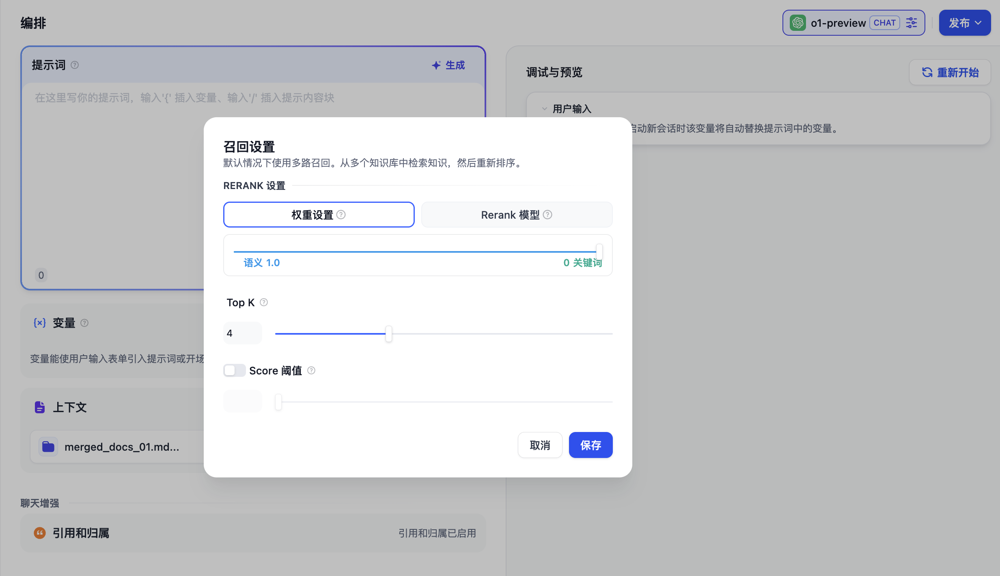

# 召回模式

當用戶構建知識庫問答類的 AI 應用時，如果在應用內關聯了多個知識庫，此時需要應用 Dify 的召回策略決定從哪些知識庫中檢索內容。

<figure><figcaption>
召回模式設置
</figcaption></figure>

### 召回設置

根據用戶意圖同時匹配所有知識庫，從多路知識庫查詢相關文本片段，經過重排序步驟，從多路查詢結果中選擇匹配用戶問題的最佳結果，需配置 Rerank 模型 API。在多路召回模式下，檢索器會在所有與應用關聯的知識庫中去檢索與用戶問題相關的文本內容，並將多路召回的相關文檔結果合併，並通過 Rerank 模型對檢索召回的文檔進行語義重排序。

在多路召回模式下，建議配置 Rerank 模型。你可以閱讀 [重排序](https://docs.dify.ai/v/zh-hans/learn-more/extended-reading/retrieval-augment/rerank) 瞭解更多。

以下是多路召回模式的技術流程圖：

<figure><figcaption>
多路召回
</figcaption></figure>

由於多路召回模式不依賴於模型的推理能力或知識庫描述，該模式在多知識庫檢索時能夠獲得質量更高的召回效果，除此之外加入 Rerank 步驟也能有效改進文檔召回效果。因此，當創建的知識庫問答應用關聯了多個知識庫時，我們更推薦將召回模式配置為多路召回。
