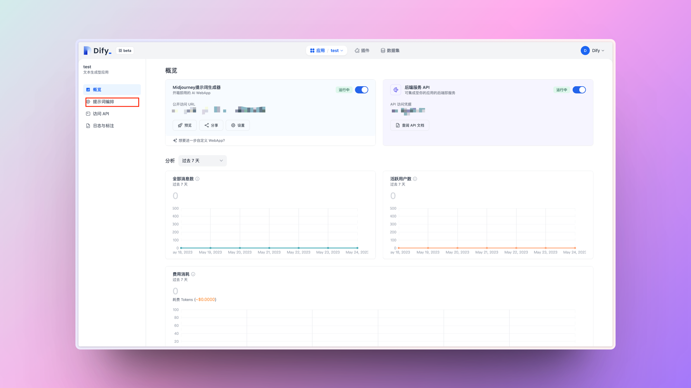
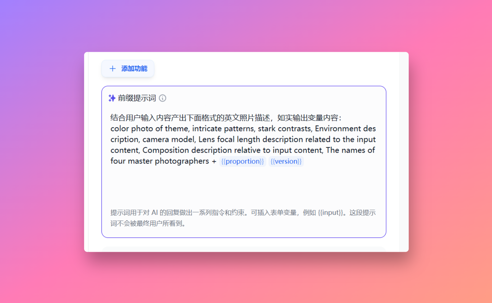
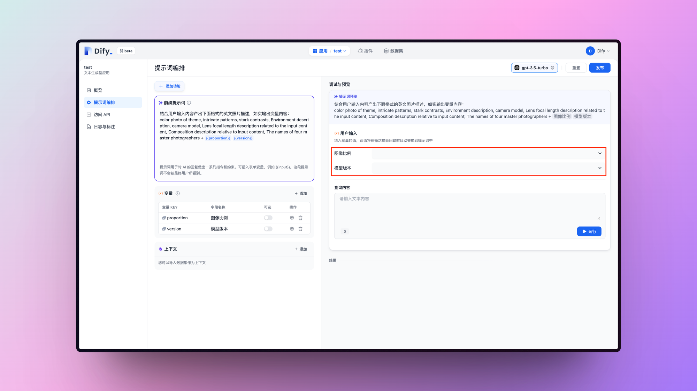
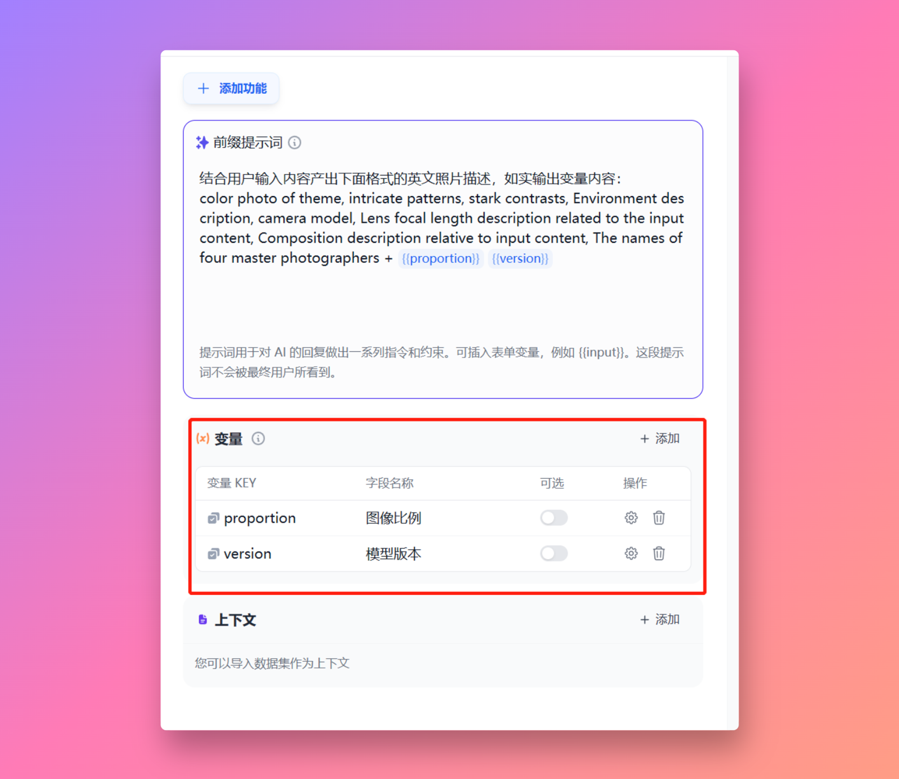
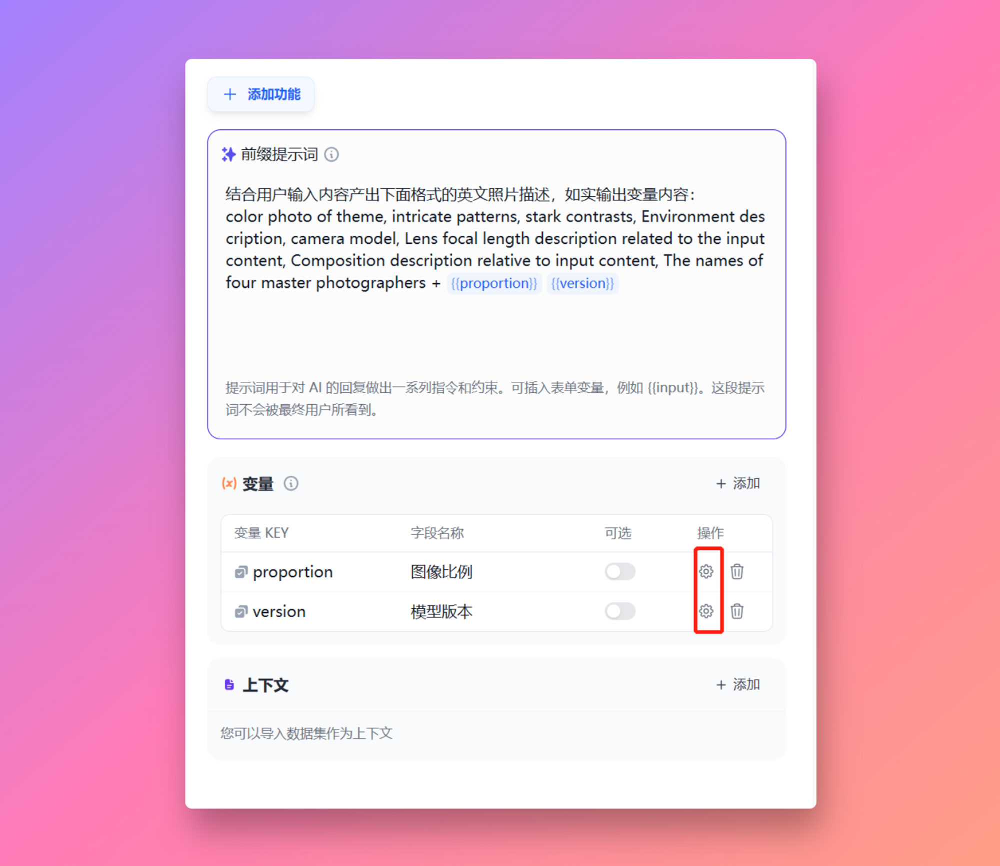
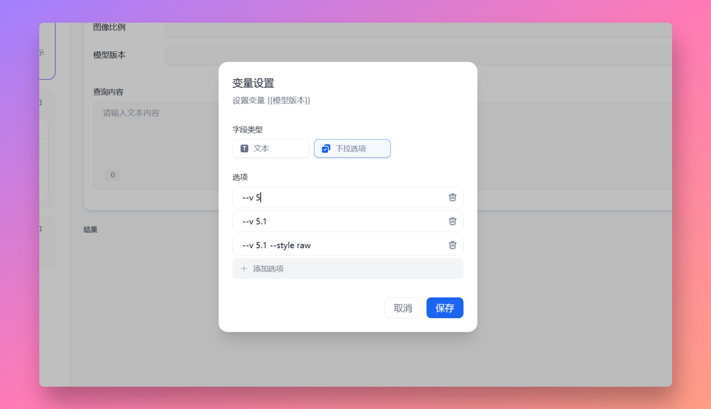
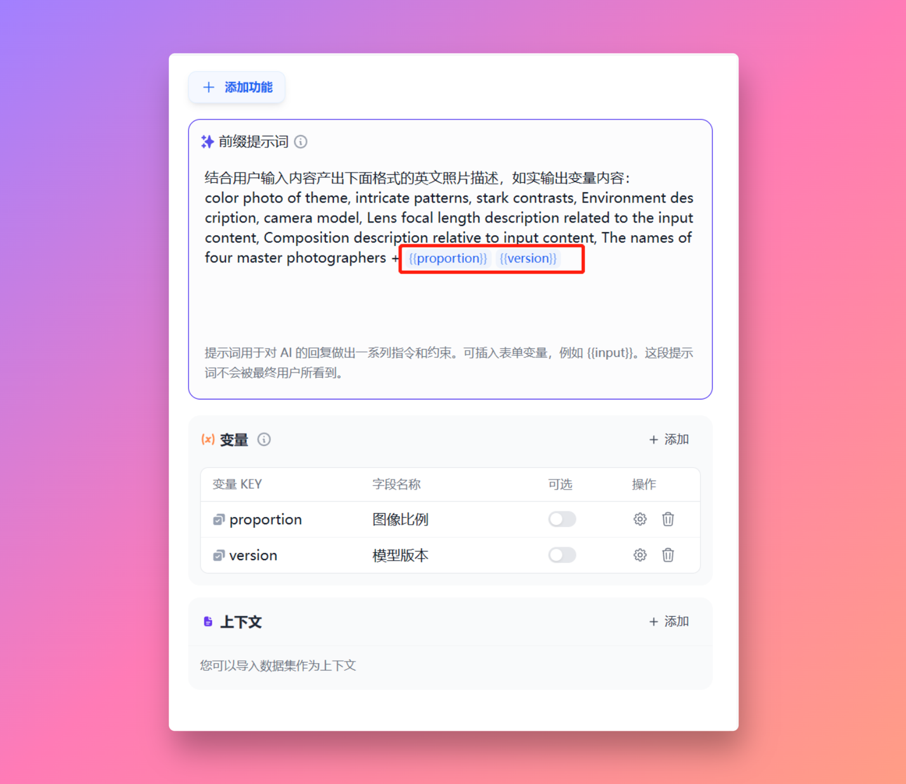
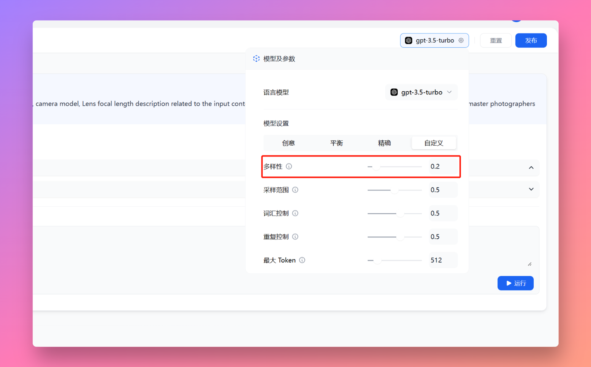
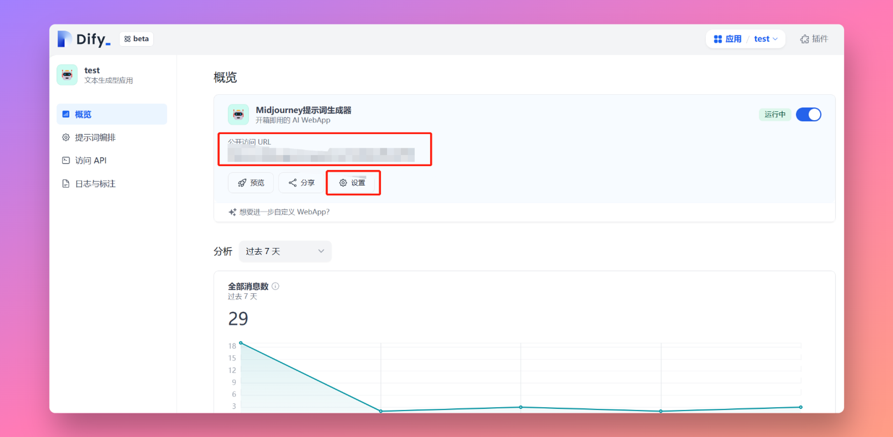

# 教你十幾分鐘不用代碼創建 Midjourney 提示詞機器人

_作者：歸藏的 AI 工具箱_

試用了一下前幾天我週刊裡推薦的自然語言編程工具 Dify，它是 @goocarlos 開發的能夠讓一個不會代碼的人只通過編寫提示詞生成一個 Web 應用，甚至連 API 也生成好了，你可以接入以後部署到你希望部署的平臺上去。

下面這個應用就是我花 20 分鐘寫的，效果非常好，如果沒有 Dify 我可能需要搞好久才能搞定。具體的功能就是根據輸入的簡短的主題生成 Midjourney 的提示詞，也能幫助你快速填寫常見的 Midjourney 命令。下面我會寫一下這個應用的創建過程幫大家熟悉一下這個平臺。

Dify 可以選擇兩種應用一種是對話型應用類似於 ChatGPT 那種，另一種是文本生成類應用沒有多輪對話的機制點擊按鈕直接生成文本內容。我們要創建的 Midjoureny 提示詞機器人，所以我們選擇文本生成應用就行。

你可以在這裡訪問 Dify：https://dify.ai/

<figure><figcaption></figcaption></figure>

我們輸入名稱創建完成之後看到的頁面就是我們的看板頁面裡面有一些數據監控和應用設置。我們先點擊左側的提示詞編排，這裡就是主要的工作頁面了。

<figure><figcaption></figcaption></figure>

這個頁面左側是提示詞設置和一些其他功能，右側可以實時預覽和使用你創建的內容。前綴提示詞就是用戶每次輸入內容後觸發的提示詞了，可以理解為每次 GPT 都會按照你的前綴提示詞內容去處理用戶輸入的信息。

<figure><figcaption></figcaption></figure>

可以看一下我的前綴提示詞結構，主要有兩部分前面是中文寫的讓 GPT 按照下面英文的結構輸出照片的描述。英文的結構就是生成提示詞的模板了，主要意思是【主題彩色照片，錯綜複雜的圖案，鮮明的對比，環境描述，相機型號，與輸入內容相關的鏡頭焦距描述，與輸入內容相關的構圖描述，四位攝影師的名字】這個就是提示詞的主要內容了。理論上你現在保存到右邊預覽區域輸入你想生成的主題就能生成對應提示詞了。

<figure><figcaption></figcaption></figure>

那可能有人注意到了後面的 \{{proportion\}} 和 \{{version\}} 是什麼呢，可以看到我右邊需要用戶選擇圖像比例和模型版本這兩個變量就是用來傳遞用戶選擇的信息的。我們看一下如何設置。

<figure><figcaption></figcaption></figure>

我們的功能是把用戶選擇的信息填到提示詞的最後方便用戶直接複製不用重新填寫和記憶這些命令，這裡就要用到下面的變量功能。

變量的作用就是把用戶表單填寫或者選擇的內容動態的帶入到提示詞裡面。比如我這裡創建了兩個變量一個代表圖像比例一個代表模型版本。點擊添加按鈕創建變量。

<figure><figcaption></figcaption></figure>

創建之後首先需要填寫前面的變量 Key 和字段名稱，變量 Key 需要英文。後面的可選開啟之後這個字段就會是選填的。之後我們需要點擊操作欄的設置來設置變量內容。

<figure><figcaption></figcaption></figure>

變量包括兩種內容一種是文本變量一種是下拉選項，文本的就是用戶需要手動輸入，下拉的話就是選擇了。這裡我們主要是不想用戶手打命令，所以我們選擇下拉選項。增加需要的選項就行。

<figure><figcaption></figcaption></figure>

之後就是使用變量了，我們需要把變量 Key 用兩個 {} 包起來填寫到前綴提示詞裡。這裡由於我們不想讓 GPT 改用戶選擇的內容，我加了一句提示詞“如實輸出變量內容”。

<figure><figcaption></figcaption></figure>

加了上面那句話 GPT 還是有一定機率改掉我們的變量內容怎麼辦，我們可以在右側模型選擇這裡把多樣性調低，這樣創造性輸出就會降低，他就不容易改寫我們的變量內容了。其他的幾個參數的意思可看小歎號瞭解。

<figure><figcaption></figcaption></figure>

好了到這裡我們的應用就創建完成了，測試輸出沒問題以後點擊右上角的發佈按鈕，你的應用就發佈了。你你和用戶可以通過公開訪問 URL 的地址訪問你的應用。可以在設置裡設置應用名稱以及簡介、圖標之類的內容。

<figure><figcaption></figcaption></figure>

這就是利用 Dify 創建一個簡單 AI 應用的流程，你還可以通過生成的 API 把你的應用部署在其他平臺或者更改它的 UI。同時 Dify 還支持上傳你自己的數據，比如你可以建一個客服機器人幫助你回答自己產品的相關問題。教程到這裡就結束了，感謝 @goocarlos 創建了這麼好的產品。
