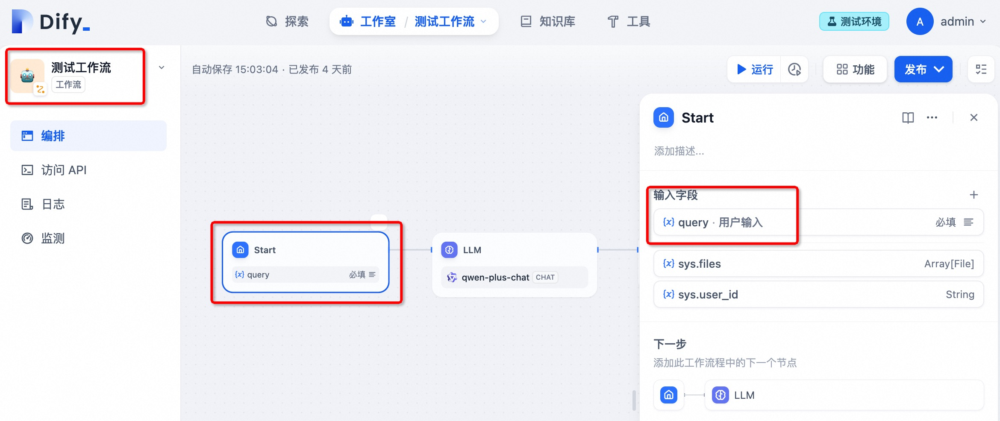
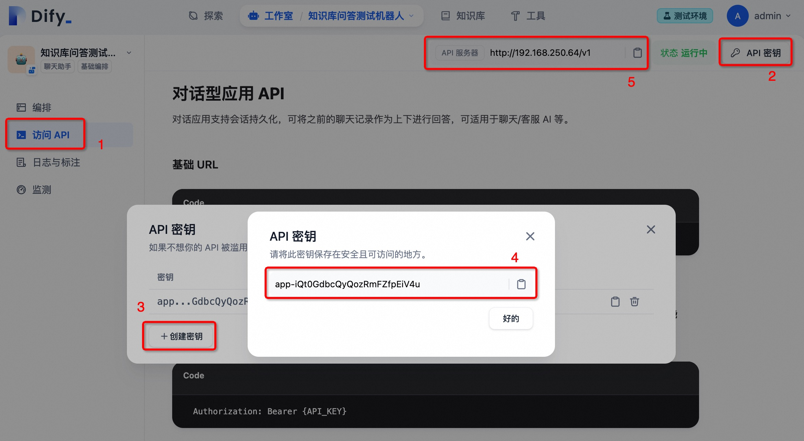
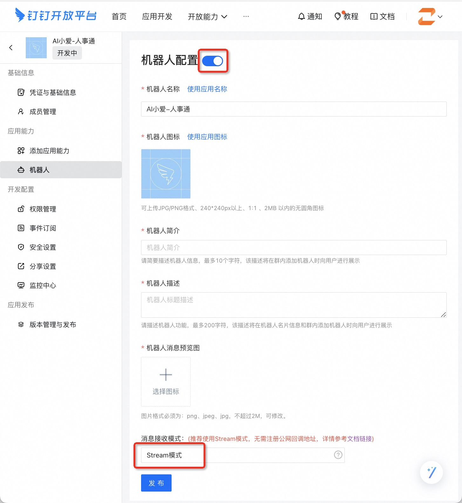
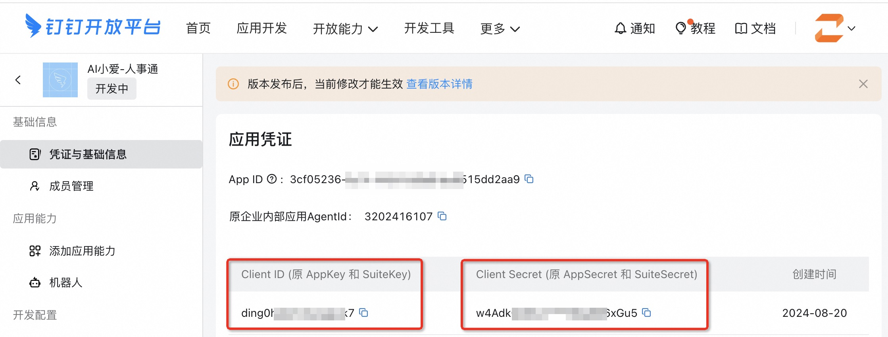

# 將 Dify 應用與釘釘機器人集成

> 本文系社區投稿，作者：zfanswer, [Dify-on-Dingtalk](https://github.com/zfanswer/dify-on-dingtalk) 開源項目作者。

IM 是天然的智能聊天機器人應用場景，校企用戶有不少是使用釘釘軟件的，通過在企業內部群中添加 Dify 應用，就可以打造功能強大的數字員工，幫助企業內部人員提質增效。

在本文中，我們將向你展示如何將你的 Dify 應用和釘釘機器人進行集成，**並在釘釘中實現打字機式的流式輸出效果**，通過使用 [Dify-on-Dingtalk](https://github.com/zfanswer/dify-on-dingtalk) 這個開源框架，進行簡單的配置就可以輕鬆完成這個集成任務。

先上效果圖，也許你就有興趣繼續讀下去了。

<figure><figcaption></figcaption></figure>

## 1. 準備工作

1. 安裝好 Git、Docker、Docker Compose
2. 一個有企業應用開發者權限的釘釘賬號
3. 可使用的 Dify 平臺（自部署和官方 SaaS 服務都可以）
4. 一個你是群主的釘釘群，用作測試

然後我們一步一步詳細介紹如何操作。

## 2. 詳細步驟

### 2.1. 創建 Dify 應用

創建 Dify 應用在本文就不贅述了，可以參考非常詳實的 [Dify 官方文檔](https://docs.dify.ai/v/zh-hans/guides/application-orchestrate/creating-an-application)。這裡你需要知道的是，本文介紹的方法支持接入的 Dify 應用包含了 Dify 目前所有類型。

下圖是一個簡易方法讓你快速識別自己應用的類型，**後續配置時需要明確寫明接入應用的類型**。

<figure><figcaption></figcaption></figure>

另外需要說明的是，雖然所有類型的應用都可以接入，但是根據類型不同也有些限制和區別：

* AGENT 也屬於 CHATBOT，聊天助手應用在接入釘釘機器人後是可以保持聊天上下文的（即支持多輪對話），只有本身在 Dify 中支持會話的才可以
* COMPLETION（文本生成）、WORKFLOW（純工作流）應用在創建的時候有限制，接收的用戶輸入 **只能有一個且變量名為 `query`**，因為釘釘對話場景下用戶輸入是單條消息，所以這裡只能設置一個變量。

<figure><figcaption></figcaption></figure>

<figure><figcaption></figcaption></figure>

這裡我們假設你已經創建好等待接入的 Dify 應用了，這時就需要查看你這個應用的 `訪問 API` 頁面，創建該應用的 API 密鑰④，並且記錄 API 服務器訪問地址⑤。

<figure><figcaption></figcaption></figure>

所以，在此步驟中你創建了待接入的 Dify 應用，同時記錄該應用的幾個重要參數：**應用的類型**、**該應用 API 祕鑰**、**API 服務器訪問地址**。

### 2.2. 創建釘釘企業應用機器人

登錄進入 [釘釘開發平臺](https://open-dev.dingtalk.com/)，選擇合適的組織，進入企業內部應用開發頁面，創建一個企業內部應用。

<figure><figcaption></figcaption></figure>

在彈出窗口裡填好 **應用名稱**、**應用描述**，上傳應用圖標點擊保存。然後自動進入應用開發配置界面，通過 `添加應用能力` 添加機器人能力。

<figure><figcaption></figcaption></figure>

打開機器人配置開關，在下方出現的表單中按你的實際情況填入各必要信息，**在消息接收模式上選擇 Stream 模式**。

<figure><figcaption></figcaption></figure>

點擊發布後，再去到左邊欄的應用發佈 -> 版本管理與發佈 -> 創建新版本，給應用建立一個新版本進行發佈。

<figure><figcaption></figcaption></figure>

最後回到 `憑證與基礎信息`，記錄下該應用的 `Client ID` 和 `Client Secret`，此時左上角應用的狀態應該是 **已發佈**，到此完成釘釘機器人的配置。

<figure><figcaption></figcaption></figure>

### 2.3. 釘釘 AI 卡片配置

為了讓釘釘機器人的回覆也實現打字機一樣的流式輸出效果，需要用到釘釘近來針對 AI 功能開放的 AI 卡片。

進入釘釘開發者後臺，頂部菜單 -> 開放能力 ->[卡片平臺](https://open-dev.dingtalk.com/fe/card) -> 新建模版，來新建一個 AI 卡片模板，填入你喜歡的模版名稱，卡片類型選擇 **消息卡片**，卡片模板場景選擇 **AI 卡片**，並 **關聯剛才創建的應用**。

<figure><figcaption></figcaption></figure>

點擊 **創建** 後進入卡片編輯頁面，這裡基本不需要任何改動，如果希望機器人在出錯時把具體錯誤信息也輸出出來，可以把 `啟用失敗狀態` 打開。

<figure><figcaption></figcaption></figure>

最後點擊保存，發佈，顯示 “模版發佈成功”，然後返回到剛才的模版列表頁面，複製 \*\* 模版 ID\*\*，保存下來一會兒會用到。

<figure><figcaption></figcaption></figure>

## 3. 部署 Dify-on-Dingtalk

### 3.1. 下載 Dify-on-Dingtalk 項目代碼

```shell
git clone https://github.com/zfanswer/dify-on-dingtalk.git
# 有網絡問題的可以從 gitee 鏡像倉庫拉取
# git clone https://gitee.com/zfanswer/dify-on-dingtalk.git
```

### 3.2. 填寫配置文件

```shell
cd dify-on-dingtalk
# 將配置文件示例拷貝到 docker 文件夾中
cd docker
cp ../.env.example .env
cp ../.bots.yaml.example .bots.yaml
# 分別修改.env 和.bots.yaml 文件，配置好所需參數。
```

本文中使用 docker 來演示如何快速啟動服務，如果需要用源代碼啟動服務，請參考代碼中 [README.md](https://github.com/zfanswer/dify-on-dingtalk/blob/main/README.md#env%25) 文件，兩個文件的參數配置可參考其中的參數說明，也可按下邊簡易配置。

`.env` 文件主要是配置全局變量的，內容示例如下：

```shell
# 日誌級別
LOG_LEVEL=INFO
# 默認每個機器人後臺監聽線程數，調大可加大可問答併發
# 不過不要太大根據 cpu 配置適當調整
DEFAULT_MAX_WORKERS=2
# Dify API 服務器訪問地址，上文 2.1. 步驟裡記錄的
DIFY_OPEN_API_URL="https://api.dify.ai/v1"
# 用戶各自上下文維持時間，默認 15 minutes，只對 chatbot app 有效
DIFY_CONVERSATION_REMAIN_TIME=15
# 釘釘 AI 卡片模版 ID，上文 2.3. 步驟裡記錄的
DINGTALK_AI_CARD_TEMPLATE_ID="<your-dingtalk-ai-card-temp-id>"
```

`.bots.yaml` 文件主要是配置釘釘機器人和 Dify 應用的綁定關係，內容示例配置如下：

```yaml
bots:
  - name: 問答助手
    # 釘釘應用憑證信息，上文 2.2. 步驟裡記錄的
    dingtalk_app_client_id: <your-dingtalk-app-client-id>
    dingtalk_app_client_secret: <your-dingtalk-app-client-secret>
    # Dify 應用類型，上文 2.1. 開頭提到的
    dify_app_type: <chatbot or completion or workflow>
    # Dify 應用 API 密鑰，上文 2.1. 步驟裡記錄的
    dify_app_api_key: <your-dify-api-key-per-app>
    # 目前是固定值，不用動
    handler: DifyAiCardBotHandler
  - name: 問答助手 2
    xxx 以下略 xxx
```

可以看到，在文件中通過添加一組新的 bot 設定，是支持一次性配置多個機器人和 Dify 應用綁定的，這是為了用於比如企業內部人事、法務、代碼助手等需要多個機器人後邊配置不同的 Dify 應用。不過需要注意的是，不要把同一個釘釘機器人綁定不同的 Dify 應用，不然具體調用哪個 Dify 應用來回答是隨機的。

### 3.3. 啟動 docker 容器

通過如下命令啟動 docker 容器，

```shell
# 假設現在 pwd 是在 docker 文件夾下
docker compose up -d
```

待容器啟動後可以通過 `docker logs < 容器 ID>` 查看服務日誌確認服務是否正常啟動，出現如下日誌且沒有報錯即為正常。

```shell
2024-08-20 18:16:42.019 | INFO     | __main__:run:33 - 待啟動機器人數量：1, 預計使用最大線程數：1
2024-08-20 18:16:42.019 | INFO     | __main__:run:37 - 啟動第 1 個機器人：agent_chatbot
2024-08-20 18:16:42.021 | INFO     | dingtalk_stream.stream:open_connection:131 - open connection, url=https://api.dingtalk.com/v1.0/gateway/connections/open
2024-08-20 18:16:42.314 | INFO     | dingtalk_stream.stream:start:72 - endpoint is % s
```

## 4. 實際對話測試

### 4.1. 將機器人添加進群聊

從群設置中找到創建的釘釘機器人，添加進群，即可開始在群眾 @機器人進行對話，該示例圖片中是使用了 Dify 應用的標註功能實現關鍵字 help 的固定輸出。

<figure><figcaption></figcaption></figure>

### 4.2. 與機器人進行私聊

與機器人進行私聊有兩種方法：

1. 在群聊中左鍵機器人頭像，選擇發送消息進入私聊界面；
2. 在搜索框中搜索機器人名稱，在功能分類下找到機器人，點擊進入私聊界面；

私聊界面中直接對話即可，不需要再 `@` 了。

<figure><figcaption></figcaption></figure>

## 5. 後記

到此為止，Dify 應用在釘釘上的集成已經完成，希望本文給你帶來了幫助。

如果你對 Dify-on-Dingtalk 的功能還有其他需求和期待，歡迎對[該項目](https://github.com/zfanswer/dify-on-dingtalk)進行貢獻。
