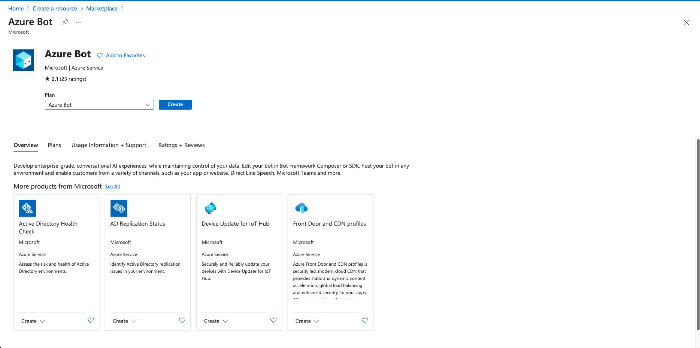
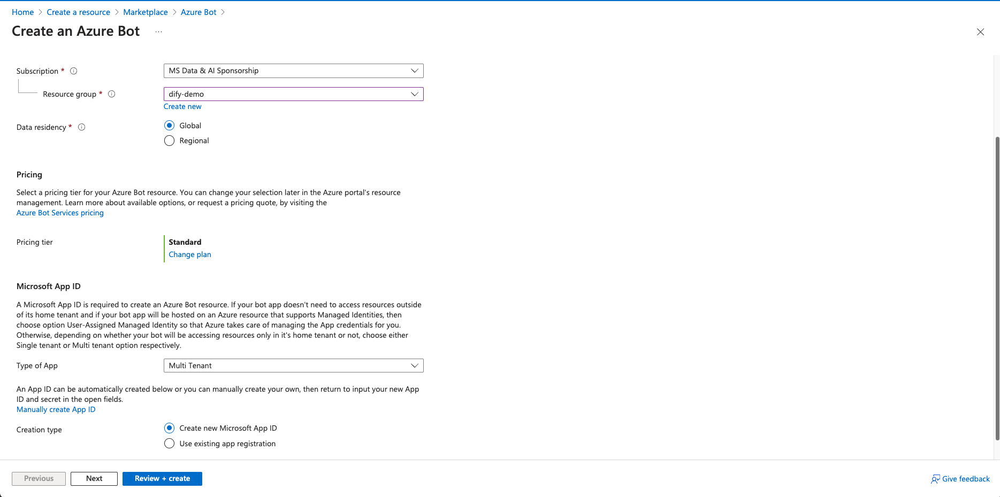
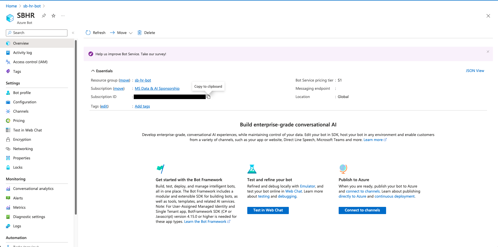
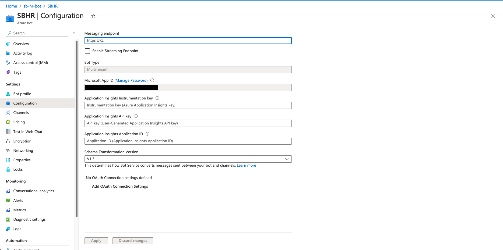
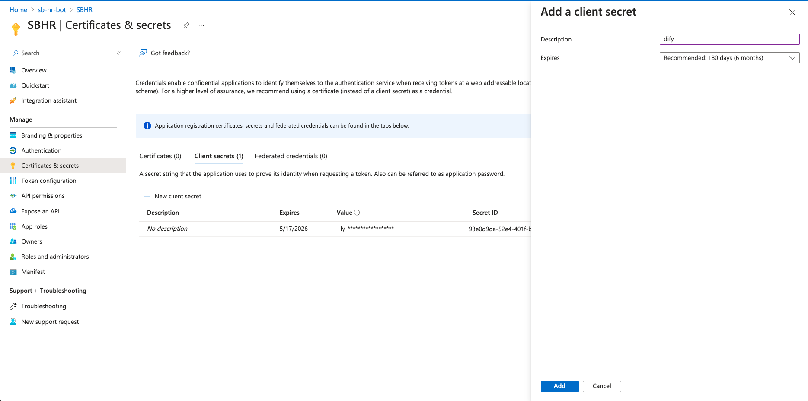
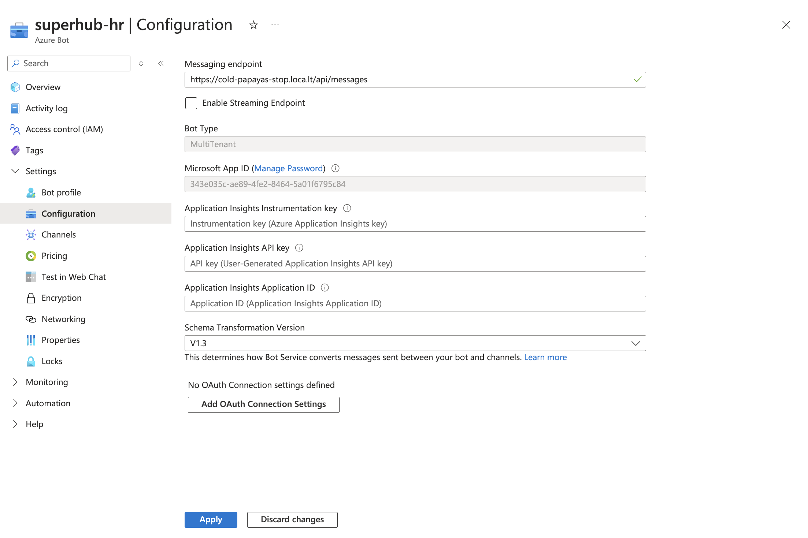
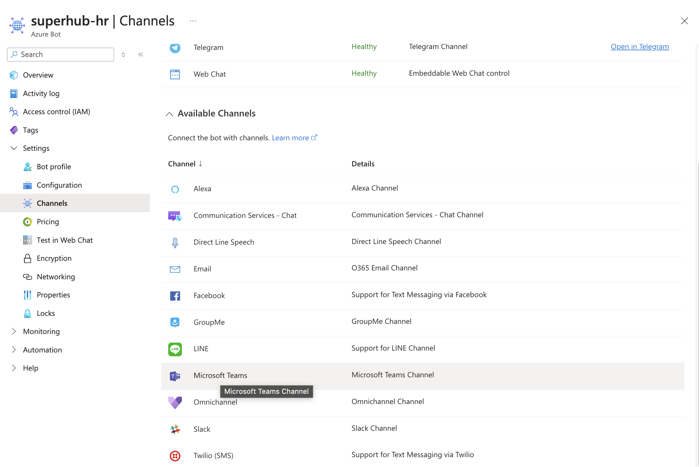
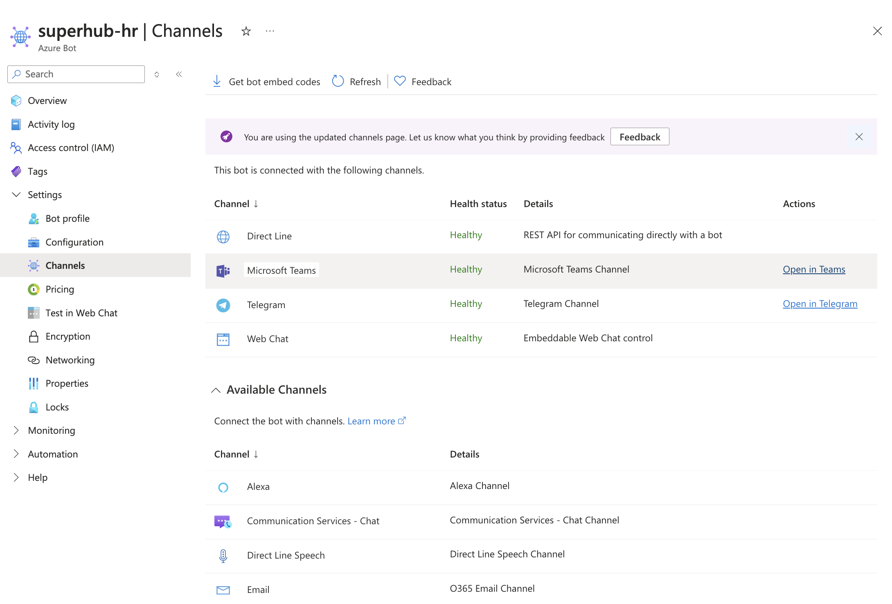
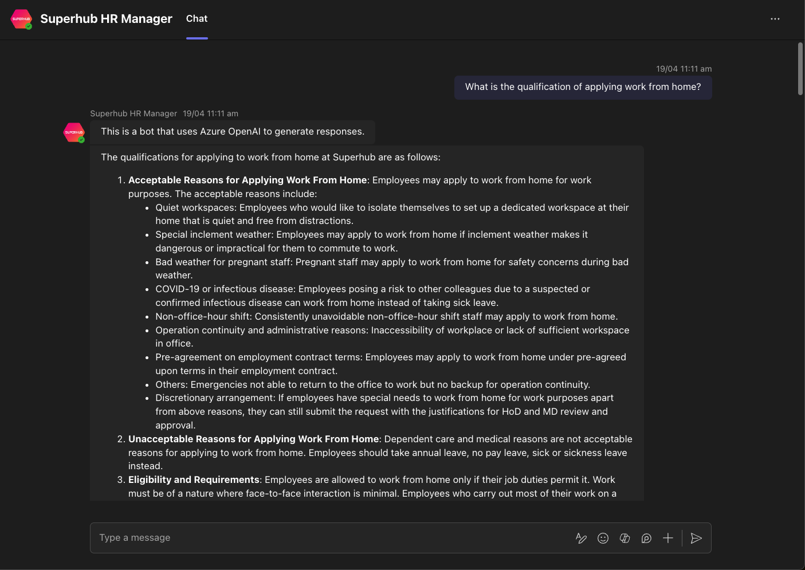

# 使用 Dify 和 Azure Bot Framework 構建 Microsoft Teams 機器人

> 作者：Warren， [Microsoft 最有價值專家 (MVP)](https://mvp.microsoft.com/en-US/mvp/profile/476f41d3-6bd1-ea11-a812-000d3a8dfe0d)

## 1. 概述

隨著人工智能的崛起，聊天機器人變得更聰明，更個性化，更直觀。在本文中，我們將向你展示如何使用 Azure Bot Service，將 Dify 集成至 Microsoft Teams，打造團隊中的 AI 助手。

在本文中將介紹如何集成 Azure Bot Service 的 Teams Channel，允許客戶與你的 Microsoft Teams 聊天機器人開始對話。

## 2. 準備工作

* 安裝好 Docker 和 Docker Compose
* Microsoft Teams 賬戶
* 一個安裝了 Microsoft Teams 的手機或電腦，用於測試你的 AI 聊天機器人
* [Azure 賬戶](https://azure.microsoft.com/en-us/free)

## 3. 創建 Dify 基礎編排聊天助手應用

首先，登錄 [Dify 平臺](https://cloud.dify.ai/signin)，使用 Github 登錄或者使用 Google 登錄。此外，你也可以參考 Dify 官方教程 [Docker Compose 部署](https://docs.dify.ai/v/zh-hans/getting-started/install-self-hosted/docker-compose) 私有部署。

<figure><figcaption></figcaption></figure>

登錄成功後，進入 Dify 頁面，我們按照下方步驟創建一個基礎編排聊天助手應用

1. 點擊頁面上方的工作室
2. 創建空白應用
3. 應用類型選擇聊天助手
4. 聊天助手編排方式選擇基礎編排
5. 選擇應用圖標併為應用填寫一個名稱，比如基礎編排聊天助手
6. 點擊創建

<figure><figcaption></figcaption></figure>

創建成功後會跳轉到上圖所示頁面，此時繼續配置應用

1. 選擇模型，如 gpt-3.5-turbo-0125
2. 設置模型參數
3. 填寫應用提示詞

<figure><figcaption></figcaption></figure>

配置完成後，可以在右側對話框進行測試。測試完成後，進行如下操作：

1. 發佈
2. 更新
3. 訪問 API

接著生成基礎編排聊天助手 API 密鑰

<figure><figcaption></figcaption></figure>

點擊 "訪問 API" 後，會跳轉到上圖的 API 管理頁面，按照如下步驟獲取 API 密鑰：

1. 點擊右上角 API 密鑰
2. 點擊創建密鑰
3. 複製保存密鑰

在保存密鑰後，還需要查看右上角的 API 服務器，如果是 Dify 官網的應用，API 服務器地址為 `https://api.dify.ai/v1`, 如果是私有部署的，請確認你自己的 API 服務器地址。

至此，創建聊天助手的準備工作結束。在此小節中我們只需要保存好兩個東西：**API 密鑰** 與 **API 服務器地址**。

## 4. 創建 Azure Bot Service

轉到 [Azure Marketplace](https://portal.azure.com/#view/Microsoft\_Azure\_Marketplace/GalleryItemDetailsBladeNopdl/id/Microsoft.AzureBot/selectionMode\~/false/resourceGroupId//resourceGroupLocation//dontDiscardJourney\~/false/selectedMenuId/home/launchingContext\~/%7B%22galleryItemId%22%3A%22Microsoft.AzureBot%22%2C%22source%22%3A%5B%22GalleryFeaturedMenuItemPart%22%2C%22VirtualizedTileDetails%22%5D%2C%22menuItemId%22%3A%22home%22%2C%22subMenuItemId%22%3A%22Search%20results%22%2C%22telemetryId%22%3A%22a09b3b54-129b-475f-bd39-d7285a272043%22%7D/searchTelemetryId/258b225f-e7d5-4744-bfe4-69fa701d9d5a) 畫面應該會直接到 Azure Bot Service 的創建畫面。

<figure><figcaption></figcaption></figure>

確認所有設置然後創建。

<figure><figcaption></figcaption></figure>

創建好後轉到 Azure Bot 頁面，先把 Subscription ID 保存好。

<figure><figcaption></figcaption></figure>

然後選擇 Configuration，保存好 Microsoft App ID 然後選擇 Manage Password。

<figure><figcaption></figcaption></figure>

創建和保存新 client secret。

<figure><figcaption></figcaption></figure>

## 5. 創建你的聊天機器人

在這一部分，你將使用 Microsoft Bot Framework 編寫一個基本的聊天機器人的代碼。

#### 5.1 下載代碼

```
git clone https://github.com/somethingwentwell/dify-teams-bot
```

#### 5.2 配置.env

在項目根目錄創建.env，內容如下:

```
MicrosoftAppType=MultiTenant
MicrosoftAppId=< 在 (4) 獲取的 Client ID>
MicrosoftAppPassword=< 在 (4) 獲取的 Client Secret>
MicrosoftAppTenantId=< 在 (4) 獲取的 Tenant ID>

API_ENDPOINT=< 在 (3) 獲取的 Dify API 服務器地址 >
API_KEY=< 在 (3) 獲取的 Dify API 密鑰 >
```

#### 5.3 運行代碼

執行 docker compose up

```
docker compose up
```

如果運行成功，你應該會看到

```
[+] Running 2/0
 ✔ Network dify-teams-bot_dify-network    Created                     0.0s 
 ✔ Container dify-teams-bot-nodejs-app-1  Created                     0.0s 
Attaching to nodejs-app-1
nodejs-app-1  | 
nodejs-app-1  | > echobot@1.0.0 start
nodejs-app-1  | > node ./index.js
nodejs-app-1  | 
nodejs-app-1  | (node:18) [DEP0111] DeprecationWarning: Access to process.binding ('http_parser') is deprecated.
nodejs-app-1  | (Use `node --trace-deprecation ...` to show where the warning was created)
nodejs-app-1  | (node:18) [DEP0111] DeprecationWarning: Access to process.binding ('http_parser') is deprecated.
nodejs-app-1  | 
nodejs-app-1  | restify listening to http://0.0.0.0:3978
nodejs-app-1  | 
nodejs-app-1  | Get Bot Framework Emulator: https://aka.ms/botframework-emulator
nodejs-app-1  | 
nodejs-app-1  | To talk to your bot, open the emulator select "Open Bot"
```

#### 5.4 使用 Localtunnel 將本地項目放到公網訪問

Azure Bot 需要向你的後端發送消息，你需要在公共服務器上託管你的應用。一個簡單的方法是使用 localtunnel。

讓 Azure BotI 應用繼續在 3978 端口運行，並在另一個終端窗口運行以下 localtunnel 命令：

```
npx localtunnel --port 3978
```

上述命令在你的本地服務器（運行在 3978 端口）和 localtunnel 創建的公共域之間建立了一個連接。一旦你有了 localtunnel 轉發 URL，任何來自客戶端對該 URL 的請求都會自動被定向到你的 FastAPI 後端。

<figure><figcaption></figcaption></figure>

## 6. 配置你的 Azure Bot

#### 6.1 打開 Azure Bot

轉到在第四步創建的 Azure Bot，並在左側面板上選擇 Configuration。

將 `Message Endpoint` 替換為在第五步中獲取的 localtunnel 轉發 URL。

<figure><figcaption></figcaption></figure>

#### 6.2 配置 Channels

在左側面板上選擇 Channels，點擊 Microsoft Teams。

<figure><figcaption></figcaption></figure>

## 7. Teams 測試

回到在 6.2 步中創建的 Channels 頁面，點擊 “Open in Teams”

<figure><figcaption></figcaption></figure>

發送 Teams 消息，並等待你的 AI 聊天機器人的回覆。嘗試向 AI 聊天機器人提問你可以向 Dify 聊天助手提問的任何問題。

<figure><figcaption></figcaption></figure>

## 8. 後記

現在，你的 AI 聊天機器人應該能夠在 Microsoft Teams 上運行良好。如果運行良好，可以切換至使用公司的 Microsoft Teams 商業賬戶內的正式環境，並使用遠程服務器託管，使這個 Teams 助手在生產環境中運行。希望你喜歡這個教程，我們下次再見。
