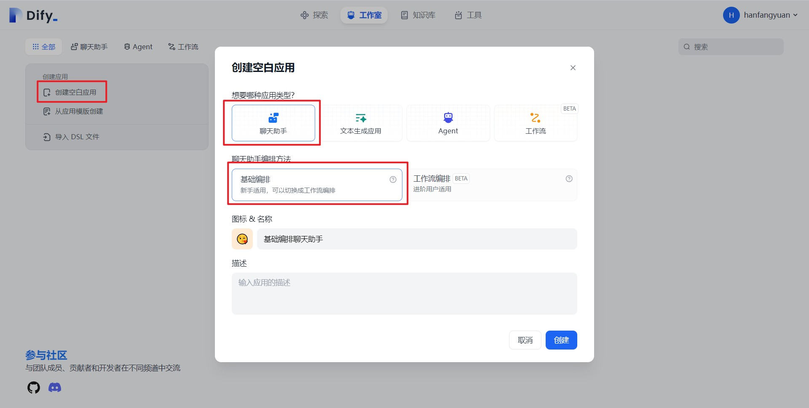
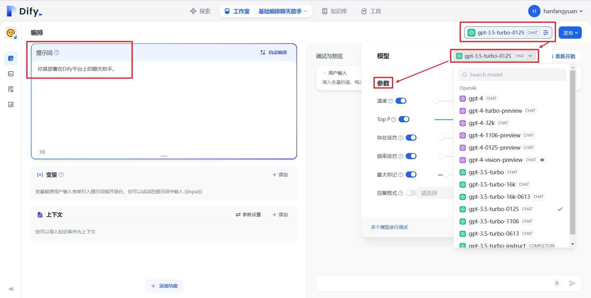

# 手摸手教你把 Dify 接入微信生態

> 作者：韓方圓，"Dify on WeChat"開源項目作者

## 1. 概述

微信作為最熱門的即時通信軟件，擁有巨大的流量。

微信友好的聊天窗口是天然的AI應用LUI(Language User Interface)/CUI(Command User Interface)。

微信不僅有個人微信，同時提供了公眾號、企業微信、企業微信應用、企業微信客服等對話渠道，擁有良好的微信生態。

把Dify應用接入微信生態，就能打造一個功能強大的智能客服，大大降低客服成本，同時也能夠提升客戶體驗。本篇教程就是手摸手地教你如何利用[Dify on WeChat](https://github.com/hanfangyuan4396/dify-on-wechat)項目，把Dify應用接入微信生態。

## 2. Dify接入個人微信

### 2.1. 準備工作

#### 2.1.1. 創建聊天助手

**（1）Dify簡介**

Dify是一個優秀的LLMOps（大型語言模型運維）平臺，Dify的詳細介紹請移步官方文檔[歡迎使用 Dify | 中文 | Dify](https://docs.dify.ai/v/zh-hans)。

**（2）登錄Dify官方應用平臺**

首先，登錄[Dify官方應用平臺](https://cloud.dify.ai/signin)，你可以選擇使用Github登錄或者使用Google登錄。此外，你也可以參考Dify官方教程[Docker Compose 部署 | 中文 | Dify](https://docs.dify.ai/v/zh-hans/getting-started/install-self-hosted/docker-compose) 私有部署，Dify是開源項目，支持私有部署。

<figure><figcaption></figcaption></figure>

**（3）創建Dify基礎編排聊天助手應用**

<figure><figcaption></figcaption></figure>

登錄成功後，進入Dify頁面，我們按照下方步驟創建一個基礎編排聊天助手應用

1. 點擊頁面上方的工作室
2. 創建空白應用
3. 應用類型選擇聊天助手
4. 聊天助手編排方式選擇基礎編排
5. 選擇應用圖標併為應用填寫一個名稱，比如基礎編排聊天助手
6. 點擊創建

<figure><figcaption></figcaption></figure>

創建成功後我們會跳轉到上圖所示頁面，我們繼續配置應用

1. 選擇模型，如gpt-3.5-turbo-0125
2. 設置模型參數
3. 填寫應用提示詞

<figure><figcaption></figcaption></figure>

在配置完成後，我們可以在右側對話框進行測試，在測試完成後，進行如下操作

1. 發佈
2. 更新
3. 訪問API

**（4）生成基礎編排聊天助手API密鑰**

<figure><figcaption></figcaption></figure>

在點擊"訪問API"後，我們會跳轉到上圖的API管理頁面，在這個頁面我們按照如下步驟獲取API密鑰：

1. 點擊右上角API密鑰
2. 點擊創建密鑰
3. 複製保存密鑰

在保存密鑰後，還需要查看右上角的API服務器，如果是Dify官網的應用，API服務器地址為 "https://api.dify.ai/v1", 如果是私有部署的，請確認你自己的API服務器地址。

至此，創建聊天助手的準備工作結束，在此小節中我們只需要保存好兩個東西：**API密鑰**與**API服務器地址**

#### 2.1.2. 下載Dify on WeChat項目

**（1）Dify on WeChat項目簡介**

[Dify on WeChat](https://github.com/hanfangyuan4396/dify-on-wechat)是[ ChatGPT on WeChat](https://github.com/zhayujie/chatgpt-on-wechat)的下游分支，額外實現了對接[Dify](https://github.com/langgenius/dify) API，支持Dify聊天助手、支持Agent調用工具和知識庫，支持Dify工作流，詳情請查看GitHub倉庫[Dify on WeChat](https://github.com/hanfangyuan4396/dify-on-wechat)。

**（2）下載代碼並安裝依賴**

1. 下載項目代碼

```bash
git clone https://github.com/hanfangyuan4396/dify-on-wechat
cd dify-on-wechat/
```

2. 安裝python

Dify on WeChat項目使用python語言編寫，請在[python官網](https://www.python.org/downloads/)下載安裝python，推薦安裝python3.8以上版本，我在ubuntu測試過3.11.6版本，可以正常運行。

3. 安裝核心依賴（必選）：

```bash
pip3 install -r requirements.txt  # 國內可以在該命令末尾添加 "-i https://mirrors.aliyun.com/pypi/simple" 參數，使用阿里雲鏡像源安裝依賴
```

4. 拓展依賴 （可選，建議安裝）：

```bash
pip3 install -r requirements-optional.txt # 國內可以在該命令末尾添加 "-i https://mirrors.aliyun.com/pypi/simple" 參數，使用阿里雲鏡像源安裝依賴
```

**（3）填寫配置文件**

我們在項目根目錄創建名為config.json的文件，文件內容如下，我們在**2.1.1小節（4）** 最後保存了**API密鑰**與**API服務器地址**，請把**dify\_api\_base**配置為**API服務器地址**；**dify\_api\_key**配置為**API密鑰**其他配置保持不變。

(PS: 很多朋友可能並不是嚴格按照我教程給出的步驟創建**聊天助手類型**的Dify應用，在此特別說明一下**dify\_app\_type**配置方法，如果你創建了**聊天助手**應用請配置為**chatbot**；創建了**Agent**應用請配置為**agent**; 創建了**工作流**應用請配置為**workflow**。)

```bash
{
  "dify_api_base": "https://api.dify.ai/v1",
  "dify_api_key": "app-xxx",
  "dify_app_type": "chatbot",
  "channel_type": "wx",
  "model": "dify",
  "single_chat_prefix": [""],
  "single_chat_reply_prefix": "",
  "group_chat_prefix": ["@bot"],
  "group_name_white_list": ["ALL_GROUP"]
}
```

### 2.2. 把基礎編排聊天助手接入微信

#### 2.2.1. 快速啟動測試

**（1）在Dify on Wechat項目根目錄執行如下命令**

```bash
cd dify-on-wechat
python3 app.py   # windows環境下該命令通常為 python app.py
```

**（2）掃碼登錄**

<figure><figcaption></figcaption></figure>

本項目使用itchat實現個人微信登錄，有封號風險，建議使用**實名認證**過的**微信小號**進行測試，在執行上述命令後，我們可以在控制檯看到打印如上圖所示二維碼，使用微信掃碼登錄，登錄後當看到"itchat:Start auto replying."字符，表示登錄成功，我們可以進行測試。

**（3）對話測試**

<figure><figcaption></figcaption></figure>

我們看到，微信機器人的回覆與在Dify測試頁面上的回覆一致。至此，恭喜你成功把Dify接入了個人微信🎉🎉🎉

(PS: 有些朋友到這裡可能在日誌中看到正常回復了消息，但是微信中沒有收到消息，請**不要用自己的微信給自己發消息**)

**（4）服務器部署**

1. 源碼部署

```bash
cd dify-on-wechat
nohup python3 app.py & tail -f nohup.out   # 在後臺運行程序並通過日誌輸出二維碼
```

2. docker compose部署

容器的**環境變量**會**覆蓋**config.json文件的配置，請修改docker/docker-compose.yml文件環境變量為你實際的配置，配置方法與**2.1.1小節(4)** 的config.json配置一致。

請確保正確配置**DIFY\_API\_BASE**, **DIFY\_API\_KEY**與**DIFY\_APP\_TYPE**環境變量。

```yaml
version: '2.0'
services:
  dify-on-wechat:
    image: hanfangyuan/dify-on-wechat
    container_name: dify-on-wechat
    security_opt:
      - seccomp:unconfined
    environment:
      DIFY_API_BASE: 'https://api.dify.ai/v1'
      DIFY_API_KEY: 'app-xx'
      DIFY_APP_TYPE: 'chatbot'
      MODEL: 'dify'
      SINGLE_CHAT_PREFIX: '[""]'
      SINGLE_CHAT_REPLY_PREFIX: '""'
      GROUP_CHAT_PREFIX: '["@bot"]'
      GROUP_NAME_WHITE_LIST: '["ALL_GROUP"]'
```

然後執行如下命令啟動容器

```bash
cd dify-on-wechat/docker       # 進入docker目錄
docker compose up -d           # 啟動docker容器
docker logs -f dify-on-wechat  # 查看二維碼並登錄
```

### 2.3. 把工作流編排聊天助手接入微信

在把Dify基礎的聊天助手應用接入微信後，我們接下來增加難度，嘗試把工作流編排聊天助手應用接入微信，實現一個具有Dify平臺知識的微信智能客服，為我們解答Dify工作流相關知識。

#### 2.3.1. 創建知識庫

**（1）下載知識庫文件**

<figure><figcaption></figcaption></figure>

我們到[dify文檔倉庫](../../guides/workflow/)下載Dify工作流介紹的文檔。

**（2）Dify中導入知識庫**

<figure><figcaption></figcaption></figure>

進入知識庫頁面，創建知識庫

<figure><figcaption></figcaption></figure>

選擇導入已有文本，上傳剛才下載的introduce.md文件，點擊下一步

<figure><figcaption></figcaption></figure>

<figure><figcaption></figcaption></figure>

選擇如下配置

* 分段設置：自動分段與清洗
* 索引方式：高質量
* 檢索設置：向量檢索

最後點擊保存並處理

<figure><figcaption></figcaption></figure>

我們看到知識庫正在進行嵌入處理，稍等片刻，即可嵌入成功。

#### 2.3.2. 創建工作流編排聊天助手

<figure><figcaption></figcaption></figure>

我們進入Dify工作室，點擊從應用模板創建

<figure><figcaption></figcaption></figure>

我們使用知識庫+聊天機器人類型的模板，設置應用圖標與名稱，點擊創建

<figure><figcaption></figcaption></figure>

跳轉到工作流編排頁面後，先點擊知識檢索節點，點擊最右側"+"添加知識庫。我們選擇之前上傳好的introduce.md知識庫，該知識庫是對Dify工作流的基本介紹。最後我們點擊添加，知識庫節點設置完成。

<figure><figcaption></figcaption></figure>

接下來選擇LLM節點，點擊設置上下文，我們選擇result變量，該變量存有知識檢索的結果。

<figure><figcaption></figcaption></figure>

設置完LLM節點後，我們點擊預覽進行測試，輸入問題：請介紹一下dify工作流。可以看到最終輸出了Dify工作流的正確介紹。測試正常後，我們返回編輯模式。

<figure><figcaption></figcaption></figure>

返回編輯模式後，依次點擊發布、更新、訪問API

#### 2.3.3. 生成工作流編排聊天助手API密鑰

在跳轉到API管理頁面後，我們參照**2.1.1小節(4)獲取"知識庫+聊天機器人"應用的API密鑰**與**API服務器地址**

#### 2.3.4. 接入微信

與**2.1.2小節（3）類似，我們在項目根目錄創建名為config.json的文件，文件內容如下，同樣把dify\_api\_base**配置為**知識庫+聊天機器人**應用的API服務器地址, **dify\_api\_key**配置為**知識庫+聊天機器人**應用的API密鑰，其他配置保持不變

```bash
{ 
  "dify_api_base": "https://api.dify.ai/v1",
  "dify_api_key": "app-xxx",
  "dify_app_type": "chatbot",
  "channel_type": "wx",
  "model": "dify",
  "single_chat_prefix": [""],
  "single_chat_reply_prefix": "",
  "group_chat_prefix": ["@bot"],
  "group_name_white_list": ["ALL_GROUP"]
}
```

我們按照**2.2.1小節**啟動程序並掃碼登錄，然後給微信機器人發送消息，進行測試

<figure><figcaption></figcaption></figure>

微信機器人的回覆與在Dify測試頁面上的回覆一致。恭喜你更進一步，把工作流編排應用接入了個人微信，你可以向知識庫中導入更多的Dify官方文檔，讓微信機器人為你解答更多的Dify相關問題。

### 2.4. 把Agent接入微信

#### 2.4.1. 創建Agent應用

<figure><figcaption></figcaption></figure>

進入工作室頁面，點擊創建空白應用，選擇Agent，設置圖標和應用名稱，最後點擊創建

<figure><figcaption></figcaption></figure>

創建成功後，我們會進入Agent應用配置頁面，在這個頁面我們選擇好對話模型，然後添加工具。我們首先添加DALL-E繪畫工具，首次使用該工具需要授權，一般我們設置好OpenAI API key和OpenAI base URL即可使用該DALL-E繪畫工具。

<figure><figcaption></figcaption></figure>

授權成功後，我們添加DALL-E 3繪畫工具

<figure><figcaption></figcaption></figure>

接著，繼續添加DuckDuckGo搜索引擎和數學工具，進行後續的工具測試

<figure><figcaption></figcaption></figure>

我們輸入問題"搜索開源項目Dify的star數量，這個數量乘以3.14是多少"，確認應用能夠正常調用工具，我們依次點擊發布、更新、訪問API

#### 2.4.2. 生成Agent API密鑰

我們繼續參照**2.1.1小節（4）獲取智能助手**應用的**API密鑰**與**API服務器地址**

#### 2.4.3. 接入微信

我們在項目根目錄創建名為config.json的文件，文件內容如下，同樣把**dify\_api\_base**配置為**智能助手**應用的API服務器地址；**dify\_api\_key**配置為**智能助手**應用的API密鑰，注意該應用為**智能助手**類型應用，還需要把**dify\_app\_type**設置為**agent**，其他配置保持不變

```bash
  {
    "dify_api_base": "https://api.dify.ai/v1",
    "dify_api_key": "app-xxx",
    "dify_app_type": "agent",
    "channel_type": "wx",
    "model": "dify",
    "single_chat_prefix": [""],
    "single_chat_reply_prefix": "",
    "group_chat_prefix": ["@bot"],
    "group_name_white_list": ["ALL_GROUP"]
 }

```

繼續參照**2.2.1小節**啟動程序並掃碼登錄，然後給微信機器人發送消息，進行測試

<figure><figcaption></figcaption></figure>

可以看到微信機器人可以正常使用搜索和繪畫工具。再一次恭喜你，把Dify Agent應用接入微信。也恭喜我，寫到這裡可以先睡覺了。

### 2.5. 把工作流接入微信

#### 2.5.1. 創建工作流應用

<figure><figcaption></figcaption></figure>

首先你需要提前下載好我預先創建的DSL文件，[點擊此處下載](https://github.com/hanfangyuan4396/dify-on-wechat/blob/master/dsl/chat-workflow.yml)。下載完成後，進入工作室頁面，點擊導入DSL文件，上傳提前下載好的文件，最後點擊創建。

<figure><figcaption></figcaption></figure>

創建完成後，按照上圖步驟進行測試。點擊運行，輸入你好，確保該工作流能正常輸出結果。

你可以在此工作流的基礎上進行修改，但是對於**工作流類型**的應用，它的輸入變量名稱十分靈活，，為了更方便地接入微信機器人，[Dify on WeChat](https://github.com/hanfangyuan4396/dify-on-wechat)項目約定**工作流類型**的應用**輸入變量命名為`query`**，**輸出變量命名為`text`**。

<figure><figcaption></figcaption></figure>

測試沒有問題後，按照上圖步驟發佈應用，依次點擊發布、更新、訪問API。

#### 2.5.2. 生成工作流API密鑰

我們同樣參照**2.1.1小節（4）獲取工作流**應用的**API密鑰**與**API服務器地址**。

#### 2.5.3. 接入微信

我們在項目根目錄創建名為config.json的文件，文件內容如下，同樣把**dify\_api\_base**配置為**工作流**應用的API服務器地址；**dify\_api\_key**配置為**工作流**應用的API密鑰，注意該應用為**工作流**類型應用，還需要把**dify\_app\_type**設置為**workflow**，其他配置保持不變

```bash
  {
    "dify_api_base": "https://api.dify.ai/v1",
    "dify_api_key": "app-xxx",
    "dify_app_type": "workflow",
    "channel_type": "wx",
    "model": "dify",
    "single_chat_prefix": [""],
    "single_chat_reply_prefix": "",
    "group_chat_prefix": ["@bot"],
    "group_name_white_list": ["ALL_GROUP"]
 }

```

同樣參照**2.2.1小節**啟動程序並掃碼登錄，然後給微信機器人發送消息，進行測試。

<figure><figcaption></figcaption></figure>

可以看到機器人成功接通了工作流api並進行了回覆，至此我們已經完全掌握瞭如何創建Dify所有類型的應用：基礎聊天助手、工作流聊天助手、智能助手、工作流，我們也學會了如何把上述應用發佈為API，並接入微信。

接下來我將會介紹如何把應用接入到微信的其他通道，如公眾號、企業微信應用、企業微信客服等。

## 3. Dify接入企業微信個人號（僅限windows環境）

> 1. 有**封號風險**，請使用企業微信**小號**測試
> 2. 在登錄舊版本的企業微信時可能會出現企業微信版本過低，無法登錄情況，參考[issue1525](https://github.com/zhayujie/chatgpt-on-wechat/issues/1525)，請嘗試更換其他企業微信號重試

### 3.1. 下載安裝企業微信

確保你有一臺windows系統的電腦，然後在此電腦下載安裝特定版本的企業微信，[官方下載鏈接](https://dldir1.qq.com/wework/work\_weixin/WeCom\_4.0.8.6027.exe)，[備用下載鏈接](https://www.alipan.com/s/UxQHrZ5WoxS)。

### 3.2. 創建Dify應用

我們已經在前面的**2.1.1**、**2.3.2**、**2.4.1**與**2.5.1**小節分別介紹了創建基礎聊天助手、工作流聊天助手、智能助手、工作流這4種不同的Dify應用，你可以根據上面的教程任意創建一種應用。

### 3.3. 下載安裝Dify on WeChat

根據 **2.1.2(2)** 步驟，下載代碼並安裝依賴，為了後續能按照ntwork依賴，**請確保你安裝的python版本為3.8、3.9或3.10**。

### 3.4. 安裝ntwork依賴

由於ntwork的安裝源不是很穩定，可以下載對應的whl文件，使用whl文件離線安裝ntwork

首先需要查看你的python版本，在命令行中輸入python查看版本信息，然後在[ntwork-whl](https://github.com/hanfangyuan4396/ntwork-bin-backup/tree/main/ntwork-whl)目錄下找到對應的whl文件，運行`pip install xx.whl`安裝ntwork依賴，注意"xx.whl"更換為whl文件的**實際路徑**。

例如我的python版本信息為

"Python 3.8.5 (default, Sep 3 2020, 21:29:08) \[MSC v.1916 64 bit (AMD64)]"

可以看到python版本是**3.8.5**，並且是**AMD64**，所以對應的whl文件為**ntwork-0.1.3-cp38-cp38-win\_amd64.whl**，需要執行如下命令安裝

```sh
pip install your-path/ntwork-0.1.3-cp38-cp38-win_amd64.whl
```

### 3.5. 填寫配置文件

我們在Dify on WeChat項目根目錄創建名為config.json的文件，下面是以Dify智能助手應用作為示例的配置文件，請正確填寫你剛剛創建應用的dify\_api\_base、dify\_api\_key、dify\_app\_type信息，請注意channel\_type填寫為 **wework**

```json
{ 
  "dify_api_base": "https://api.dify.ai/v1",
  "dify_api_key": "app-xxx",
  "dify_app_type": "agent",
  "channel_type": "wework",
  "model": "dify",
  "single_chat_prefix": [""],
  "single_chat_reply_prefix": "",
  "group_chat_prefix": ["@bot"],
  "group_name_white_list": ["ALL_GROUP"]
}
```

### 3.6. 登錄企業微信

務必提前在電腦掃碼登錄企業微信

### 3.7. 啟動微信個人號機器人

運行如下命令啟動機器人

```sh
cd dify-on-wechat
python app.py
```

我們可以看到終端輸出如下信息，**等待wework程序初始化完成**，最後啟動成功\~

```
[INFO][2024-04-30 21:16:04][wework_channel.py:185] - 等待登錄······
[INFO][2024-04-30 21:16:05][wework_channel.py:190] - 登錄信息:>>>user_id:xxx>>>>>>>>name:
[INFO][2024-04-30 21:16:05][wework_channel.py:191] - 靜默延遲60s，等待客戶端刷新數據，請勿進行任何操作······
[INFO][2024-04-30 21:17:05][wework_channel.py:224] - wework程序初始化完成········
```

<figure><figcaption></figcaption></figure>

現在我們給機器人發送消息，可以看到接入成功！

## 4. Dify接入公眾號

待更新\~

## 5. Dify接入企業微信應用

待更新\~

## 6. Dify接入企業微信客服

待更新\~

## 7. 後記

我是社畜打工人，精力實在有限，只能晚上下班還有周末空閒時間維護[Dify on WeChat](https://github.com/hanfangyuan4396/dify-on-wechat)項目，單靠我個人開發項目進度十分緩慢，希望大家能一起參與進來這個項目，多多提PR，讓Dify的生態變得更好\~
