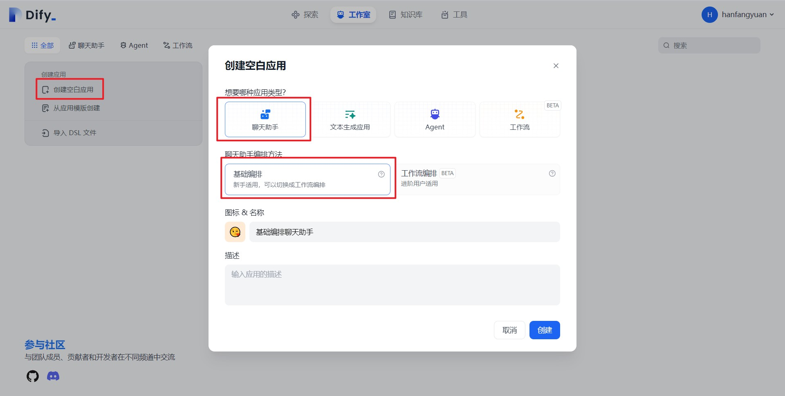
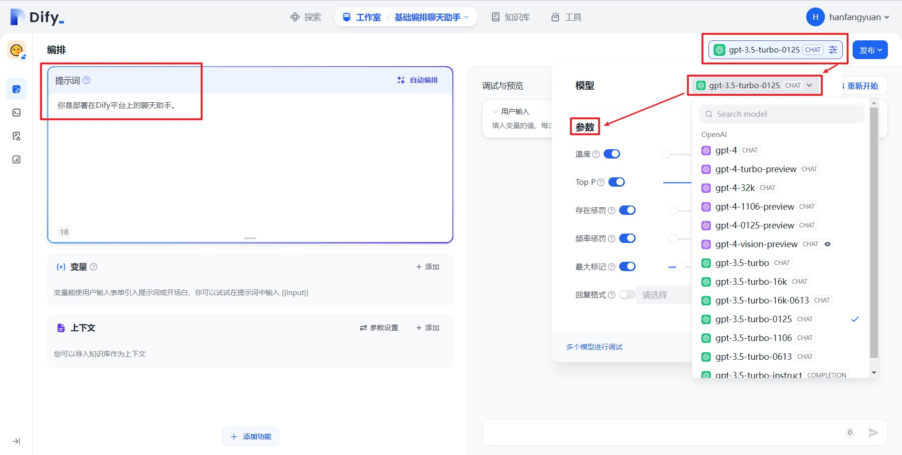
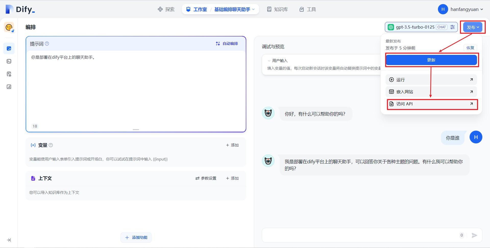
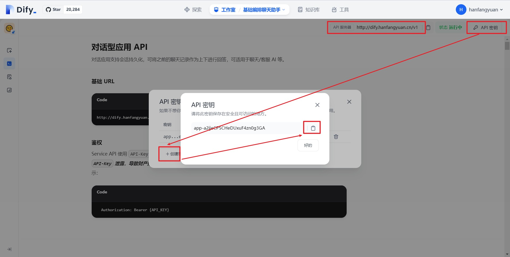
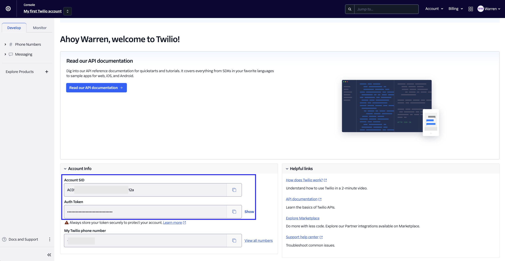
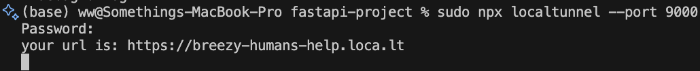
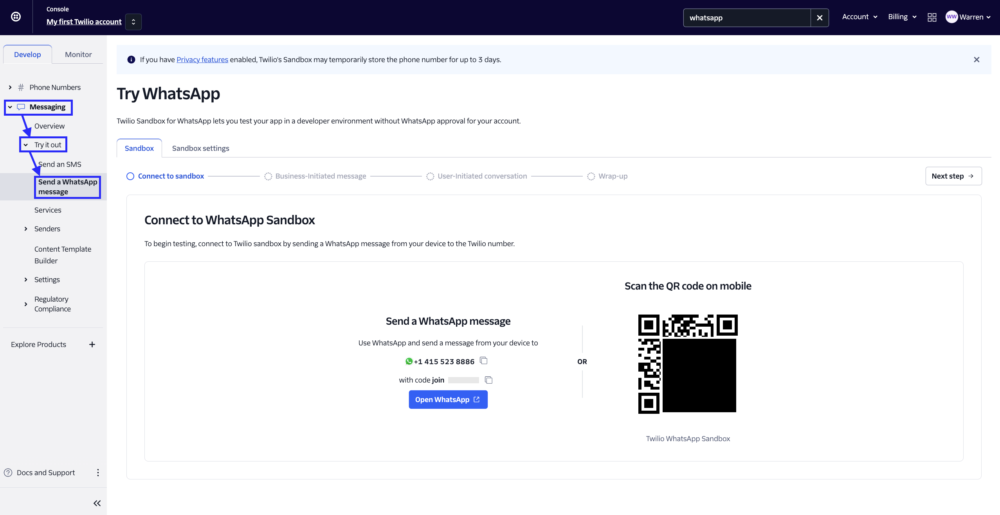
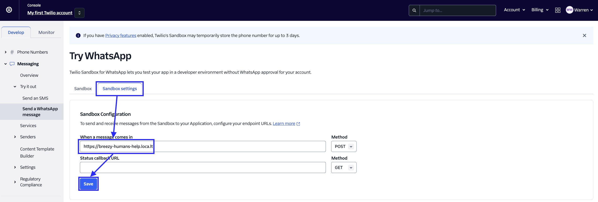

# 使用 Dify 和 Twilio 構建 WhatsApp 機器人

> 作者：Warren， [Microsoft 最有價值專家 (MVP)](https://mvp.microsoft.com/en-US/mvp/profile/476f41d3-6bd1-ea11-a812-000d3a8dfe0d)

## 1. 概述

隨著世界通過消息應用程序變得越來越緊密地連接在一起，聊天機器人已成為企業與客戶進行更個人化交流的關鍵工具。

隨著人工智能的崛起，聊天機器人變得更聰明，更個性化，更直觀。在本文中，我們將向您展示如何使用使用Dify和Twilio將其與WhatsApp集成。

您將首先使用FastAPI 接入Dify設置後端，然後，您將集成Twilio的WhatsApp消息API，允許客戶與您的WhatsApp聊天機器人開始對話。

使用Localtunnel，將FastAPI本地主機放在互聯網上，使其可以供Twilio API通信。

## 2. 準備工作

* 安裝好Docker 和Docker Compose
* Twilio帳戶： 在[這裡](https://www.twilio.com/try-twilio) 創建一個免費Twilio帳戶
* 一部安裝了WhatsApp的智能手機，用於測試您的AI聊天機器人
* 對FastAPI的基本理解，這是一個使用Python 3.6+構建API的框架

## 3. 創建Dify基礎編排聊天助手應用 （節錄自[手摸手教你把 Dify 接入微信生態](dify-on-wechat.md))

首先，登錄[Dify官方應用平臺](https://cloud.dify.ai/signin)，你可以選擇使用Github登錄或者使用Google登錄。此外，你也可以參考Dify官方教程[Docker Compose 部署 | 中文 | Dify](https://docs.dify.ai/v/zh-hans/getting-started/install-self-hosted/docker-compose) 私有部署，Dify是開源項目，支持私有部署。

<figure><figcaption></figcaption></figure>

登錄成功後，進入Dify頁面，我們按照下方步驟創建一個基礎編排聊天助手應用

1. 點擊頁面上方的工作室
2. 創建空白應用
3. 應用類型選擇聊天助手
4. 聊天助手編排方式選擇基礎編排
5. 選擇應用圖標併為應用填寫一個名稱，比如基礎編排聊天助手
6. 點擊創建

<figure><figcaption></figcaption></figure>

創建成功後我們會跳轉到上圖所示頁面，我們繼續配置應用

1. 選擇模型，如gpt-3.5-turbo-0125
2. 設置模型參數
3. 填寫應用提示詞

<figure><figcaption></figcaption></figure>

在配置完成後，我們可以在右側對話框進行測試，在測試完成後，進行如下操作

1. 發佈
2. 更新
3. 訪問API

**（4）生成基礎編排聊天助手API密鑰**

<figure><figcaption></figcaption></figure>

在點擊"訪問API"後，我們會跳轉到上圖的API管理頁面，在這個頁面我們按照如下步驟獲取API密鑰：

1. 點擊右上角API密鑰
2. 點擊創建密鑰
3. 複製保存密鑰

在保存密鑰後，還需要查看右上角的API服務器，如果是Dify官網的應用，API服務器地址為 "https://api.dify.ai/v1", 如果是私有部署的，請確認你自己的API服務器地址。

至此，創建聊天助手的準備工作結束，在此小節中我們只需要保存好兩個東西：**API密鑰**與**API服務器地址**

## 4. 獲取Twilio密鑰

轉到\[Twilio控制檯] 畫面應該會直接獲取到Account SID 和Auth Token，保存好這兩個東西。

<figure><figcaption></figcaption></figure>

## 5. 創建您的聊天機器人

在這一部分，您將使用FastAPI和Twilio編寫一個基本的聊天機器人的代碼。

#### 5.1 下載代碼

```
git clone https://github.com/somethingwentwell/dify-twilio-whatsapp
```

#### 5.2 配置.env

在項目根目錄創建.env，內容如下:

```
TWILIO_NUMBER=+14155238886
TWILIO_ACCOUNT_SID=<在(4)獲取的Twilio Account SID>
TWILIO_AUTH_TOKEN=<在(4)獲取的Twilio Auth Token>
DIFY_URL=<在(3)獲取的Dify API服務器地址>
DIFY_API_KEY=<在(3)獲取的Dify API密鑰>
```

#### 5.3 運行代碼

執行docker compose up

```
docker compose up
```

如果運行成功，你應該會看到

```
dify-whatsapp-1  | INFO:     Started server process [68]
dify-whatsapp-1  | INFO:     Waiting for application startup.
dify-whatsapp-1  | INFO:     Application startup complete.
```

在瀏覽器中打開 http://localhost:9000。你應該看到的結果是一個JSON響應，內容為 {"msg": "working"}。

#### 5.4 使用Localtunnel 將本地項目放到公網訪問

Twilio需要向您的後端發送消息，您需要在公共服務器上託管您的應用。一個簡單的方法是使用localtunnel。

讓FastAPI應用繼續在9000端口運行，並在另一個終端窗口運行以下localtunnel命令：

```
npx localtunnel --port 9000
```

上述命令在您的本地服務器（運行在9000端口）和localtunnel創建的公共域之間建立了一個連接。一旦您有了localtunnel轉發URL，任何來自客戶端對該URL的請求都會自動被定向到您的FastAPI後端。

<figure><figcaption></figcaption></figure>

#### 5.5 代碼解釋

**5.5.1 檢查該號碼是否已在白名單中，不在白名單的用戶直接返回“您未註冊此服務。”**

```python
enrolled_numbers = ['+14155238886']
```

對應

```python
    # Check if the number is enrolled
    if whatsapp_number not in enrolled_numbers:
        message = client.messages.create(  
            from_=f"whatsapp:{twilio_number}",  
            body="You are not enrolled in this service.",  
            to=f"whatsapp:{whatsapp_number}"  
        )
        return ""
```

**5.5.2 將WhatsApp號碼作為Dify會話ID，確保用戶持續保持該會話**

```python
conversation_ids = {}
```

對應

```python
    url = dify_url
    headers = {  
        'Content-Type': 'application/json',  
        'Authorization': f"Bearer {dify_api_key}",  
    }  
    data = {  
        'inputs': {},  
        'query': Body,  
        'response_mode': 'streaming',  
        'conversation_id': conversation_ids.get(whatsapp_number, ''),  
        'user': whatsapp_number,  
    }  
    response = requests.post(url, headers=headers, data=json.dumps(data), stream=True)  
    answer = []  
    for line in response.iter_lines():  
        if line:  
            decoded_line = line.decode('utf-8')  
            if decoded_line.startswith('data: '):  
                decoded_line = decoded_line[6:]  
            try:  
                json_line = json.loads(decoded_line) 
                if "conversation_id" in json_line:
                    conversation_ids[whatsapp_number] = json_line["conversation_id"]
                if json_line["event"] == "agent_thought":  
                    answer.append(json_line["thought"])  
            except json.JSONDecodeError: 
                print(json_line)  
                continue  

    merged_answer = ''.join(answer)  
```

## 6. 配置您的Twilio沙箱以供WhatsApp使用

#### 6.1 打開WhatsApp沙盒

要使用Twilio的消息API使聊天機器人能與WhatsApp用戶通信，您需要配置Twilio沙箱以供WhatsApp使用。以下是操作方法：

轉到[Twilio控制檯](https://console.twilio.com/)並在左側面板上選擇消息選項卡。

在“試試看”下，點擊“發送WhatsApp消息”。您將默認進入沙盒選項卡，您會看到一個電話號碼“+14155238886”，旁邊有一個加入的代碼，右邊有一個二維碼。

<figure><figcaption></figcaption></figure>

要啟用Twilio測試環境，將此代碼的文本作為WhatsApp消息發送到顯示的電話號碼。如果您正在使用網絡版本，可以點擊超鏈接將您引導到WhatsApp聊天。

#### 6.2 配置WhatsApp沙盒

在“沙盒”選項卡旁邊，選擇“沙盒設置”選項卡。

複製您的localtunnel URL並附加/message。將其粘貼到“當消息進入時”旁邊的框中：

Twilio沙盒webhook 完整的URL應如下所示：https://breezy-humans-help.loca.lt/message。

您將在FastAPI應用程序中配置的端點是/message，如上所述。聊天機器人的邏輯將在此端點上。

完成後，按“保存”按鈕。

<figure><figcaption></figcaption></figure>

## 7. WhatsApp測試

掃6.1 頁面的二維碼進入WhatsApp 沙盒環境，然後發送WhatsApp消息，並等待您的AI聊天機器人的回覆。嘗試向AI聊天機器人提問您可以向Dify 聊天助手提問的任何問題。

<figure><figcaption></figcaption></figure>

## 8. 後記

現在，你的AI聊天機器人在WhatsApp上運行良好。也許你的下一步是使用你自己的WhatsApp商業賬戶，而不是Twilio沙盒，並使用服務器託管而不是在本地構建，使這個WhatsApp助手在生產中運行。希望你喜歡這個教程，我們下次再見。
