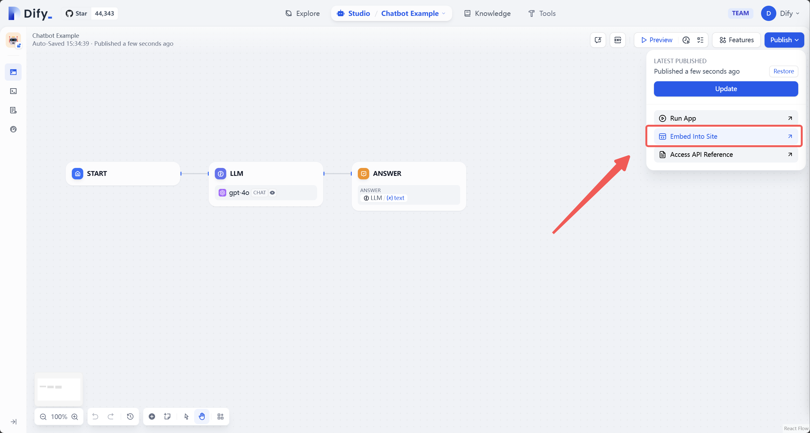
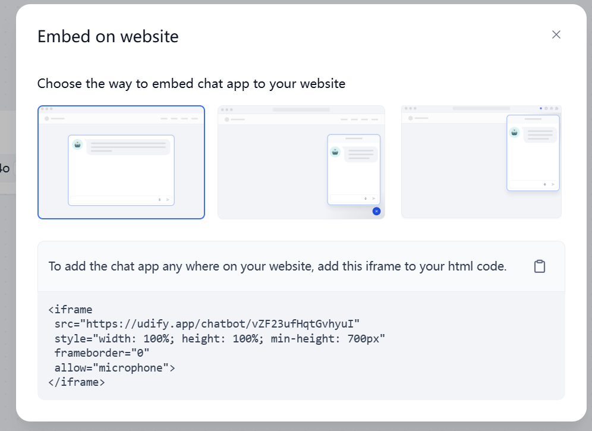
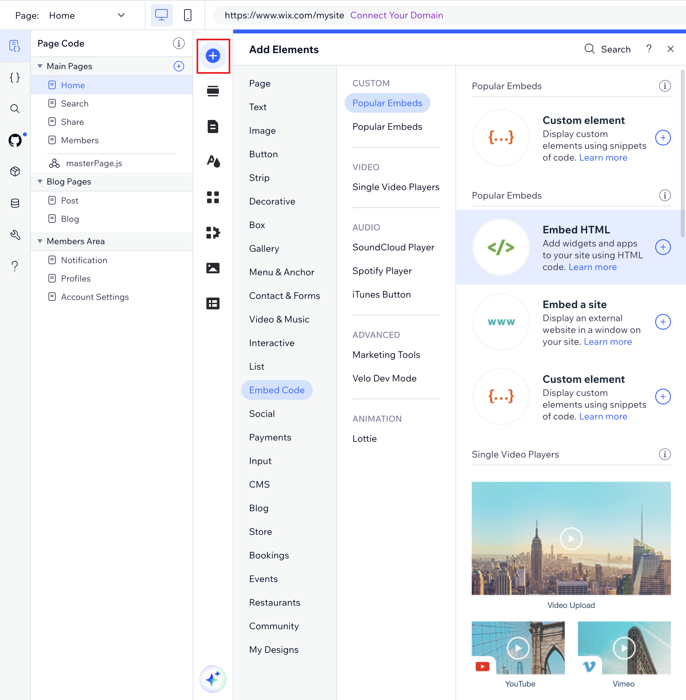
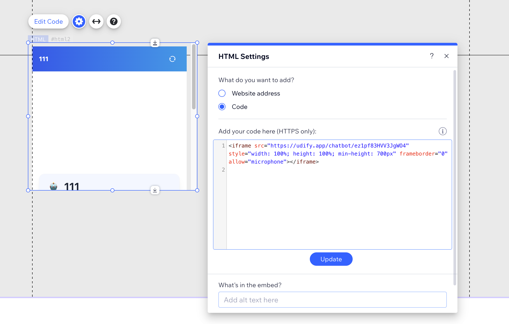

# 如何將 Dify Chatbot 集成至 Wix 網站？

Wix 是一個非常流行的網站創建平臺，它允許用戶通過拖拽的方式可視化創建自己的網站。通過 iframe 代碼功能，能夠實現 Wix 與 Dify 聊天機器人的集成。

除此之外，你還可以使用此功能在 Wix 網頁內顯示來自外部服務器和其他來源的內容，例如說創建天氣小部件、股票小部件、日曆或任何其它自定義網頁元素。

在本文中，我們將指導你如何將 Dify 聊天機器人通過 iframe 代碼嵌入到你的 Wix 網站中。除了將應用嵌入至 Wix 網站內，你也可以通過同樣的方法將 Dify 應用集成至你的網站、博客或其他網頁中。

## 1. 獲取 Dify 應用的 iFrame 代碼片段

假設你已創建了一個 [Dify AI 應用](https://docs.dify.ai/v/zh-hans/guides/application-orchestrate/creating-an-application)，你可以通過以下步驟獲取 Dify 應用的 iFrame 代碼片段：

* 登錄你的 Dify 賬戶
* 選擇你想要嵌入的 Dify 應用
* 點擊右上角的“發佈”按鈕
*   在發佈頁面中，選擇 “Embed Into Site” 選項。

    
* 選擇合適的樣式並複製顯示的 iFrame 代碼，例如：



## 2. 在 Wix 網站中嵌入 iFrame 代碼片段

登錄 Wix 網站，打開你要編輯的網頁。點擊網頁左側藍色的 `+` （Add Elements）按鈕，然後選擇 **Embed Code**，最後點擊 **Embed HTML** 添加一個 HTML iFrame 元素到頁面。



在 `HTML Settings` 框內選擇 `Code` 選項，複製並粘貼你在 Dify 應用中獲取的 iFrame 代碼片段，然後點擊 **Update** 按鈕進行保存並進行預覽。

以下是一個嵌入 Dify Chatbot 的 iFrame 代碼示例：

```bash
<iframe src="https://udify.app/chatbot/1yS3gohroW1sKyLc" style="width: 100%; height: 100%; min-height: 700px" frameborder="0" allow="microphone"></iframe>
```



> ⚠️ 請確保 iFrame 代碼中的地址以 HTTPS 開頭，HTTP 地址將無法正常顯示。

## 3. 自定義 Dify Chatbot

你可以調整 Dify Chatbot 的按鈕樣式、位置和其它設置。

### 3.1 自定義樣式

你可以通過修改 iFrame 代碼中的 `style` 屬性來自定義 Chatbot 按鈕的樣式。例如：

```bash
<iframe src="https://udify.app/chatbot/1yS3gohroW1sKyLc" style="width: 100%; height: 100%; min-height: 700px" frameborder="0" allow="microphone"></iframe>

# 添加一個 2 像素寬的黑色實線邊框 border: 2px solid #000

→

<iframe src="https://udify.app/chatbot/1yS3gohroW1sKyLc" style="width: 80%; height: 80%; min-height: 500px; border: 2px solid #000;" frameborder="0" allow="microphone"></iframe>
```

### 3.2 自定義位置

你還可以通過修改 `style` 屬性中的 `position` 值可以調整按鈕的位置。例如：

```bash
<iframe src="https://udify.app/chatbot/1yS3gohroW1sKyLc" style="width: 100%; height: 100%; min-height: 700px" frameborder="0" allow="microphone"></iframe>

# 將 Chatbot 固定在網頁右下角，距離底部和右側 20 像素。

→

<iframe src="https://udify.app/chatbot/1yS3gohroW1sKyLc" style="width: 100%; height: 100%; min-height: 700px; position: fixed; bottom: 20px; right: 20px;" frameborder="0" allow="microphone"></iframe>
```

## 常見問題

**1. iframe 方框內未正常顯示內容應如何處理？**

* 確保 URL 以 HTTPS 開頭；
* 檢查 `iframe` 代碼中是否有拼寫錯誤；
* 確認嵌入的內容符合 Wix 的安全政策；

**2. iframe 內容被裁剪，內容顯示不全應如何處理？**

你可以調整並修改 `iframe` 代碼框內的 `width` 和 `height` 的百分比值。
