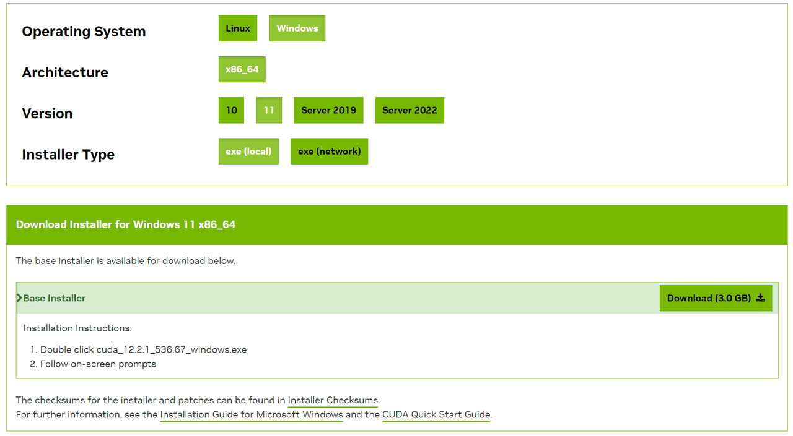
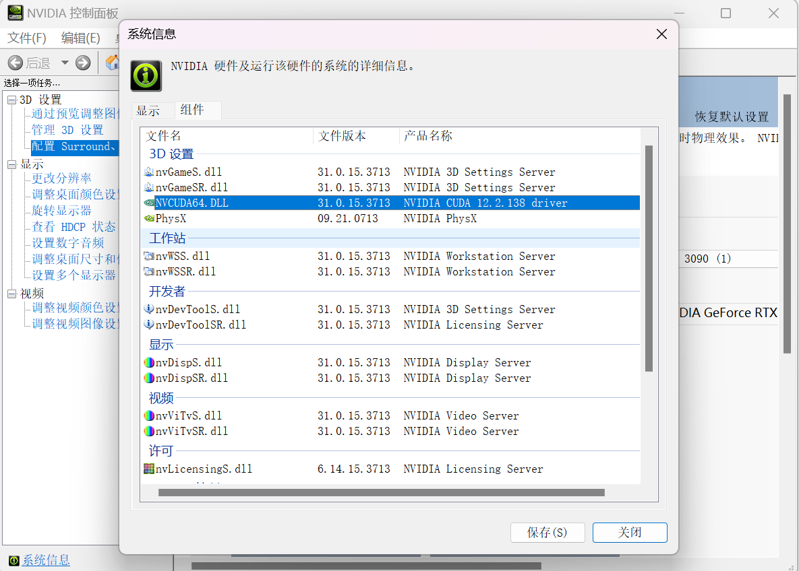

# 使用全套開源工具構建 LLM 應用實戰：在 Dify 調用 Baichuan 開源模型能力

> 作者：Rico。Dify.AI 資深前端工程師，LLM 技術探索者。

## 背景

在當下開源大語言模型火熱的背景下，有很大一部分開發者希望本地部署開源 LLM，用於研究 LLM 或者是基於開源 LLM 構建自己的 LLM 應用。筆者也正在嘗試通過開源社區的一系列相關優秀項目，通過本地化部署服務來構建自己的 LLM 應用。那麼本地部署一個開源 LLM 來構建一個聊天應用需要哪些準備呢？

1. \*\*本地環境的準備：\*\*因為我們需要在本地部署一個開源的大模型，所以你需要準備一個相當硬核的本地環境。硬件上需要一臺擁有高性能、大顯存的 NVDIA 顯卡，大容量高速內存以及大容量固態硬盤，軟件上則需要安裝顯卡驅動、CUDA、Python 環境。筆者這次選擇跑 Baichuan-13B-Chat 模型為例，基本配置是 CPU i9-13900K、GTX3090 24 GB 雙卡、64GB 內存和 2TB 固態硬盤。
2. \*\*一個大型語言模型（LLM）：\*\*這是我們構建 LLM 應用的基礎。不同的 LLM 根據預訓練的數據和目標任務的不同，其模型結構和學到的知識也不相同。基於不同模型構建出來的 AI 應用表現也會不一樣。你可以通過火熱的 AI 社區 [Hugging Face](https://huggingface.co/) 上找自己感興趣的開源 LLMs 來進行嘗試和能力對比 。
3. \*\*一個本地部署 LLM 的推理服務：\*\*推理服務可以將預訓練好的 LLM 模型加載到本地服務器，並提供模型預測接口，這樣就可以本地化使用 LLM 模型進行各種 NLP 任務，而不需要依賴雲服務。你可以使用一些優秀的 GitHub 開源項目，這些項目對熱門的開源 LLM 都做了推理服務的一鍵部署。知名度比較高的有 [LocalAI](https://github.com/go-skynet/LocalAI)、[openLLM](https://github.com/bentoml/OpenLLM) 等。
4. \*\*一個簡單易用的“ LLM 操作系統 ” Dify.AI：\*\*如果要基於 LLM 的能力構建一個聊天應用，你可能需要學習研究全套的 LLM 技術棧，比如：不同模型的 API 調用、向量數據庫選型、Embedding 技術研究等等。如果你使用開源項目 [Dify.AI](https://github.com/langgenius/dify)，則可以省掉這些研究學習工作，**幫助你通過可視化的界面即可快速創建基於不同 LLM 能力的** **AI** **應用。** Dify 最近的版本新增了對開源 LLMs 的支持，對託管在 HuggingFace 和 Replicate 上所有的模型都能快速調用和切換使用，同時支持本地部署方式能夠基於 [OpenLLM](https://github.com/bentoml/OpenLLM) 和 [Xorbits inference](https://github.com/xorbitsai/inference) 推理服務來實現 AI 應用的構建。

筆者將嘗試使用**開源的 LLMOps 平臺 Dify.AI + 開源的推理服務** **Xinference** **+** **開源模型 Baichuan-13B-Chat** 為例，手把手實操教你在 windows 環境下，使用全套開源工具產品來構建一個 LLM 聊天應用。

## 環境準備

Conda 和 Python 是基礎要求，本文將從零開始介紹環境配置。

#### 配置 python 環境

一般情況下建議使用 Conda 進行 python 版本管理。先根據 Conda [官網文檔](https://docs.conda.io/projects/conda/en/stable/user-guide/install/index.html)安裝 Conda。然後用 Conda 初始化 Python 3.11 環境：

```
conda create --name python-3-11 python=3.11
conda activate python-3-11
```

#### 安裝 CUDA

推薦直接從[官網](https://developer.nvidia.com/cuda-downloads?target\_os=Windows\&target\_arch=x86\_64\&target\_version=11\&target\_type=exe\_local)安裝。 Windows 11 選擇下圖版本。

<figure><figcaption></figcaption></figure>

根據引導安裝完，打開 `NVDIA 控制面板 -> 系統信息` 看到完成了安裝。

<figure><figcaption></figcaption></figure>

**WSL2 準備**

由於 Dify 的 docker 部署推薦使用 WSL2 環境。所以現在先安裝 WSL2 。參考[微軟官方指引](https://learn.microsoft.com/en-us/windows/wsl/install)。

**第一步，管理員身份運行** **CMD** **：**

1. Win + R
2. Input CMD
3. Ctrl + Shift + Enter

<figure><figcaption></figcaption></figure>

**第二步，在** **CMD** **中用指令安裝**

```PowerShell
wsl --install
```

結果看到了支持的各種系統版本：

```PowerShell
適用於 Linux 的 Windows 子系統已安裝。

以下是可安裝的有效分發的列表。
請使用“wsl --install -d <分發>”安裝。

NAME                                   FRIENDLY NAME
Ubuntu                                 Ubuntu
Debian                                 Debian GNU/Linux
kali-linux                             Kali Linux Rolling
Ubuntu-18.04                           Ubuntu 18.04 LTS
Ubuntu-20.04                           Ubuntu 20.04 LTS
Ubuntu-22.04                           Ubuntu 22.04 LTS
OracleLinux_7_9                        Oracle Linux 7.9
OracleLinux_8_7                        Oracle Linux 8.7
OracleLinux_9_1                        Oracle Linux 9.1
openSUSE-Leap-15.5                     openSUSE Leap 15.5
SUSE-Linux-Enterprise-Server-15-SP4    SUSE Linux Enterprise Server 15 SP4
SUSE-Linux-Enterprise-15-SP5           SUSE Linux Enterprise 15 SP5
openSUSE-Tumbleweed                    openSUSE Tumbleweed
```

我使用選擇安裝了默認的 Ubuntu 版本：

```PowerShell
wsl --install -d Ubuntu
```

之後就可以在 CMD 中使用 `wsl`命令進入Ubuntu 了。

**第三步，安裝 Docker Desktop**

去 Docker [官方文檔](https://docs.docker.com/desktop/install/windows-install/#wsl-2-backend)下載 Docker Desktop。安裝時注意勾上 `Use WSL 2 instead of Hyper-V` 選項。安裝完成後重啟電腦。通過 CMD 查看是否正常安裝好。

```PowerShell
wsl -l --verbose

 NAME                   STATE           VERSION
* Ubuntu                 Running         2
  docker-desktop         Running         2
  docker-desktop-data    Running         2
```

可以看到 WSL 中 Ubuntu 和 Docker 都運行起來了，並且確認是 WSL2 版本。

**第四步，為 WSL 配置代理**

由於每次重啟後 WSL 的 ip 地址都會變更，所以我們可以編寫一個腳本來解決。第 4 行改為你自己的端口號。

```Bash
#!/bin/sh
hostip=$(cat /etc/resolv.conf | grep nameserver | awk '{ print $2 }')
wslip=$(hostname -I | awk '{print $1}')
port=7890
 
PROXY_HTTP="http://${hostip}:${port}"
 
set_proxy(){
  export http_proxy="${PROXY_HTTP}"
  export HTTP_PROXY="${PROXY_HTTP}"
 
  export https_proxy="${PROXY_HTTP}"
  export HTTPS_proxy="${PROXY_HTTP}"
 
  export ALL_PROXY="${PROXY_SOCKS5}"
  export all_proxy=${PROXY_SOCKS5}
 
  git config --global http.https://github.com.proxy ${PROXY_HTTP}
  git config --global https.https://github.com.proxy ${PROXY_HTTP}
 
  echo "Proxy has been opened."
}
 
unset_proxy(){
  unset http_proxy
  unset HTTP_PROXY
  unset https_proxy
  unset HTTPS_PROXY
  unset ALL_PROXY
  unset all_proxy
  git config --global --unset http.https://github.com.proxy
  git config --global --unset https.https://github.com.proxy
 
  echo "Proxy has been closed."
}
 
test_setting(){
  echo "Host IP:" ${hostip}
  echo "WSL IP:" ${wslip}
  echo "Try to connect to Google..."
  resp=$(curl -I -s --connect-timeout 5 -m 5 -w "%{http_code}" -o /dev/null www.google.com)
  if [ ${resp} = 200 ]; then
    echo "Proxy setup succeeded!"
  else
    echo "Proxy setup failed!"
  fi
}
 
if [ "$1" = "set" ]
then
  set_proxy
 
elif [ "$1" = "unset" ]
then
  unset_proxy
 
elif [ "$1" = "test" ]
then
  test_setting
else
  echo "Unsupported arguments."
fi
```

可以修改`~/.bashrc` 方便使用命令：

```Bash
alias proxy="source /path/to/proxy.sh"
```

詳細可以參考了該[博客](https://www.cnblogs.com/tuilk/p/16287472.html)。

**第五步，進入 Ubuntu 安裝 conda 配置 python**

和前面的環境準備一樣，參照官方文檔安裝 conda 配置 python，不過是安裝 linux 版本。

**第六步，安裝 WSL 的 CUDA**

進入官網，選擇 WSL-Ubuntu 版本，按照指引使用命令行安裝。

<figure><figcaption></figcaption></figure>

修改`~/.bashrc`將 CUDA 添加至環境變量：

```Bash
export LD_LIBRARY_PATH=/usr/local/cuda-12.2/lib64
export PATH=$PATH:/usr/local/cuda-12.2/lib64
```

**第七步，安裝 PyTorch**

進入 PyTorch [官網](https://pytorch.org/)，按照環境安裝 PyTorch。

<figure><figcaption></figcaption></figure>

這樣環境準備就完成了。

## 部署推理服務 Xinference

根據 Dify 的[部署文檔](https://docs.dify.ai/v/zh-hans/advanced/model-configuration/xinference)，Xinference 支持的模型種類很多。本次以 Baichuan-13B-Chat 為例。

> [Xorbits inference](https://github.com/xorbitsai/inference) 是一個強大且通用的分佈式推理框架，旨在為大型語言模型、語音識別模型和多模態模型提供服務，甚至可以在筆記本電腦上使用。它支持多種與 GGML 兼容的模型，如 ChatGLM，Baichuan，Whisper，Vicuna，Orca 等。 Dify 支持以本地部署的方式接入 Xinference 部署的大型語言模型推理和 Embedding 能力。

#### 安裝 Xinfernece

在 WSL 中執行如下命令：

```Bash
$ pip install "xinference"
```

上面的命令會安裝 Xinference 用於推理的基礎依賴。Xinference 還支持用 `ggml 推理` 和 `PyTorch 推理`，需要裝如下的依賴：

```Bash
$ pip install "xinference[ggml]"
$ pip install "xinference[pytorch]"
$ pip install "xinference[all]"
```

#### 啟動 Xinference 並下載部署 Baichuan-13B-Chat 模型

在 WSL 中執行下面的命令：

```Bash
$ xinference -H 0.0.0.0
```

Xinference 默認會在本地啟動一個 worker，端點為：`http://127.0.0.1:9997`，端口默認為 `9997`。 默認只可本機訪問，配置了 `-H 0.0.0.0`，非本地客戶端可任意訪問。 如需進一步修改 host 或 port，可查看 Xinference 的幫助信息：`xinference --help`。

```Bash
2023-08-25 18:08:31,204 xinference   27505 INFO     Xinference successfully started. Endpoint: http://0.0.0.0:9997
2023-08-25 18:08:31,204 xinference.core.supervisor 27505 INFO     Worker 0.0.0.0:53860 has been added successfully
2023-08-25 18:08:31,205 xinference.deploy.worker 27505 INFO     Xinference worker successfully started.
```

在瀏覽器中打開: [http://localhost:9997](http://localhost:9997)，選擇 baichuan-chat，pytorch，13B，4bit，點擊 create 部署。

<figure><figcaption></figcaption></figure>

或者使用 CLI 部署:

```Bash
xinference launch --model-name baichuan-chat --model-format pytorch --size-in-billions 13 --quantization 4
```

由於不同模型在不同硬件平臺兼容性不同，請查看 [Xinference 內置模型](https://inference.readthedocs.io/en/latest/models/builtin/index.html) 確定創建的模型是否支持當前硬件平臺。

#### 使用 Xinference 管理模型

要查看部署好的所有模型，在命令行中，執行下面的命令：

```Bash
$ xinference list 
```

會顯示類似下面的信息：

```Bash
UID                                   Type    Name           Format      Size (in billions)  Quantization
------------------------------------  ------  -------------  --------  --------------------  --------------
0fc70cd0-4b2a-11ee-a428-00155d0b318a  LLM     baichuan-chat  pytorch                     13  4-bit
```

`0fc70cd0-4b2a-11ee-a428-00155d0b318a` 就是剛才部署的模型的 uid 。

## 部署 Dify.AI

主要流程參考官網[部署文檔](https://docs.dify.ai/v/zh-hans/getting-started/install-self-hosted/docker-compose)。

#### Clone Dify

Clone Dify 源代碼至本地。

```Bash
git clone https://github.com/langgenius/dify.git
```

#### Start Dify

進入 Dify 源代碼的 docker 目錄，執行一鍵啟動命令：

```Bash
cd dify/docker
docker compose up -d
```

部署結果：

```Bash
[+] Running 7/7
 ✔ Container docker-weaviate-1  Running                                                0.0s 
 ✔ Container docker-web-1       Running                                                0.0s 
 ✔ Container docker-redis-1     Running                                                0.0s 
 ✔ Container docker-db-1        Running                                                0.0s 
 ✔ Container docker-worker-1    Running                                                0.0s 
 ✔ Container docker-api-1       Running                                                0.0s 
 ✔ Container docker-nginx-1     Started                                                0.9s 
```

最後檢查是否所有容器都正常運行：

```Bash
docker compose ps
```

運行狀態：

```Bash
NAME                IMAGE                              COMMAND                  SERVICE             CREATED             STATUS              PORTS
docker-api-1        langgenius/dify-api:0.3.16         "/bin/bash /entrypoi…"   api                 24 hours ago        Up 3 hours          5001/tcp
docker-db-1         postgres:15-alpine                 "docker-entrypoint.s…"   db                  33 hours ago        Up 3 hours          0.0.0.0:5432->5432/tcp
docker-nginx-1      nginx:latest                       "/docker-entrypoint.…"   nginx               24 hours ago        Up 4 minutes        0.0.0.0:80->80/tcp
docker-redis-1      redis:6-alpine                     "docker-entrypoint.s…"   redis               33 hours ago        Up 3 hours          6379/tcp
docker-weaviate-1   semitechnologies/weaviate:1.18.4   "/bin/weaviate --hos…"   weaviate            33 hours ago        Up 3 hours          
docker-web-1        langgenius/dify-web:0.3.16         "/bin/sh ./entrypoin…"   web                 33 hours ago        Up 3 hours          3000/tcp
docker-worker-1     langgenius/dify-api:0.3.16         "/bin/bash /entrypoi…"   worker              33 hours ago        Up 3 hours          5001/tcp
```

包括 3 個業務服務 `api / worker / web`，以及 4 個基礎組件 `weaviate / db / redis / nginx`。

Docker 啟動成功後，在瀏覽器中訪問：http://127.0.0.1/。設置過密碼後登陸，會進入應用列表頁。

<figure><figcaption></figcaption></figure>

至此，成功使用 Docker 部署了 Dify 社區版。

## 在 Dify 接入 Xinference

#### 配置模型供應商

在 `設置 > 模型供應商 > Xinference` 中填入模型信息：

* Model Name 是模型部署的名稱。
* Server URL 是 Xinference 的 end point 地址。
* Model UID 則是通過 `xinference list`獲取到的部署的模型的 UID。

需要注意的是 Sever Url 不能用 localhost。因為如果填 localhost，訪問的是 docker 裡的 localhost，會導致訪問失敗。解決方案是將 Sever Url 改成局域網 ip。

而 WSL 環境下則需要使用 WSL 的 IP 地址。在 WSL 中使用命令獲取：

```Bash
hostname -I
172.22.195.4
```

<figure><figcaption></figcaption></figure>

#### 使用 Baichuan-13B-Chat

創建應用，就可以在應用中使用上一步配置的 Baichuan-13B-Chat 模型了。在 Dify 的提示詞編排界面，選擇 baichuan-chat 模型，設計你的應用提示詞（prompt），即可發佈一個可訪問的 AI 應用。

<figure><figcaption></figcaption></figure>

以上，就是本地部署 Dify 接入 Xinference 部署的 baichuan-chat 的全過程。 至此，我們基於 Baichuan-13B-Chat 的一個基本的聊天應用就基本完成了。

## 後記

當然，對於一個生產級別的 LLM 應用來說，只是完成大模型的接入和推理、聊天交互是遠遠不夠。我們還需要針對性的對 LLM 進行 Prompt 的調優、添加私有數據作為上下文，亦或者是對 LLM 本身進行微調等工作，這需要長期的迭代和優化才能使得 LLM 應用表現越來越好。**Dify.AI 作為一箇中間件工具平臺，提供了一個完整 LLM App 技術棧的可視化的操作系統。完成了以上的基礎服務部署後，後續的應用迭代和改進都可以基於 Dify 來完成，使得 LLM 應用的構建和管理變得更加簡單和易用，在業務數據的處理上直接上傳即可自動完成清洗處理，後續也將提供數據標註和改進的服務，甚至你的業務團隊都可以參與協作。**

目前 LLM 的發展和應用落地還處於非常早期的階段，相信在不久後，無論是 LLM 的能力釋放，還是基於 LLM 之上的各個工具能力的不斷完善，都會不斷降低開發者探索 LLM 能力的門檻，讓更多豐富場景的 AI 應用湧現。
