# 如何訓練出專屬於“你”的問答機器人？

_作者：阿喬_

_火槍擊穿了專屬於騎士階層身披的鎧甲與榮耀，武力對等才會有真正的平權。_

技術平權的速度從未來得如此之快。

作為兢兢業業的 CODING DevOps 項目的技術文檔工程師，在為產品貢獻數百篇文檔後，依然止不住要在各種用戶群 / 技術支持群裡為客戶解答問題。即使在每條答覆中貼上文檔鏈接，依然架不住新用戶反覆提問。（沒辦法，DevOps 產品中間又包含多項子產品）

_注：CODING DevOps 是騰訊雲旗下的一站式研發管理平臺及雲原生開發工具，旨在讓軟件研發如同工業生產般簡單高效，助力提升企業研發管理效能。_

雖然由 ChatGPT 掀起 AI 革命已來，但是它並不能夠回答“我的”問題，也不能回答“你的”問題。但它卻可以回答“大家”的問題。

為什麼？ChatGPT 本身便是由龐大的互聯網語料庫訓練而成，並且這部分訓練數據截止於 2021 年 9 月。如果你的產品在這個日期之前就有幸在互聯網中佔有一席之地，那恭喜你，GPT 可以大概率可以回答出你的產品是大概是幹嘛用的。因為它會從你的官網收集已有的描述語料。具體到單獨的產品或公司的細節時它便開始靠胡言亂語來敷衍你了。

例如這樣 🔽

<figure>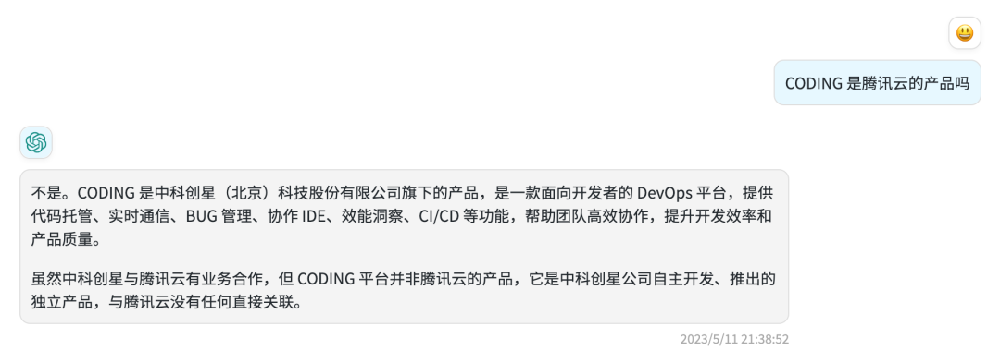<figcaption></figcaption></figure>

這裡的“胡言亂語”指的是它會用其他不相關的概念進行回答，並且**你並不能夠預期什麼問題會有什麼回答，這在商業場景下十分致命。在大多數情況下，ChatGPT 對於一些帶有公理性質**的知識回答是沒有問題的，作為一個可以日常侃大山閒聊的對象依然是合格的，可是你卻看著它的強大的學習和理解能力望洋興嘆。

**“你這個孫悟空什麼時候才能懂我，給我想要的回答？”**

這也是為什麼說它能夠迴應大家的問題，但是卻不能夠回答出“我”想要的問題。

### **改變發生**

直到，Dify 橫空出世。

你可以簡單地將 Dify 理解為是一個能夠幫助你進行數據清理和文檔訓練的地方。咱們也給狗屁通（GPT）補補課，手動給它補上缺失的語料。把它從通用型聊天機器人，變成你的專業問答機器人。是的，從侃大山到對答如流，這中間的鴻溝不是一點半點，需要強大的理解、歸納總結能力。不過這正是狗屁通（GPT）的強項。

###

### **註冊並生成應用**

現在，我們打開 Dify 並註冊一個聊天機器人，我們在這裡選擇“對話型應用”。

<figure>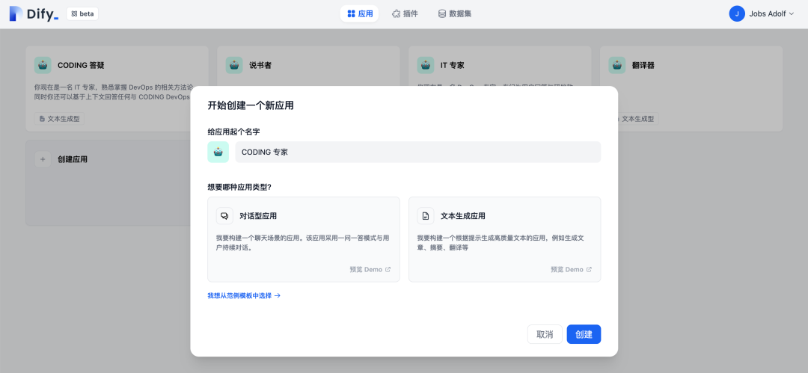<figcaption></figcaption></figure>

Duang，一個聊天機器人就做好了。

<figure>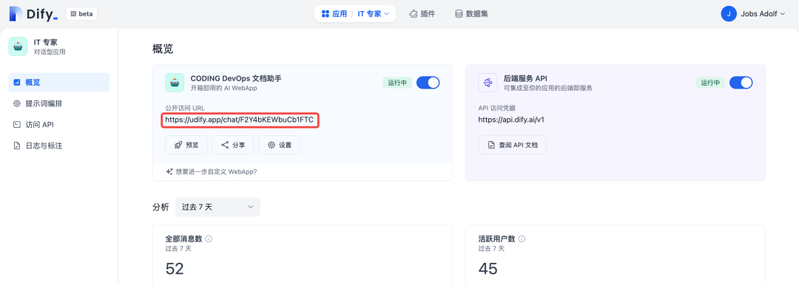<figcaption></figcaption></figure>

訪問這個鏈接就可以看到一個聊天機器人了。但是，它現在也只是一個**通用型聊天機器人**，離商業可用的**專用型問答機器人**還差一個語料的距離。

<figure>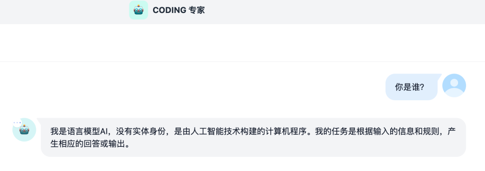<figcaption></figcaption></figure>

###

### **準備語料**

Dify 提供了一個名叫“數據集”的功能，這裡就是我們上傳語料的地方。

<figure>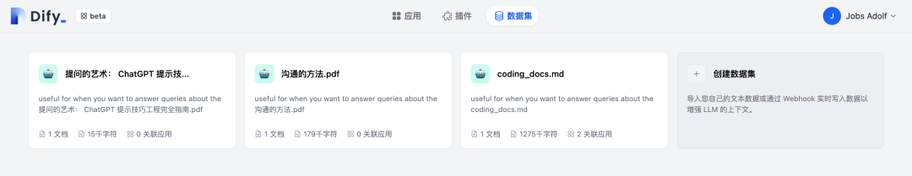<figcaption></figcaption></figure>

現在點擊“創建數據集”選項，上傳你的文本內容。

<figure>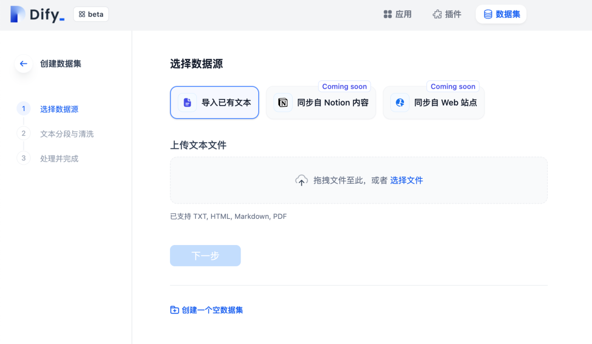<figcaption></figcaption></figure>

目前 Dify 僅支持上傳單個文件，文件格式支持 TXT、HTML、MarkDown、PDF。

_是的沒錯，你也可以把電子書上傳進來，用 AI 幫助你提煉書本內容。_

在正式開始訓練前，我們得先把教材準備好。好在 CODING 之前的所有文檔皆以 Git 代碼倉庫 + Markdown 的形式進行協作，因此我只需要先把文檔先拉到本地中。不過我現在碰到了第一個問題，那就是如何把倉庫中的這一系列 .md 文檔文件合併至同一個文件中？

<figure>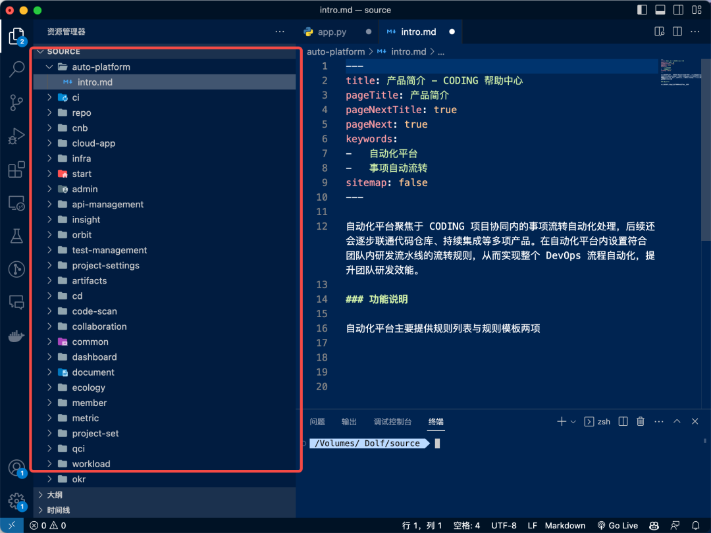<figcaption></figcaption></figure>

不怕，讓 AI 給我們寫一段 python 吧。

<figure>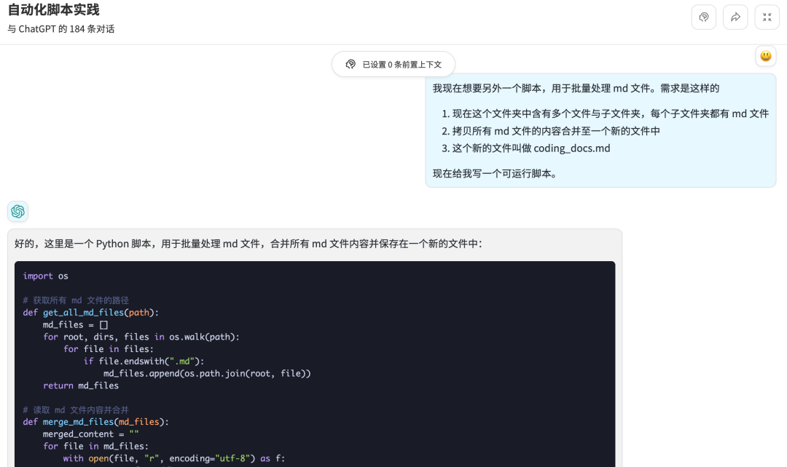<figcaption></figcaption></figure>

試著運行這個腳本，oh，輸入路徑後就成功生成了一篇總合文檔！如果你想了解如何讓 AI 給你寫代碼，不妨閱讀[《如何用狗屁通（GPT ）解決一個套娃問題》](http://mp.weixin.qq.com/s?\_\_biz=MzU2Njg1NDA3Mw==\&mid=2247484248\&idx=1\&sn=50809b40f520c767483e1a7b0eefb9c1\&chksm=fca76b8ecbd0e298e627140d63e7b3383d226ab293a2e8fefa04b5a1ee12f187520560ec1579\&scene=21#wechat\_redirect)。

<figure>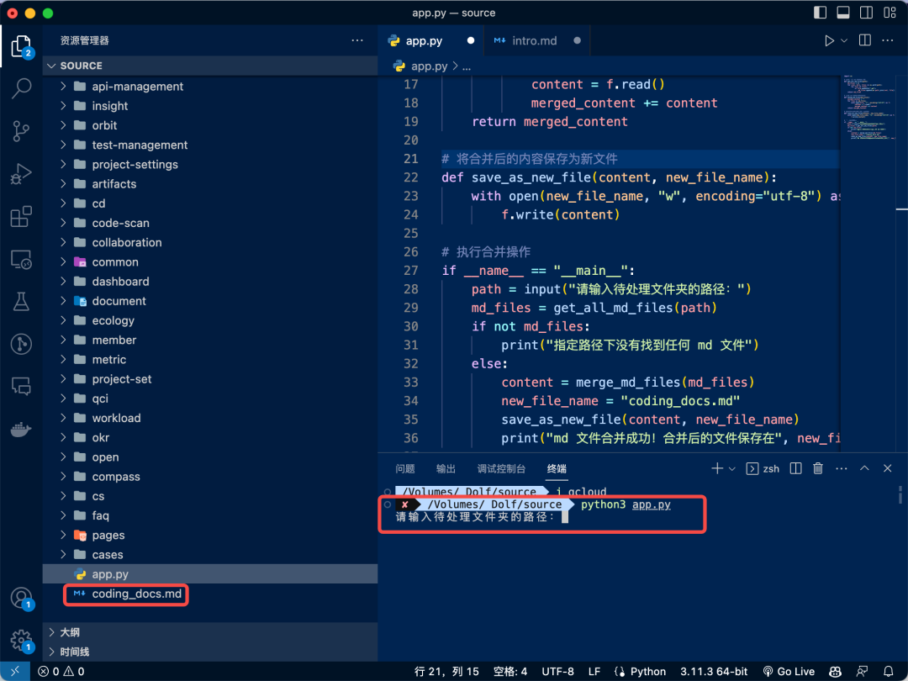<figcaption></figcaption></figure>

###

### **開始訓練**

現在要做的事，就是上傳這個文件並靜待訓練成果了。

<figure>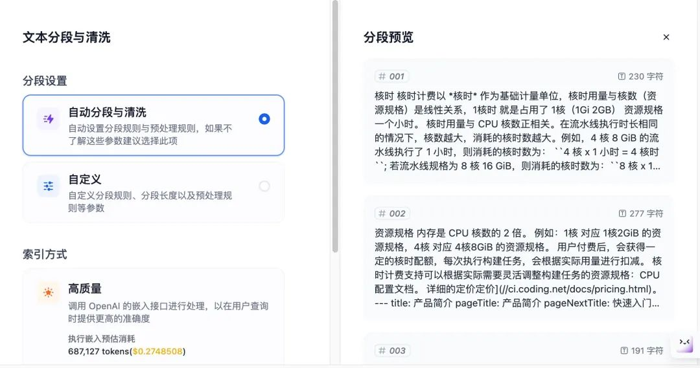<figcaption></figcaption></figure>

數據自動分段與清洗完成後，在剛創建的應用設置中的上下文，關聯這一篇文檔。為了保證響應速度和成本控制，這裡直接用 3.5 模型。

<figure>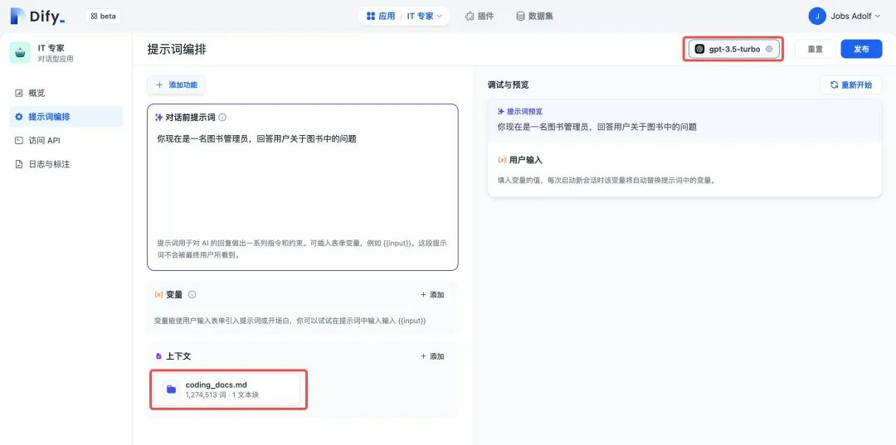<figcaption></figcaption></figure>

###

### **訓練成功**

現在再去和這個機器人互動，看看它會回答什麼？

<figure>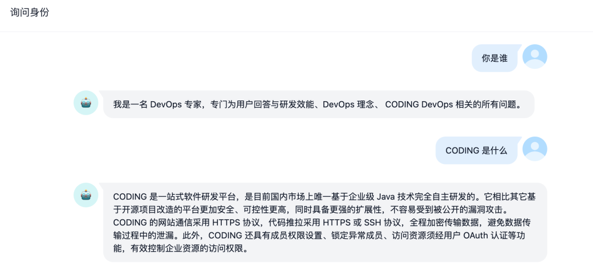<figcaption></figcaption></figure>

好了，你已經是個成熟的問答機器人了，可以回答更加複雜的產品問題了。

<figure>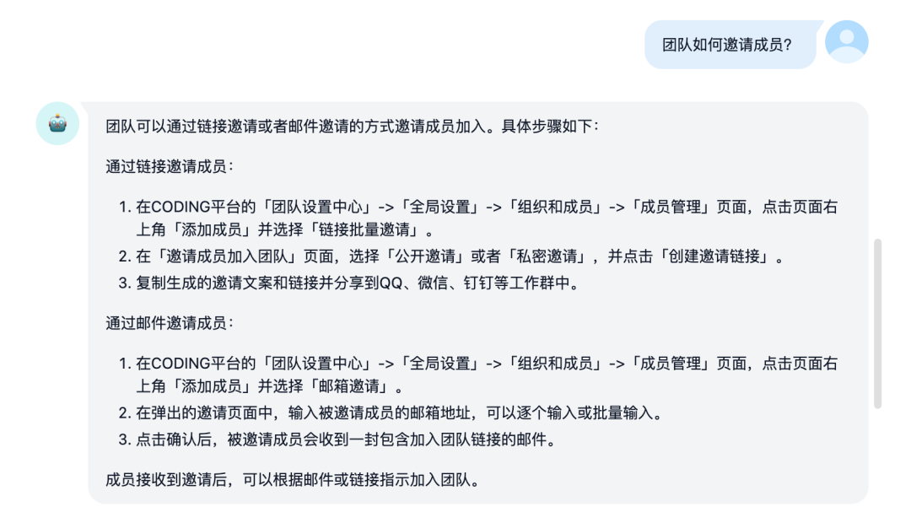<figcaption></figcaption></figure>

<figure>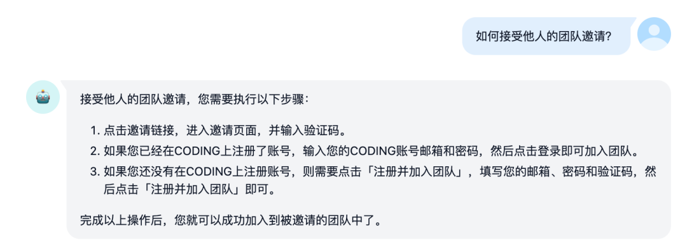<figcaption></figcaption></figure>

<figure>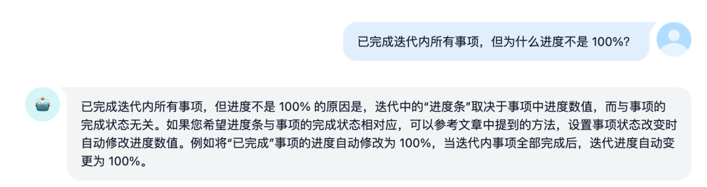<figcaption></figcaption></figure>

<figure>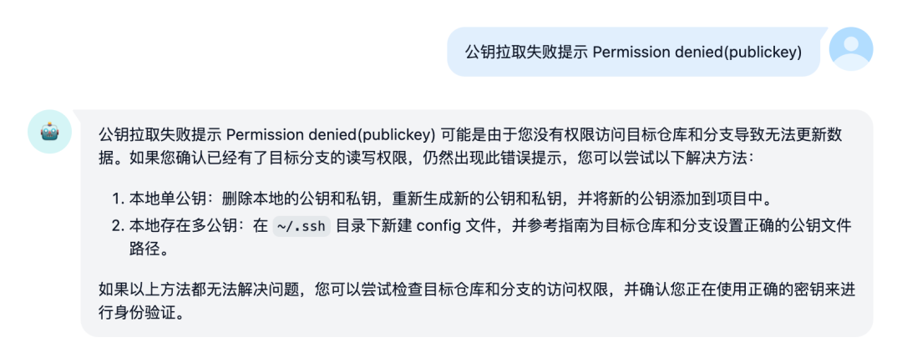<figcaption></figcaption></figure>

這個問答機器人花了多久做出來，成本如何？

整理語料+訓練完成控制在半個小時以內，訓練成本 0.27 美元。

現在，AI 可以深入到產品內部，變成妥妥的產品專家。只要有優秀的文檔，所有公司都可以打造出專用型問答機器人。

武力對等才會有真正的平權。如果你對我的實踐過程同樣感興趣，可以來體驗一下我做好的機器人，地址：[https://udify.app/chat/F2Y4bKEWbuCb1FTC](https://udify.app/chat/F2Y4bKEWbuCb1FTC)

不妨也來 Dify 平臺訓練屬於你自己的機器人。做一個考試問答機器人？出題機器人？
