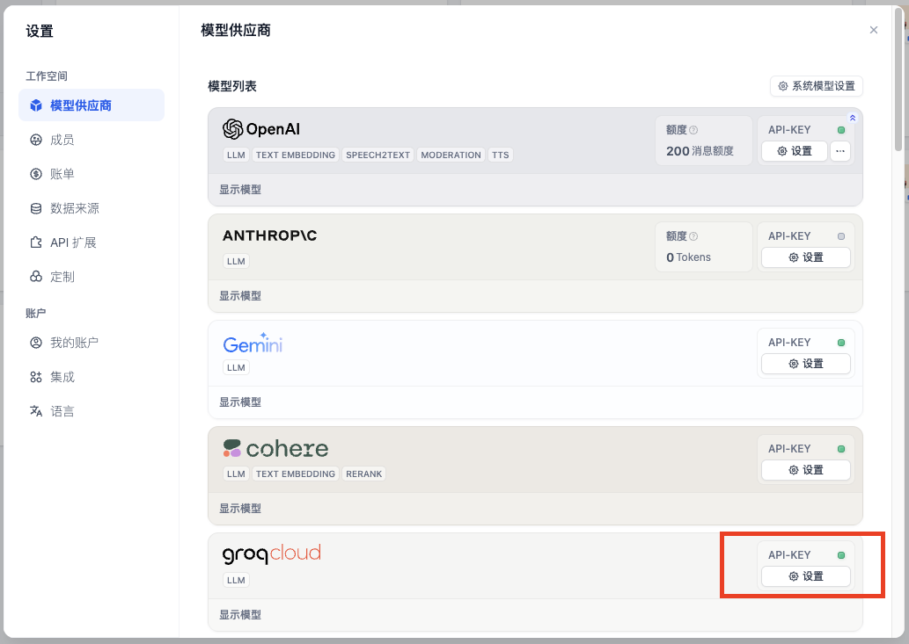
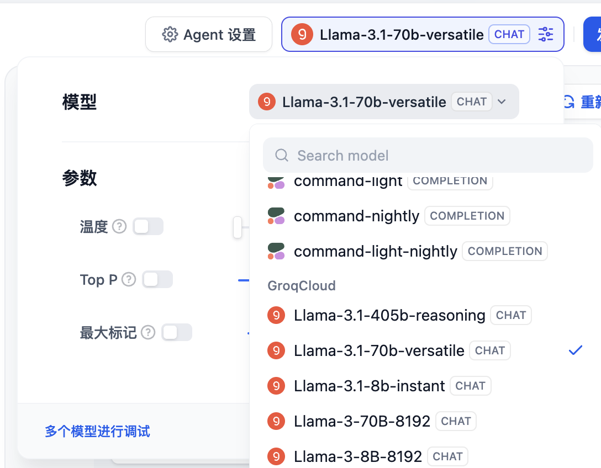

# 如何搭建 AI 圖片生成應用

> 作者：Steven Lynn。Dify Technical Writer。

隨著圖像生成技術的興起，湧現了許多優秀的圖像生成產品，比如 Dall-e、Flux、Stable Diffusion 等。

本文將使用圖像生成模型，指導你使用 Dify 快速開發一個 AI 圖片生成應用。

<figure><figcaption></figcaption></figure>

### 本實驗中你將掌握的知識點

* 使用 Dify 構建 Agent 的方法
* Agent 的基本概念
* 提示詞工程的基礎知識
* 工具的使用
* 大模型的幻覺的概念

### 1. 獲取和填入 Stablility API 密鑰

[點擊這裡](https://platform.stability.ai/account/keys) 即可跳轉至 Stability 的 API 密鑰管理頁。

如果你尚未註冊，會被要求先註冊再進入管理頁。

進入管理頁後，點擊複製密鑰即可。

<figure><figcaption></figcaption></figure>

接下來，你需要通過以下步驟把密鑰填入 [Dify - 工具 - Stability](https://cloud.dify.ai/tools) 中：

* 登錄 Dify
* 進入工具
* 選擇 Stability
* 點擊授權&#x20;

<figure><figcaption></figcaption></figure>

* 填入密鑰並保存

### 2. 配置模型供應商

為了優化交互，我們需要LLM來將用戶的指令具體化，也就是讓LLM來撰寫生成圖片的提示詞（Prompt）。接下來，我們按照如下的步驟在 Dify 配置模型供應商。

Free 版本的 Dify 提供了免費 200 條 OpenAI 的消息額度

如果消息額度不夠用，你可以參考下圖步驟, 自定義其它模型供應商:

點擊**右上角頭像 - 設置 - 模型供應商**&#x20;

<figure><figcaption></figcaption></figure>

如果尚未找到合適的模型供應商，groq 平臺提供了 Llama 等 LLM 的免費調用額度。

登錄 [groq API 管理頁](https://console.groq.com/keys)

點擊 **Create API Key**，設置一個想要的名稱並且複製 API Key。

回到**Dify - 模型供應商**，選擇**groqcloud**，點擊 **設置**。

<figure><figcaption></figcaption></figure>

粘貼 API Key 並保存。

<figure><figcaption></figcaption></figure>

### 3. 構建 Agent

回到**Dify - 工作室**，選擇**創建空白應用**。

<figure><figcaption></figcaption></figure>

在本實驗中，我們只需要瞭解 Agent 的基礎用法即可。


**什麼是 Agent**

Agent 是一種模擬人類行為和能力的 AI 系統，它通過自然語言處理與環境交互，能夠理解輸入信息並生成相應的輸出。Agent 還具有 "感知" 能力，可以處理和分析各種形式的數據。此外，Agent 能夠調用和使用各種外部工具和 API 來完成任務，擴展其功能範圍。這種設計使 Agent 能夠更靈活地應對複雜情況，在一定程度上模擬人類的思考和行為模式。

因此，很多人都會將 Agent 稱為“智能體”。


選擇 **Agent**，填寫名稱即可。

<figure><figcaption></figcaption></figure>

接下來你會進入到如下圖的 Agent 編排界面

<figure><figcaption></figcaption></figure>

我們選擇 LLM，本篇教程中我們使用 groq 提供的 Llama-3.1-70B 為例：

<figure><figcaption></figcaption></figure>

在**工具**中添加 AI 繪圖工具 Stability：

<figure><figcaption></figcaption></figure>

<figure><figcaption></figcaption></figure>

#### 撰寫提示詞

提示詞（Prompt）是 Agent 的靈魂，直接影響到輸出的效果。通常來說越具體的提示詞輸出的效果越好，但是過冗長的提示詞也會導致一些負面效果。

調整提示詞的工程，我們稱之為提示詞工程（Prompt Engineering）

在本次實驗中，你不必擔心沒有掌握提示詞工程，我們會在後面循序漸進地學習它。

讓我們從最簡單的提示詞開始：

```
根據用戶的提示，使用工具 stability_text2image 繪畫指定內容
```

用戶每次輸入命令的時候，Agent 都會知曉這樣的系統級的指令，從而瞭解要執行用戶繪畫的任務的時候需要調用一個叫 stability 的工具。

例如：畫一個女孩，手中拿著一本打開的書

<figure><figcaption></figcaption></figure>

#### 不想撰寫提示詞？當然可以！

點擊提示詞的右上角**生成**。

<figure><figcaption></figcaption></figure>

在**指令**中輸入你的需求，點擊**生成**，右側生成的提示詞中會出現由AI生成的提示詞。

<figure><figcaption></figcaption></figure>

不過，為了養成對提示詞良好的理解，我們在初期最好不要依賴這一項功能。

### 發佈

點擊右上角的發佈按鈕，發佈後選擇**運行**就可以獲得一個在線運行的 Agent 的網頁。

<figure><figcaption></figcaption></figure>

複製這個網頁的 URL，可以分享給其他好友使用。

### 思考題 1：如何指定生成圖片的畫風？

我們可以在用戶輸入的命令中加上畫風的指令，例如：二次元風格，畫一個女孩，手中拿著一本打開的書

<figure><figcaption></figcaption></figure>

但是如果我們希望風格默認都是二次元風格呢，那麼我們加在系統提示詞裡就行了，因為我們之前瞭解到系統提示詞是每次執行用戶命令都會知曉的，優先級更高。

```
根據用戶的提示，使用工具 stability_text2image 繪畫指定內容，畫面是二次元風格
```

### 思考題 2: 如何拒絕部分用戶的某些請求？

在許多業務場景中，我們需要避免輸出一些不合理的內容，但是 LLM 很多時候比較 “傻”，用戶下指令時會照做不誤，即使輸出的內容是錯的，這種模型為了努力回答用戶而編造虛假內容的現象稱為模型幻覺（Hallucinations），那麼我們需要讓模型必要的時候拒絕用戶的請求。

此外，用戶也可能提一些和業務無關的內容，我們也需要讓 Agent 這個時候拒絕請求。

我們可以使用 markdown 格式給不同的提示詞進行劃分，將上述教 Agent 拒絕不合理內容的提示詞寫到 “約束” 標題下。當然，這樣的格式僅僅是為了規範化，你可以有自己的格式。

```
## 任務
根據用戶的提示，使用工具 stability_text2image 繪畫指定內容，畫面是二次元風格。

## 約束
如果用戶在請求和繪畫無關的內容，回覆：“對不起，我不明白你在說什麼”
```

例如，我們嘗試提問：今晚吃什麼&#x20;

<figure><figcaption></figcaption></figure>

在一些更正式的業務場景中，我們可以調用敏感詞庫來拒絕用戶的請求。

在**添加功能 - 內容審查**中添加關鍵詞 “晚飯”，當用戶輸入關鍵詞時，則 Agent 應用輸出 “對不起，我不明白你在說什麼”。

<figure><figcaption></figcaption></figure>
