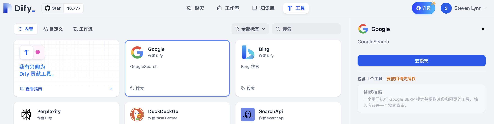
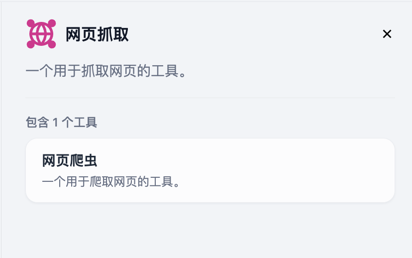
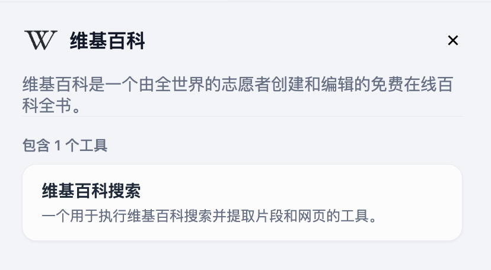
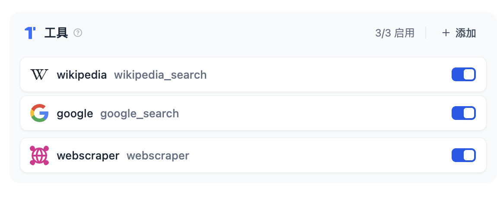

# AI Agent 實戰：搭建個人在線旅遊助手

> 作者: Steven Lynn。 Dify Technical Writer。

在上一個實驗 [如何搭建 AI 圖片生成應用](build-ai-image-generation-app.md) 中，我們已初步瞭解了 Agent 的概念，並且嘗試動手寫了系統提示詞。

本次實驗中，我們將繼續探索 Agent 的提示詞，學習更加規範的提示詞撰寫方法。

### 本實驗中你將掌握的知識點

* 使用 Dify 構建 Agent 的方法
* 結構化的提示詞撰寫技巧
* 變量的使用方法

### 1. 準備

在新建 Agent 之前，請先確保以下步驟已經完成：

* 註冊和登錄 [Dify](https://dify.ai)，如果你想要進行本地部署，可以參考 [社區版 - Docker Compose 部署](../../getting-started/install-self-hosted/docker-compose.md)
* 至少配置一個模型供應商（Dify 贈送 200 條 OpenAI 消息額度，但為了確保實驗順利建議自行配置 LLM 的 API Key）

### 2. 配置工具

#### Google

搭建在線旅遊助手需要使用聯網的搜索引擎作為參考資料來源，本文中將以 Google 作為示例。

當然，你也可以使用其他的搜索引擎，例如[必應](https://docs.dify.ai/zh-hans/guides/tools/tool-configuration/bing)，甚至是由 AI 驅動的 [Perplexity](https://docs.dify.ai/zh-hans/guides/tools/tool-configuration/perplexity)。

Dify 提供的 Google 工具基於 SerpAPI，因此需要提前進入 SerpAPI 的 API Key 管理頁申請 API Key 並粘貼到 `Dify - 工具` 的對應位置。

具體操作步驟如下：

1. 新增 SearpAPI 的 API Key：

進入[SearpAPI - API Key](https://serpapi.com/manage-api-key)，如果你尚未註冊，會被跳轉至進入註冊頁。

SerpAPI提供一個月100次的免費調用次數，這足夠我們完成本次實驗了。如果你需要更多的額度，可以增加餘額，或者使用其他的開源方案。

點擊複製

<figure><figcaption></figcaption></figure>

2. 前往 **Dify - 工具 - Google**：

點擊 `去授權` ，填入API Key並保存。

<figure><figcaption></figcaption></figure>

#### webscraper

本次實驗中，我們需要一個爬蟲工具從指定的網頁中抓取內容，Dify 已提供內置工具，無需額外配置。

<figure><figcaption></figcaption></figure>

#### Wikipedia

我們還希望 Agent 能夠準確介紹目的地知識，Wikipedia 是一個比較好知識來源，Dify 也內置了該工具，無需額外配置。

<figure><figcaption></figcaption></figure>

### 3. 構建 Agent

首先我們選擇 `創建空白應用 - Agent`：

添加工具：`Google`、`webscraper`和`wikipedia`並啟用。

<figure><figcaption></figcaption></figure>

4. **示例輸出**

示例輸出不是必要的部分。示例輸出的目的是為了給 Agent 一個書寫格式的參考，以確保 Agent 的輸出更接近我們的期望。

以下是旅遊助手的示例輸出：

```
## 示例

### 詳細旅行計劃

**酒店推薦**
1. 肯辛頓酒店 (瞭解更多：www.doylecollection.com/hotels/the-kensington-hotel)
- 評分：4.6⭐
- 價格：每晚約350美元
- 簡介：坐落在一座攝政時期的聯排別墅中，這家優雅的酒店距離南肯辛頓地鐵站5分鐘步行路程，距離維多利亞和阿爾伯特博物館10分鐘步行路程。

2. 倫勃朗酒店 (瞭解更多：www.sarova-rembrandthotel.com)
- 評分：4.3⭐
- 價格：每晚約130美元
- 簡介：建於1911年，最初是哈羅德百貨公司（距離0.4英里）的公寓，這家現代化酒店坐落在維多利亞和阿爾伯特博物館對面，距離南肯辛頓地鐵站（直達希思羅機場）5分鐘步行路程。

**第1天 - 抵達和安頓**
- **上午**：抵達機場。歡迎來到您的冒險之旅！我們的代表將在機場迎接您，確保您順利入住。
- **下午**：入住酒店，稍作休息，恢復精力。
- **晚上**：在住宿周邊進行輕鬆的步行遊覽，熟悉當地環境。發現附近的用餐選擇，享受愉快的第一頓晚餐。

**第2天 - 文化與自然之旅**
- **上午**：從帝國理工學院開始您的一天，這是世界頂尖的學府之一。享受一次校園導覽。
- **下午**：選擇參觀自然歷史博物館（以其引人入勝的展覽而聞名）或維多利亞和阿爾伯特博物館（慶祝藝術和設計）。之後，在寧靜的海德公園放鬆，也許還可以在蛇形湖上乘船遊覽。
- **晚上**：探索當地美食。我們推薦您在傳統的英國酒吧享用晚餐。

**附加服務：**
- **禮賓服務**：在您停留期間，我們的禮賓服務隨時可以協助預訂餐廳、購買門票、安排交通，以及滿足任何特殊要求，以提升您的體驗。
- **24/7支持**：我們提供全天候支持，以解決您在旅行中可能遇到的任何問題或需求。

祝您旅途愉快，滿載豐富經歷和美好回憶！
```

### 思考題 1: 如何規範化用戶輸入？

通常我們輸入 Agent 內容都是自然語言，而自然語言的一個缺點是很難規範化，有可能包含了一些 Agent不需要的信息或者沒有價值的信息，這個時候我們可以引入變量來規範化輸入。

Dify 目前支持`文本`、`段落`、`下拉選項`、`數字`、`基於 API 的變量`這幾種類型的變量。

在本實驗中，我們只需要選用`文本`類型的變量即可。

在**變量**中，選擇合適的變量類型，我們可以詢問用戶目的地、旅行天數、預算。

| 變量Key       | 變量類型 | 字段名稱 | 可選 |
| ----------- | ---- | ---- | -- |
| destination | 文本   | 目的地  | 是  |
| day         | 文本   | 旅行天數 | 是  |
| budget      | 文本   | 旅行預算 | 是  |

需要注意的是，`變量 Key`，也就是變量的名稱，僅支持大小寫英文、數字、下劃線。`字段名稱`是用戶可以看到的提示內容。

添加變量後，用戶可以按照應用開發者的意圖嚮應用提供必要的背景信息，實現的效果如下：

<figure><figcaption></figcaption></figure>
