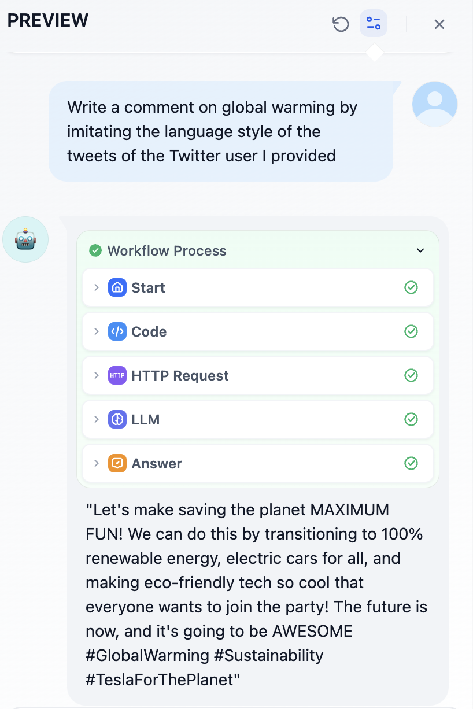

# ChatFlow 實戰：搭建 Twitter 賬號分析助手

> 作者： Steven Lynn。 Dify Technical Writer。

## 簡介

Dify 內置了一些網絡爬蟲工具例如 Jina ，它可以將網頁轉換為 LLM 可以讀取的 markdown 格式。

然而，X（以前叫 Twitter）自 2023 年 2 月 2 日起停止提供免費 API 訪問，並且升級了其反爬蟲措施。像 Jina 這樣的工具無法直接訪問 X 的內容。

> Starting February 9, we will no longer support free access to the Twitter API, both v2 and v1.1. A paid basic tier will be available instead 🧵
>
> — Developers (@XDevelopers) [February 2, 2023](https://twitter.com/XDevelopers/status/1621026986784337922?ref\_src=twsrc%5Etfw)

好在 Dify 有 HTTP 工具，我們可以通過發送 HTTP 請求來調用外部爬蟲工具。下面讓我們開始吧！

## 本實驗中你將掌握的知識點

* ChatFlow 的基礎知識
* 如何在 Dify 中避免明文密鑰
* HTTP 工具的使用

## **前提條件**

### 註冊 Crawlbase

Crawlbase 是一個為企業和開發者設計的全方位數據爬取和抓取平臺，Crawlbase Scraper 可以從 X、Facebook 和 Instagram 等社交平臺抓取數據。

點擊註冊：[crawlbase.com](https://crawlbase.com)

### Dify 平臺

[Dify](https://cloud.dify.ai/) 是一個開源的 LLM 應用開發平臺。你可以選擇[雲服務](https://cloud.dify.ai/)（開箱即用）或參考 [docker compose 本地](https://docs.dify.ai/getting-started/install-self-hosted)自建 Dify 平臺。我們需要使用 LLM 處理由 Crawlbase 抓取的社交平臺數據。

Free 版本的 Dify 提供了免費 200 條 OpenAI 的消息額度，如果消息額度不夠用，你可以參考下圖步驟, 自定義其它模型供應商。

點擊**右上角頭像 - 設置 - 模型供應商**

<figure><figcaption></figcaption></figure>

## 創建 ChatFlow 應用

現在，讓我們開始創建 ChatFlow。點擊`創建空白應用 - 工作流編排`：

<figure><figcaption></figcaption></figure>

初始化的 Chatflow 應用如下：

<figure><figcaption></figcaption></figure>

## 添加節點

### 開始節點

在開始節點中，我們可以在聊天開始時添加一些系統變量。在本文中，我們需要一個 Twitter 用戶的 ID 作為字符串變量。讓我們將其命名為`id`。

點擊開始節點並添加一個新變量：

<figure><figcaption></figcaption></figure>

### 代碼節點

根據[Crawlbase文檔](https://crawlbase.com/docs/crawling-api/scrapers/#twitter-profile)所述，變量`url`（將在下一個節點中使用）為 `https://twitter.com/` + `user id`，例如 Elon Musk 應當是[`https%3A%2F%2Ftwitter.com%2Felonmusk`](https://twitter.com/elonmusk)。

為了將用戶ID轉換為完整URL，我們可以使用以下Python代碼將前綴`https://twitter.com/`與用戶 ID 整合：

```python
def main(id: str) -> dict:
    return {
        "url": "https%3A%2F%2Ftwitter.com%2F"+id,
    }
```

添加一個代碼節點並選擇 Python ，然後設置輸入和輸出變量名：

<figure><figcaption></figcaption></figure>

### HTTP 請求節點

根據 [Crawlbase文檔](https://crawlbase.com/docs/crawling-api/scrapers/#twitter-profile)，如果以 HTTP 請求格式抓取 Twitter 用戶的個人資料，我們需要按以下格式填寫 HTTP 請求節點：

<figure><figcaption></figcaption></figure>

出於安全考慮，最好不要直接將 API Key 作為明文輸入。在 Dify 最新版本中，可以在`環境變量`中設置令牌值。點擊 `env` - `添加變量`來設置 API Key，這樣就不會以明文出現在節點中。

<figure><figcaption></figcaption></figure>

點擊[此處](https://crawlbase.com/dashboard/account/docs)獲取 Crawlbase API Key。輸入 `/`插入為變量。

<figure><figcaption></figcaption></figure>

點擊此節點的開始按鈕，輸入Elon Musk 的 URL 進行測試：

<figure><figcaption></figcaption></figure>

### LLM 節點

現在，我們可以使用 LLM 來分析 Crawlbase 抓取的結果並執行我們的命令。

變量 `context` 的值為 HTTP 請求節點的 `body`。

以下是一個提示詞示例。

<figure><figcaption></figcaption></figure>

## 測試運行

點擊 `預覽`開始測試運行，並在`id`中輸入 Twitter 用戶 ID：

例如，我想分析 Elon Musk 的推文，並以他的語氣寫一條關於全球變暖的推文。

<figure><figcaption></figcaption></figure>

點擊右上角的`發佈`，並將其添加到你的網站中。

## 寫在最後

Crawlbase 應該是目前最便宜的 Twitter 爬蟲服務，但有時它可能無法正確抓取用戶推文的內容，具體效果請以實際調用為準。

## 鏈接

* [X@dify\_ai](https://x.com/dify\_ai)
* Dify 的 [GitHub 倉庫](https://github.com/langgenius/dify)
