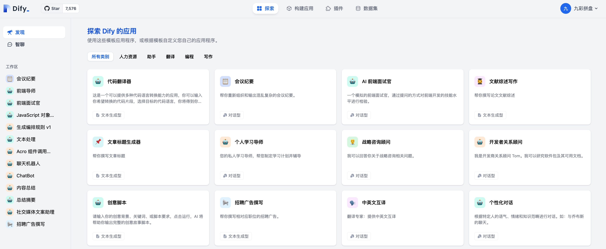
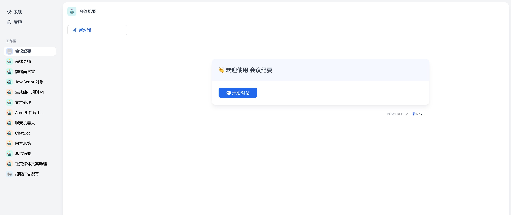

# 發現

## 模板應用

在 **探索 > 發現** 中, 我們提供了一些常用的模板應用。這些應用涵蓋翻譯、寫作、編程和助手。

<figure><figcaption></figcaption></figure>

如果你想使用模板應用，點擊模板上的“添加到工作區”按鈕。便可以在左側的工作區中使用該應用。

<figure><figcaption></figcaption></figure>

如果你要修改模板以創建新應用程序，請單擊模板上的“自定義”按鈕。

## 工作區

工作區是應用程序的導航。在工作區中點擊一個應用，便可直接使用該應用。

<figure><figcaption></figcaption></figure>

工作區中的應用包括：你自己的應用和其他團隊添加到工作區的應用。
